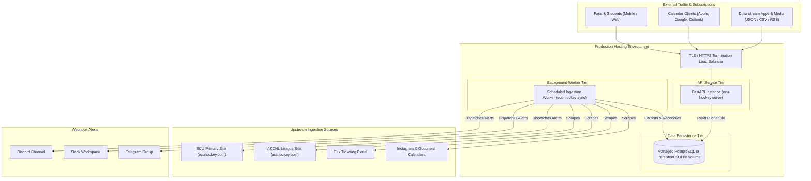
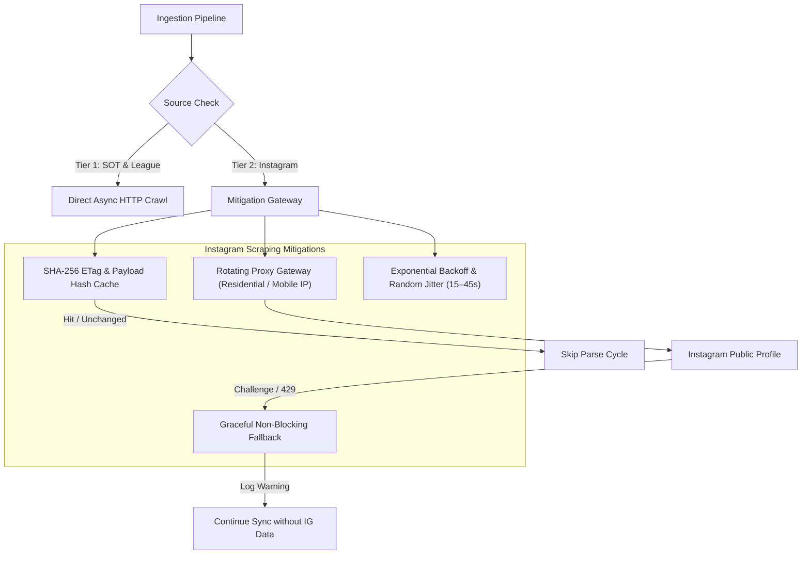
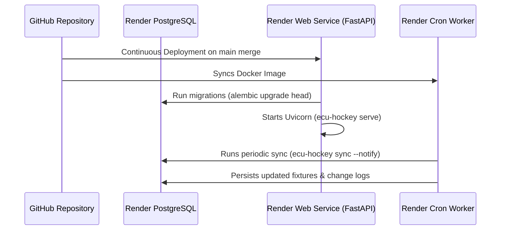

# Production Deployment Guide & Architectural Hosting Analysis

<!--TOC-->

______________________________________________________________________

**Table of Contents**

- [1. System Architecture & Production Topologies](#1-system-architecture--production-topologies)
- [2. Background Worker Hosting Options Evaluation](#2-background-worker-hosting-options-evaluation)
  - [2.1. Hosting Options Comparison Matrix](#21-hosting-options-comparison-matrix)
  - [2.2. Architectural Details by Provider](#22-architectural-details-by-provider)
    - [2.2.1. Railway Cron & Background Services](#221-railway-cron--background-services)
    - [2.2.2. Render Background Workers & Cron Jobs](#222-render-background-workers--cron-jobs)
    - [2.2.3. Fly.io Machines with Scheduled Triggers](#223-flyio-machines-with-scheduled-triggers)
    - [2.2.4. AWS Lambda + EventBridge + ECR](#224-aws-lambda--eventbridge--ecr)
- [3. API Hosting Options & SSL/TLS Requirements](#3-api-hosting-options--ssltls-requirements)
  - [3.1. Provider Evaluation for Calendar API](#31-provider-evaluation-for-calendar-api)
  - [3.2. Mandatory SSL/TLS & HTTPS Termination Requirements](#32-mandatory-ssltls--https-termination-requirements)
- [4. Instagram Anti-Bot & Rate Limiting Mitigation Strategy](#4-instagram-anti-bot--rate-limiting-mitigation-strategy)
  - [4.1. Threat & Limitation Overview](#41-threat--limitation-overview)
  - [4.2. Mitigation Architecture](#42-mitigation-architecture)
  - [4.3. Tactical Implementation Steps](#43-tactical-implementation-steps)
- [5. Database Persistence Strategy: SQLite vs. Managed PostgreSQL](#5-database-persistence-strategy-sqlite-vs-managed-postgresql)
  - [5.1. Tradeoff Comparison](#51-tradeoff-comparison)
  - [5.2. Architecture Recommendation](#52-architecture-recommendation)
- [6. Containerization Guide](#6-containerization-guide)
  - [6.1. Multi-Stage Dockerfile Architecture](#61-multi-stage-dockerfile-architecture)
  - [6.2. Published Container Images (ghcr.io)](#62-published-container-images-ghcrio)
  - [6.3. Local Container Deployment with Docker Compose](#63-local-container-deployment-with-docker-compose)
  - [6.4. Running Database Migrations in Container](#64-running-database-migrations-in-container)
  - [6.5. Automated GitHub Actions Container Pipeline](#65-automated-github-actions-container-pipeline)
  - [6.6. Continuous Deployment with GitHub Actions (`deploy.yml`)](#66-continuous-deployment-with-github-actions--deployyml)
  - [6.7. Turnkey Infrastructure via Render Blueprint (`render.yaml`)](#67-turnkey-infrastructure-via-render-blueprint--renderyaml)
  - [6.8. Live Production Deployment (`ecu-hockey-api.onrender.com`)](#68-live-production-deployment--ecu-hockey-apionrendercom)
    - [6.8.1. Deployed Infrastructure Topology](#681-deployed-infrastructure-topology)
    - [6.8.2. Complete Endpoint Inventory & Reference](#682-complete-endpoint-inventory--reference)
    - [6.8.3. Executable `curl` Examples](#683-executable-curl-examples)
      - [6.8.3.1. Public Endpoints](#6831-public-endpoints)
      - [6.8.3.2. Protected Administrative Endpoints](#6832-protected-administrative-endpoints)
    - [6.8.4. Calendar Client Subscription Instructions](#684-calendar-client-subscription-instructions)
- [7. Platform-Specific Deployment Walkthroughs](#7-platform-specific-deployment-walkthroughs)
  - [7.1. Walkthrough A: Deploying to Render](#71-walkthrough-a-deploying-to-render)
  - [7.2. Walkthrough B: Deploying to Railway](#72-walkthrough-b-deploying-to-railway)
  - [7.3. Walkthrough C: Deploying to Fly.io with Persistent SQLite](#73-walkthrough-c-deploying-to-flyio-with-persistent-sqlite)
- [8. Operational Runbook & Health Monitoring](#8-operational-runbook--health-monitoring)
  - [8.1. Liveness & Health Probes](#81-liveness--health-probes)
  - [8.2. Operational Commands Quick Reference](#82-operational-commands-quick-reference)
  - [8.3. Runbook: Investigating & Mitigating Deployment Failures](#83-runbook-investigating--mitigating-deployment-failures)
    - [8.3.1. Step 1: Inspect GitHub Actions Summary & Job Logs](#831-step-1-inspect-github-actions-summary--job-logs)
    - [8.3.2. Step 2: Check Cloud Provider Container & Runtime Logs](#832-step-2-check-cloud-provider-container--runtime-logs)
    - [8.3.3. Step 3: Troubleshoot Database Migration Failures](#833-step-3-troubleshoot-database-migration-failures)
    - [8.3.4. Step 4: Emergency Rollback Procedure](#834-step-4-emergency-rollback-procedure)

______________________________________________________________________

<!--TOC-->

This document provides a comprehensive architectural evaluation, operational deployment guide, and hosting analysis for running the **ECU Men's Ice Hockey Calendar** services in production environments. It addresses background worker scheduling, calendar REST API hosting, database persistence strategies, anti-bot scraping mitigations (specifically for Instagram), and container orchestration.

<!-- toc -->

<!-- tocstop -->

______________________________________________________________________

## 1. System Architecture & Production Topologies

The system comprises two core operational workloads:

1. **Calendar & Data API Service**: A lightweight, async [FastAPI](https://fastapi.tiangolo.com/) service serving RFC 5545 iCalendar feeds (`/calendar.ics`), Webcal subscriptions, public JSON/CSV data feeds, and health diagnostics endpoints.
2. **Scraper & Reconciliation Worker**: A periodic synchronization pipeline that crawls upstream web sources (`ecuhockey.com`, `acchockey.com`, ticketing sites, social media, and opponent schedules), reconciles discrepancies, detects schedule changes, persists updates, and dispatches webhook notifications.



______________________________________________________________________

## 2. Background Worker Hosting Options Evaluation

The scraper pipeline runs periodically (e.g., every 6–12 hours, or hourly during active season weekends). The following table compares the leading hosting architectures for running this background synchronization process.

### 2.1. Hosting Options Comparison Matrix

| Platform                     | Worker Model                                 | Free / Low-Cost Tier                                | Cold Start Delay                   | Persistent Storage                      | Scheduled Cron Reliability           | Operational Complexity           | Recommendation                   |
| :--------------------------- | :------------------------------------------- | :-------------------------------------------------- | :--------------------------------- | :-------------------------------------- | :----------------------------------- | :------------------------------- | :------------------------------- |
| **Railway**                  | Scheduled Service / Cron Job                 | ~$5/mo credit; usage-based ($0.000234/GB-hr)        | Instant (Container start ~3s)      | Persistent Volumes (1GB included)       | Built-in native cron schedule syntax | Low                              | **Top Recommendation**           |
| **Render**                   | Background Worker / Cron Job                 | ~$7/mo for Background Worker; Cron at $1/mo + usage | Fast (~5s)                         | Render Disks ($0.25/GB/mo)              | Native Cron Job dashboard            | Low                              | **Highly Recommended**           |
| **Fly.io**                   | Ephemeral Micro-VM / Machine Cron            | Free allowance (3 shared-cpu VMs); ~$3–5/mo         | Sub-second Micro-VM launch         | NVMe Volumes ($0.15/GB/mo)              | Machine cron schedule or standby     | Medium                           | **Strong Contender**             |
| **AWS Lambda + EventBridge** | Serverless Function triggered by EventBridge | 1M free requests/mo; $0.20 per 1M afterwards        | 2–8s (Python container cold start) | Ephemeral `/tmp` only (requires S3/RDS) | AWS EventBridge 99.99% SLA           | High (IAM, VPC, ECR, CloudWatch) | Best for Enterprise / AWS stacks |

### 2.2. Architectural Details by Provider

#### 2.2.1. Railway Cron & Background Services

- **Architecture**: A containerized job deployed from Dockerfile that triggers on a predefined cron expression (e.g., `0 */6 * * *`) or runs as a daemon sleeping between runs.
- **Pros**:
  - Native integration with Railway managed PostgreSQL.
  - Zero charge when cron service is idle (in cron mode).
  - Straightforward secrets management and GitHub webhook continuous deployment.
- **Cons**: Requires billing payment method on file to access usage tier beyond basic free trial.

#### 2.2.2. Render Background Workers & Cron Jobs

- **Architecture**: Render provides dedicated Cron Jobs that spin up container instances according to standard cron syntax, execute `ecu-hockey sync --notify`, and exit upon completion.
- **Pros**:
  - Clear separation of web traffic and scheduled background execution.
  - Automatic email notifications on job exit failure.
  - Seamless zero-downtime database connection to Render PostgreSQL.
- **Cons**: Paid plan required for persistent disks if SQLite is chosen instead of managed Postgres.

#### 2.2.3. Fly.io Machines with Scheduled Triggers

- **Architecture**: Standalone Firecracker micro-VMs that start on a schedule or sleep when idle.
- **Pros**:
  - Global Anycast network; can locate workers near scraping target endpoints.
  - Generous free resource allocations.
  - Direct volume attachment support for SQLite persistence.
- **Cons**: Managing machine restart states and custom cron logic requires CLI familiarity (`flyctl`).

#### 2.2.4. AWS Lambda + EventBridge + ECR

- **Architecture**: Docker container packaged to Amazon ECR, invoked by an EventBridge Rule schedule.
- **Pros**:
  - Virtually free for low-frequency scheduled invocations.
  - Highly resilient cloud infrastructure.
- **Cons**:
  - 15-minute execution limit per invocation.
  - Complex network setup required to communicate with private RDS instances (NAT Gateway costs ~$32/mo).
  - Ephemeral disk only, requiring external database or S3 synchronization.

______________________________________________________________________

## 3. API Hosting Options & SSL/TLS Requirements

### 3.1. Provider Evaluation for Calendar API

| Hosting Platform   | Deployment Model     | Free Tier Available?             | Custom Domain & Auto-SSL            | Inactivity Sleep / Cold Starts              | Suitability               |
| :----------------- | :------------------- | :------------------------------- | :---------------------------------- | :------------------------------------------ | :------------------------ |
| **Render**         | Docker / Web Service | Yes (Free tier sleeps after 15m) | Yes (Managed Let's Encrypt)         | ~50s spin-up on free tier; 0s on $7 Starter | Excellent ($7/mo Starter) |
| **Railway**        | Docker Web Service   | Usage credit                     | Yes (Managed Cloudflare / SSL)      | None (always-on)                            | Excellent                 |
| **Fly.io**         | Anycast Micro-VM     | Yes (Within allowance)           | Yes (Automatic Let's Encrypt certs) | Optional auto-stop/start                    | Excellent                 |
| **PythonAnywhere** | WSGI Web App         | Yes (Restricted whitelist)       | Paid tier only for custom domains   | No container support; WSGI focused          | Not Recommended           |

> [!WARNING]
> **Why PythonAnywhere is Not Recommended**:
>
> 1. PythonAnywhere is built on WSGI servers and requires cumbersome ASGI bridges for modern FastAPI applications.
> 2. The free tier strictly enforces an outbound proxy whitelist, blocking scrapers from accessing `ecuhockey.com`, `acchockey.com`, and external ticketing domains.
> 3. Custom Dockerfiles and multi-container orchestration are unsupported.

### 3.2. Mandatory SSL/TLS & HTTPS Termination Requirements

Calendar clients impose strict cryptographic and protocol requirements on iCalendar feed URLs:

1. **Strict TLS Protocol Enforcement**:
   - **Google Calendar**, **Apple Calendar (iOS / macOS)**, and **Microsoft Outlook 365** mandate valid, trusted SSL/TLS certificates signed by recognized public Certificate Authorities (CAs). Self-signed certificates will fail silently or be permanently rejected during calendar subscription.
2. **Webcal Scheme Compatibility**:
   - The `webcal://` scheme is an unregistered pseudo-protocol that calendar clients handle by replacing `webcal://` with `https://`. Production hosting must terminate HTTPS and redirect HTTP traffic to HTTPS automatically.
3. **CORS and Content Headers**:
   - Calendar subscription endpoints must serve:
     - `Content-Type: text/calendar; charset=utf-8`
     - `Content-Disposition: inline; filename="calendar.ics"`
     - `Cache-Control: public, max-age=3600` (or appropriate refresh cadence)

Both **Render**, **Railway**, and **Fly.io** provide automated TLS termination and certificate renewal via Let's Encrypt with zero manual configuration.

______________________________________________________________________

## 4. Instagram Anti-Bot & Rate Limiting Mitigation Strategy

The Instagram crawler inspects official social media announcements for fixture changes and graphic updates. Meta/Instagram deploys aggressive bot detection mechanisms including IP blocking, device fingerprinting, and login wall challenges.

### 4.1. Threat & Limitation Overview

- **IP-Based Throttling**: Requests from standard datacenter cloud IP ranges (AWS, DigitalOcean, Hetzner) are often blocked or served HTTP 429 / HTTP 302 login redirects.
- **Session Expiration**: Ephemeral session cookies expire quickly, requiring automated refresh mechanisms.
- **Account Ban Risk**: Automated scrapers logging in with credentials risk account checkpoint flags.

### 4.2. Mitigation Architecture



### 4.3. Tactical Implementation Steps

1. **Rotating Proxy Gateways**:

   - Route Instagram requests through a proxy gateway supporting IP rotation across residential or mobile pools (e.g., Bright Data, ScraperAPI, Oxylabs) by configuring `PROXY_URL` or `HTTP_PROXY`:

     ```bash
     export PROXY_URL="http://<username>:<password>@residential.proxyprovider.com:8080"
     ```

2. **Conservative Scraping Frequency**:

   - Scrape Instagram at a low frequency (maximum once every 6 to 12 hours). Schedule checks should be cached using SHA-256 hashes so duplicate requests are bypassed.

3. **Graceful Pipeline Isolation (Non-Fatal Degradation)**:

   - In accordance with the system's reconciliation precedence hierarchy:
     $$\\text{Tier 1 (Official Site & League)} > \\text{Tier 2 (Instagram & Tickets)} > \\text{Tier 3 (Opponents)}$$
   - If the Instagram scraper encounters an HTTP 429, CAPTCHA, or connection failure, the error is logged as a warning and the synchronization pipeline proceeds without interruption using the authoritative Tier 1 sources.

4. **Header and User-Agent Randomization**:

   - Rotate realistic desktop and mobile User-Agent strings and include standard `Accept-Language`, `Sec-Fetch-Dest`, and `Sec-Fetch-Mode` headers (already implemented in `ResilientHttpClient`).

______________________________________________________________________

## 5. Database Persistence Strategy: SQLite vs. Managed PostgreSQL

The system uses SQLAlchemy 2.0 ORM with schema migrations managed by Alembic. The database engine transparently supports both SQLite and PostgreSQL.

### 5.1. Tradeoff Comparison

| Factor                 | SQLite on Persistent Volume                            | Managed PostgreSQL (Render / Railway / Supabase)                    |
| :--------------------- | :----------------------------------------------------- | :------------------------------------------------------------------ |
| **Architecture**       | Single-file database on local block storage            | Networked relational database server                                |
| **Write Concurrency**  | Single-writer locking; database locks during ingestion | Multi-version concurrency control (MVCC); concurrent reads & writes |
| **Horizontal Scaling** | Single instance only (cannot share disk across nodes)  | Multiple API and worker instances can connect concurrently          |
| **Backups**            | Volume snapshots; manual file copies                   | Automated point-in-time recovery (PITR) & daily snapshots           |
| **Operational Cost**   | Included in volume cost (~$0.15–$0.25/GB/mo)           | Free tier available; ~$5–$15/mo for production tier                 |
| **Connection Pooling** | Native file access (zero network overhead)             | SQLAlchemy connection pooling (`QueuePool`, 5–20 connections)       |

### 5.2. Architecture Recommendation

- **Single-Node Deployment (Low Cost / Hobby)**:
  - Use **SQLite on a Persistent Volume** attached to your container at `/data/ecu_hockey.db`. Set `DATABASE_URL=sqlite:////data/ecu_hockey.db`.
  - Simple, zero external infrastructure, practically zero monthly cost.
- **Production Multi-Container Deployment (Recommended)**:
  - Use **Managed PostgreSQL**. Set `DATABASE_URL=postgresql://<username>:<password>@<host>:5432/ecu_hockey`.
  - Allows running multiple FastAPI web instances behind a load balancer while a background worker service performs schedule ingestion concurrently without database locks.

______________________________________________________________________

## 6. Containerization Guide

The repository includes a production-ready, multi-stage [`Dockerfile`](Dockerfile), orchestration configuration in [`docker-compose.yml`](docker-compose.yml), and an automated CI/CD publication pipeline via GitHub Actions to GitHub Container Registry ([`ghcr.io/bdperkin/ecu-hockey-calendar`](https://github.com/bdperkin/ecu-hockey-calendar/pkgs/container/ecu-hockey-calendar)).

### 6.1. Multi-Stage Dockerfile Architecture

The build process uses two stages:

1. **`builder` stage**: Uses `ghcr.io/astral-sh/uv` to synchronize dependencies from `uv.lock` in bytecode-compiled format without installing developer dependencies.
2. **`runtime` stage**: A minimal `python:3.12-slim` image containing only production dependencies, an unprivileged `appuser` (UID 10001), healthcheck utilities, and the project entrypoints.

### 6.2. Published Container Images (ghcr.io)

Pre-built multi-architecture images (`linux/amd64`, `linux/arm64`) are automatically compiled and published to GitHub Container Registry upon each semantic release and merge to `main`.

To pull and run the latest image directly without building from source:

```bash
# Pull the latest container image
docker pull ghcr.io/bdperkin/ecu-hockey-calendar:latest

# Run standalone container with SQLite storage volume
docker run -d \
  --name ecu-hockey-calendar \
  -p 8000:8000 \
  -v calendar_data:/data \
  -e DATABASE_URL=sqlite:////data/ecu_hockey.db \
  ghcr.io/bdperkin/ecu-hockey-calendar:latest

# Verify service health
curl -s http://localhost:8000/health | jq .
```

### 6.3. Local Container Deployment with Docker Compose

To spin up the complete production environment locally (FastAPI service + PostgreSQL + Scraper Worker):

```bash
# Copy environment template
cp .env.example .env

# Launch containers in detached mode using published GHCR image
docker compose up -d

# Or build locally from source in detached mode
docker compose up -d --build

# Verify container health status
docker compose ps

# View service logs
docker compose logs -f api
docker compose logs -f worker

# Test local API health endpoint
curl -s http://localhost:8000/health | jq .

# Test calendar feed download
curl -s http://localhost:8000/calendar.ics -o schedule.ics
```

### 6.4. Running Database Migrations in Container

Alembic migrations run automatically on container startup or manually on demand:

```bash
# Apply pending schema migrations inside the running API container
docker compose exec api alembic upgrade head

# Check current revision
docker compose exec api alembic current
```

### 6.5. Automated GitHub Actions Container Pipeline

Container builds and publications are automated through `.github/workflows/docker.yml`:

- **Multi-Architecture Support**: Compiles native binaries for `linux/amd64` (Intel/AMD) and `linux/arm64` (Apple Silicon, AWS Graviton) using QEMU and Docker Buildx.
- **Build Caching**: Leverages GitHub Actions cache backend (`type=gha`) for ultra-fast incremental layer compilation.
- **Release Tagging**: Automatically tags images with semantic versioning tags (`vX.Y.Z`, `vX.Y`, `latest`) on tagged releases, and `edge` on commits to `main`.
- **Pull Request Validation**: Validates Docker build integrity on pull requests without pushing to the registry.
- **Supply-Chain Security**: Generates SLSA build provenance attestations and Software Bill of Materials (SBOM).

### 6.6. Continuous Deployment with GitHub Actions (`deploy.yml`)

The repository includes an automated Continuous Deployment (CD) workflow ([`.github/workflows/deploy.yml`](.github/workflows/deploy.yml)) that orchestrates zero-downtime deployment of published container images to production cloud infrastructure:

- **Automated Triggers**:
  - Automatically triggers upon successful completion of the `Docker` build-and-publish workflow (`workflow_run`) on branch `main`, deploying the `edge` container tag.
  - Automatically triggers on new GitHub Releases (`release: [published]`), deploying semantic version tags (`vX.Y.Z`).
  - Supports manual triggering (`workflow_dispatch`) with environment selection (`production` or `staging`) and custom image tag parameters.
- **Supported Deployment Mechanisms**:
  - **Render Deploy Hooks**: Calls a unique webhook URL (`DEPLOY_HOOK_URL`) via HTTP POST to trigger zero-downtime rolling updates.
  - **Render REST API**: Dispatches deployment via `RENDER_API_KEY` and `RENDER_SERVICE_ID` with explicit image URL referencing `ghcr.io/bdperkin/ecu-hockey-calendar:<tag>`.
  - **Fly.io Deploy**: Uses `FLY_API_TOKEN` to execute `flyctl deploy --image ...`.
- **Automated Database Migrations**:
  - Database schema migrations (`alembic upgrade head`) are executed prior to serving traffic, either via Render / Fly.io release commands or automatically during container startup via `AUTO_MIGRATE=true` (or `ecu-hockey serve --migrate`).
  - If schema migrations fail, container startup aborts immediately with a non-zero exit code. This prevents container port binding and ensures the load balancer retains existing traffic on the prior healthy version.
- **Automated Post-Deployment Health Verification**:
  - Actively polls the public `/health` endpoint (`${PRODUCTION_URL}/health`) up to 30 times (10-second intervals) until the service reports `"status": "healthy"`.
  - Fails the workflow and emits diagnostic error messages if the service does not become healthy within the timeout window.
- **GitHub Environments & Secrets Setup**:
  1. In the repository settings, navigate to **Settings** > **Environments** and create an environment named `production`.
  2. Add the following secrets / variables:
     - `DEPLOY_HOOK_URL`: (Required for hook deployment) Webhook deploy URL generated in your hosting dashboard.
     - `PRODUCTION_URL`: (Required for health probe) Public HTTPS URL of the service (e.g., `https://calendar.ecuhockey.com` or `https://ecu-hockey-api.onrender.com`).
     - `RENDER_API_KEY`: (Optional) API key for programmatic Render REST API deployments.
     - `RENDER_SERVICE_ID`: (Optional) Target Render service identifier (`srv-xxxxxx`).
     - `FLY_API_TOKEN`: (Optional) Authentication token for Fly.io deployments.

### 6.7. Turnkey Infrastructure via Render Blueprint (`render.yaml`)

A complete Infrastructure-as-Code specification is provided in [`render.yaml`](render.yaml) defining:

- **`ecu-hockey-api` Web Service**: Containerized FastAPI service with auto-scaling, SSL termination, health checking (`/health`), and automated pre-deploy migrations (`alembic upgrade head`).
- **`ecu-hockey-worker` Cron Job**: Containerized background runner executing `ecu-hockey sync --notify` every 6 hours (`0 */6 * * *`).
- **`ecu-hockey-db` Database**: Managed PostgreSQL cluster with automated backups and internal network connectivity.

To deploy via Blueprint:

1. Navigate to [dashboard.render.com/blueprints](https://dashboard.render.com/blueprints).
2. Click **New Blueprint Instance** and connect `bdperkin/ecu-hockey-calendar`.
3. Render automatically discovers `render.yaml`, provisions the database, wires internal environment variables, and launches both services.

### 6.8. Live Production Deployment (`ecu-hockey-api.onrender.com`)

The project maintains an active, public production instance hosted on [Render](https://render.com) at [`https://ecu-hockey-api.onrender.com/`](https://ecu-hockey-api.onrender.com/):

- **Live Service Base URL**: [`https://ecu-hockey-api.onrender.com/`](https://ecu-hockey-api.onrender.com/)
- **One-Click Calendar Subscription**: [`webcal://ecu-hockey-api.onrender.com/calendar.ics`](webcal://ecu-hockey-api.onrender.com/calendar.ics)
- **Direct iCalendar Feed**: [`https://ecu-hockey-api.onrender.com/calendar.ics`](https://ecu-hockey-api.onrender.com/calendar.ics)
- **Interactive OpenAPI Documentation**: [`https://ecu-hockey-api.onrender.com/docs`](https://ecu-hockey-api.onrender.com/docs)
- **ReDoc API Reference**: [`https://ecu-hockey-api.onrender.com/redoc`](https://ecu-hockey-api.onrender.com/redoc)
- **Health & Diagnostics Probe**: [`https://ecu-hockey-api.onrender.com/health`](https://ecu-hockey-api.onrender.com/health)

#### 6.8.1. Deployed Infrastructure Topology

The production architecture is deployed declaratively using [`render.yaml`](render.yaml) across three orchestrated services:

1. **Web Service (`ecu-hockey-api`)**:

   - **Runtime**: Docker multi-arch image (`ghcr.io/bdperkin/ecu-hockey-calendar:edge`).
   - **Hosting Tier**: Oregon region, `0.5c-512mb`.
   - **Automated Pre-Deploy Command**: `alembic upgrade head` applies relational migrations before traffic routes.
   - **Health Checking**: Probed continuously at `/health` with automatic restart on failure.
   - **Networking**: Automated Let's Encrypt SSL/TLS termination with HTTP/2 and CORS support.

2. **Scheduled Cron Worker (`ecu-hockey-worker`)**:

   - **Runtime**: Docker image (`ghcr.io/bdperkin/ecu-hockey-calendar:edge`).
   - **Execution Cadence**: Runs `ecu-hockey sync --notify` every 6 hours (`0 */6 * * *`).
   - **Functionality**: Crawls primary, conference, ticketing, and opponent feeds; executes schedule reconciliation; detects fixture changes; and dispatches webhook alerts to Discord, Slack, and Telegram.

3. **Managed Database (`ecu-hockey-db`)**:

   - **Engine**: PostgreSQL 16 on `0.1c-256mb` (`ecu_hockey`).
   - **Access**: Secure internal network URL automatically injected into `DATABASE_URL` for both web and cron services.

> [!NOTE]
> **Render Free-Tier Cold-Start Latency**:
> On Render's free tier, the web service automatically spins down to zero after 15 minutes of inactivity. When a new incoming request arrives, Render spins up the container, which takes approximately 30 to 50 seconds. Once active, subsequent requests respond with sub-second latency. A delayed initial response is normal cold-start behavior and does not indicate service downtime.

#### 6.8.2. Complete Endpoint Inventory & Reference

All endpoints below are verified against the running production service:

| Method        | Path                   | Description                                              | Content-Type                   | Auth       | Query Parameters                                                     |
| :------------ | :--------------------- | :------------------------------------------------------- | :----------------------------- | :--------- | :------------------------------------------------------------------- |
| `GET`         | `/`                    | API service status, name, version, and endpoints map     | `application/json`             | Public     | —                                                                    |
| `GET`, `HEAD` | `/health`              | Liveness and readiness diagnostics probe                 | `application/json`             | Public     | —                                                                    |
| `GET`, `HEAD` | `/calendar.ics`        | RFC 5545 iCalendar calendar subscription feed            | `text/calendar; charset=utf-8` | Public     | `season`, `include_past`, `alarm_minutes`, `webcal`                  |
| `GET`, `HEAD` | `/api/schedule.json`   | Master schedule feed formatted as structured JSON        | `application/json`             | Public     | `season`, `opponent`, `home_only`, `status`                          |
| `GET`, `HEAD` | `/api/schedule.csv`    | Master schedule export formatted as tabular CSV          | `text/csv; charset=utf-8`      | Public     | `season`, `opponent`, `home_only`, `status`                          |
| `GET`         | `/api/v1/sync/status`  | Synchronization history, telemetry, and scraper status   | `application/json`             | Public     | —                                                                    |
| `POST`        | `/api/v1/sync/trigger` | Trigger an on-demand synchronization and ingestion cycle | `application/json`             | **Bearer** | `source`                                                             |
| `GET`         | `/api/v1/conflicts`    | List schedule discrepancies and cross-source conflicts   | `application/json`             | **Bearer** | `severity`, `game_id`, `field`, `requires_review`, `limit`, `offset` |
| `GET`         | `/docs`                | Interactive Swagger UI API documentation                 | `text/html`                    | Public     | —                                                                    |
| `GET`         | `/redoc`               | ReDoc API documentation viewer                           | `text/html`                    | Public     | —                                                                    |
| `GET`         | `/openapi.json`        | Machine-readable OpenAPI 3.1 schema specification        | `application/json`             | Public     | —                                                                    |

#### 6.8.3. Executable `curl` Examples

##### 6.8.3.1. Public Endpoints

```bash
# Query root service metadata & version
curl -fsSL -H "Accept: application/json" https://ecu-hockey-api.onrender.com/ | jq .

# Check health diagnostics & database connectivity
curl -fsSL https://ecu-hockey-api.onrender.com/health | jq .

# HTTP HEAD probe for lightweight uptime monitors
curl -I https://ecu-hockey-api.onrender.com/health

# Download RFC 5545 iCalendar feed with 60-minute alarms
curl -fsSL "https://ecu-hockey-api.onrender.com/calendar.ics?alarm_minutes=60" -o ecu_schedule.ics

# Query master schedule JSON (filter for home games only)
curl -fsSL "https://ecu-hockey-api.onrender.com/api/schedule.json?home_only=true" | jq .

# Download master schedule CSV for spreadsheets
curl -fsSL "https://ecu-hockey-api.onrender.com/api/schedule.csv?status=SCHEDULED" -o schedule.csv

# Inspect synchronization telemetry & crawler audit status
curl -fsSL https://ecu-hockey-api.onrender.com/api/v1/sync/status | jq .

# View OpenAPI 3.1 specification schema
curl -fsSL https://ecu-hockey-api.onrender.com/openapi.json | jq .info
```

##### 6.8.3.2. Protected Administrative Endpoints

Administrative endpoints require authentication using the `ADMIN_API_TOKEN` secret passed via `Authorization: Bearer <TOKEN>` or `X-API-Key: <TOKEN>`. Requests without a valid token return `401 Unauthorized`.

```bash
# Trigger an on-demand synchronization cycle for a specific source
curl -fsSL -X POST "https://ecu-hockey-api.onrender.com/api/v1/sync/trigger?source=ecuhockey" \
  -H "Authorization: Bearer $ADMIN_API_TOKEN" \
  -H "Content-Type: application/json" | jq .

# Inspect active schedule conflicts and discrepancies
curl -fsSL "https://ecu-hockey-api.onrender.com/api/v1/conflicts?severity=high" \
  -H "Authorization: Bearer $ADMIN_API_TOKEN" | jq .
```

> [!NOTE]
> `POST /api/v1/sync/trigger` returns `202 Accepted` when an execution handler is attached, or `501 Not Implemented` in deployments where on-demand execution is not wired and synchronization is handled exclusively via scheduled cron.

#### 6.8.4. Calendar Client Subscription Instructions

Subscribing to the live feed allows external calendar clients to synchronize fixture changes, venue updates, and postponements automatically.

- **Apple Calendar (macOS & iOS)**:
  - Open terminal or browser: `open "webcal://ecu-hockey-api.onrender.com/calendar.ics"`
  - Or in Calendar: **File** > **New Calendar Subscription...**, paste `https://ecu-hockey-api.onrender.com/calendar.ics`, and set Auto-refresh to **Every hour** or **Every day**.
- **Google Calendar**:
  - Open [Google Calendar](https://calendar.google.com/).
  - Beside **Other calendars**, click **+** > **From URL**.
  - Enter `https://ecu-hockey-api.onrender.com/calendar.ics` and click **Add calendar**.
- **Microsoft Outlook / 365**:
  - Navigate to [Outlook on the web](https://outlook.office.com/calendar).
  - Click **Add calendar** > **Subscribe from web**.
  - Paste `https://ecu-hockey-api.onrender.com/calendar.ics`, specify a name (e.g. `ECU Hockey`), and select **Import**.

______________________________________________________________________

## 7. Platform-Specific Deployment Walkthroughs

### 7.1. Walkthrough A: Deploying to Render

Render offers an intuitive platform with native Docker support and managed PostgreSQL.



1. **Create PostgreSQL Database**:
   - Go to [dashboard.render.com](https://dashboard.render.com) > **New +** > **PostgreSQL**.
   - Name: `ecu-hockey-db`, Database: `ecu_hockey`, Plan: **Free** or **Basic (0.1c-256mb)**.
   - Copy the **Internal Database URL**.
2. **Deploy API Web Service**:
   - Click **New +** > **Web Service** > Connect your repository.
   - Environment: **Docker**.
   - Docker Command: `alembic upgrade head && ecu-hockey serve --host 0.0.0.0 --port 8000`.
   - Add Environment Variables:
     - `DATABASE_URL`: Paste the Internal Database URL from step 1.
     - `ADMIN_API_TOKEN`: Generate a strong random token.
     - `DISCORD_WEBHOOK_URL`: (Optional) Your Discord channel webhook.
3. **Deploy Periodic Scraper Worker**:
   - Click **New +** > **Cron Job** > Connect your repository.
   - Environment: **Docker**.
   - Schedule: `0 */6 * * *` (runs every 6 hours).
   - Command: `ecu-hockey sync --notify`.
   - Add Environment Variables (`DATABASE_URL`, webhook URLs).

### 7.2. Walkthrough B: Deploying to Railway

Railway provides instant Docker container deployments with pay-as-you-go pricing.

1. **Initialize Project**:
   - Open [railway.app](https://railway.app) > **New Project** > **Provision PostgreSQL**.
2. **Deploy Service from GitHub**:
   - Click **+ New** > **GitHub Repo** > Select `bdperkin/ecu-hockey-calendar`.
   - In **Settings** > **Build**, select **Dockerfile**.
   - Set **Start Command**: `alembic upgrade head && ecu-hockey serve --host 0.0.0.0 --port $PORT`.
3. **Connect Variables**:
   - In **Variables**, click **Add Reference** and select `DATABASE_URL` from the PostgreSQL service.
   - Add `ADMIN_API_TOKEN` and webhook URLs.
4. **Attach Custom Domain**:
   - Go to **Networking** > **Custom Domain** > follow DNS CNAME instructions for automatic SSL.

### 7.3. Walkthrough C: Deploying to Fly.io with Persistent SQLite

For maximum simplicity with minimal cost:

1. **Install Fly CLI and Authenticate**:

   ```bash
   curl -L https://fly.io/install.sh | sh
   fly auth login
   ```

2. **Launch Application Configuration**:

   ```bash
   fly launch --no-deploy
   ```

3. **Create Persistent Storage Volume**:

   ```bash
   fly volumes create calendar_data --size 1 --region iad
   ```

4. **Configure `fly.toml` Mounts**:

   ```toml
   [mounts]
     source = "calendar_data"
     destination = "/data"

   [env]
     DATABASE_URL = "sqlite:////data/ecu_hockey.db"
     PORT = "8000"

   [[services]]
     internal_port = 8000
     protocol = "tcp"
     [services.concurrency]
       hard_limit = 50
       soft_limit = 35
     [[services.ports]]
       handlers = ["http"]
       port = 80
       force_https = true
     [[services.ports]]
       handlers = ["tls", "http"]
       port = 443
   ```

5. **Deploy**:

   ```bash
   fly deploy
   ```

______________________________________________________________________

## 8. Operational Runbook & Health Monitoring

### 8.1. Liveness & Health Probes

The API exposes a standardized `/health` endpoint for load balancers and container orchestrators:

```bash
curl -f https://your-calendar-domain.com/health | jq .
```

Expected Response:

```json
{
  "status": "healthy",
  "database": "connected",
  "scrapers": [
    {"source_code": "ecuhockey", "name": "ECU Hockey Official Schedule", "status": "active"},
    {"source_code": "acchockey", "name": "ACCHL League Schedule", "status": "active"}
  ],
  "timestamp": "2026-09-08T21:00:00Z"
}
```

### 8.2. Operational Commands Quick Reference

| Operational Task                    | Command                                                                                      |
| :---------------------------------- | :------------------------------------------------------------------------------------------- |
| **Run On-Demand Synchronization**   | `ecu-hockey sync --notify`                                                                   |
| **Inspect System & Sync Telemetry** | `ecu-hockey status`                                                                          |
| **List Unresolved Data Conflicts**  | `ecu-hockey conflicts --review-only`                                                         |
| **Trigger Remote Sync via API**     | `curl -X POST https://api.domain.com/api/v1/sync/trigger -H "Authorization: Bearer <TOKEN>"` |
| **Export Master ICS Schedule**      | `ecu-hockey export schedule.ics`                                                             |
| **Apply Database Migrations**       | `uv run alembic upgrade head`                                                                |
| **Rollback Previous Migration**     | `uv run alembic downgrade -1`                                                                |

### 8.3. Runbook: Investigating & Mitigating Deployment Failures

When a continuous deployment run fails in GitHub Actions or the hosting dashboard:

#### 8.3.1. Step 1: Inspect GitHub Actions Summary & Job Logs

Open the failed **Deploy to Hosting Platform** run under the GitHub repository **Actions** tab:

1. Review the **Continuous Deployment Summary** table to identify the target environment, trigger event, image tag, and failure phase.
2. If the failure occurred during the **Trigger hosting deployment** step, check the HTTP status code returned by the hosting deploy hook or API. Common causes include rotated deploy hook URLs or expired API tokens.
3. If the failure occurred during the **Verify post-deployment service health** step, review the polling output to see the HTTP response status code and JSON error payload.

#### 8.3.2. Step 2: Check Cloud Provider Container & Runtime Logs

Inspect the live runtime logs from the cloud platform dashboard:

- **Render**: Navigate to **Web Service** > **Logs**. Look for Python traceback errors, database connection timeouts, or port binding failures.
- **Railway**: Navigate to **Deployments** > Select active deployment > **View Logs**.
- **Fly.io**: Run `fly logs -a ecu-hockey-calendar` via terminal.

#### 8.3.3. Step 3: Troubleshoot Database Migration Failures

If the deployment failed during `alembic upgrade head` (either in pre-deploy or container startup):

1. Check the database connectivity string (`DATABASE_URL`). Ensure credentials and network host resolution are valid.

2. Verify the current schema revision in the database:

   ```bash
   alembic current
   ```

3. Check for migration locks or conflicts:

   ```bash
   alembic check
   ```

4. If a faulty migration was applied, downgrade to the previous revision:

   ```bash
   alembic downgrade -1
   ```

#### 8.3.4. Step 4: Emergency Rollback Procedure

If a deployed release introduces critical runtime defects:

1. **PaaS Rollback**: In Render or Railway, open the **Deployments** tab, locate the last known healthy deployment, and click **Rollback to this deploy**. This immediately reverts traffic to the previous container image without rebuilding.

2. **GitHub Actions Rollback**: Manually trigger the **Deployment** workflow (`.github/workflows/deploy.yml`) via `workflow_dispatch`:

   - Select `environment`: `production`
   - Set `image_tag` to the previous stable release tag (e.g., `v0.4.0`) or git commit SHA.

3. **Verify Restored Health**: Confirm the health probe responds with HTTP 200:

   ```bash
   curl -f https://your-calendar-domain.com/health | jq .
   ```
