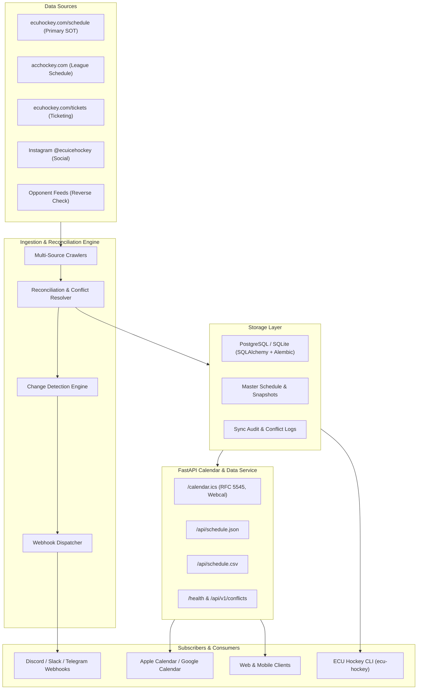
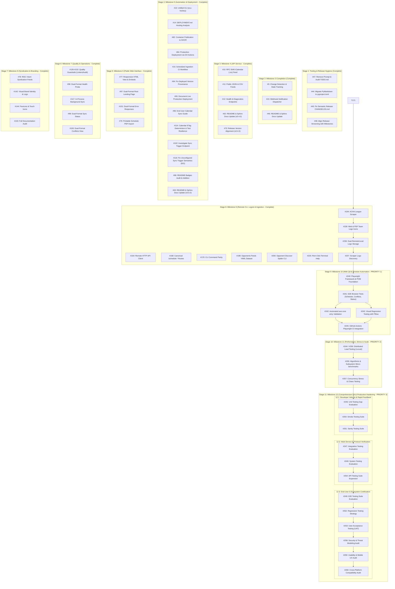

# Roadmap and Implementation Plan

<!--TOC-->

______________________________________________________________________

**Table of Contents**

- [1. System Architecture Overview](#1-system-architecture-overview)
- [2. Planned Milestones and Phases](#2-planned-milestones-and-phases)
  - [2.1. Milestone 1: v0.1.0 - Foundation & Core Architecture (Complete)](#21-milestone-1-v010---foundation--core-architecture-complete)
  - [2.2. Milestone 2: v0.2.0 - Storage Layer & Multi-Source Scrapers (Complete)](#22-milestone-2-v020---storage-layer--multi-source-scrapers-complete)
    - [2.2.1. Phase 2.1: Relational Persistence & Schema Migrations](#221-phase-21-relational-persistence--schema-migrations)
    - [2.2.2. Phase 2.2: Primary & League Web Crawlers](#222-phase-22-primary--league-web-crawlers)
    - [2.2.3. Phase 2.3: Social & Opponent Reverse Crawlers](#223-phase-23-social--opponent-reverse-crawlers)
  - [2.3. Milestone 3: v0.3.0 - Schedule Reconciliation, Change Detection & Alerts (Complete)](#23-milestone-3-v030---schedule-reconciliation-change-detection--alerts-complete)
    - [2.3.1. Phase 3.1: Tooling & Release Infrastructure Hygiene](#231-phase-31-tooling--release-infrastructure-hygiene)
    - [2.3.2. Phase 3.2: Reconciliation & Conflict Resolution Engine](#232-phase-32-reconciliation--conflict-resolution-engine)
    - [2.3.3. Phase 3.3: Change State Detection & Audit History](#233-phase-33-change-state-detection--audit-history)
    - [2.3.4. Phase 3.4: Webhook Notification Dispatcher](#234-phase-34-webhook-notification-dispatcher)
    - [2.3.5. Phase 3.5: Documentation Alignment](#235-phase-35-documentation-alignment)
  - [2.4. Milestone 4: v0.4.0 - Calendar & Data API Service](#24-milestone-4-v040---calendar--data-api-service)
    - [2.4.1. Phase 4.1: Public Calendar & Data Feeds](#241-phase-41-public-calendar--data-feeds)
    - [2.4.2. Phase 4.2: Diagnostics & Administration Endpoints](#242-phase-42-diagnostics--administration-endpoints)
    - [2.4.3. Phase 4.3: Documentation Alignment](#243-phase-43-documentation-alignment)
    - [2.4.4. Phase 4.4: Release Alignment & Milestone Reconciliation](#244-phase-44-release-alignment--milestone-reconciliation)
  - [2.5. Milestone 5: v0.5.0 - CLI, Automation & Production Deployment](#25-milestone-5-v050---cli-automation--production-deployment)
    - [2.5.1. Phase 5.1: Unified Command-Line Interface](#251-phase-51-unified-command-line-interface)
    - [2.5.2. Phase 5.2: Production Deployment Strategy & Hosting Analysis](#252-phase-52-production-deployment-strategy--hosting-analysis)
    - [2.5.3. Phase 5.3: Automated Container Build & Registry Publication to ghcr.io](#253-phase-53-automated-container-build--registry-publication-to-ghcrio)
    - [2.5.4. Phase 5.4: Automated Production Deployment to Hosting Service](#254-phase-54-automated-production-deployment-to-hosting-service)
    - [2.5.5. Phase 5.5: Scheduled Automation & CI Sync Workflows (Complete)](#255-phase-55-scheduled-automation--ci-sync-workflows-complete)
    - [2.5.6. Phase 5.6: GitHub Pages Documentation & Static Calendar Deployment (Complete)](#256-phase-56-github-pages-documentation--static-calendar-deployment-complete)
    - [2.5.7. Phase 5.7: Build Version Provenance & Deployed Version Reporting (Complete)](#257-phase-57-build-version-provenance--deployed-version-reporting-complete)
    - [2.5.8. Phase 5.8: Production Service Documentation & End-User Onboarding](#258-phase-58-production-service-documentation--end-user-onboarding)
    - [2.5.9. Phase 5.9: Calendar Feed Determinism & CI Test Resilience](#259-phase-59-calendar-feed-determinism--ci-test-resilience)
    - [2.5.10. Phase 5.10: Administrative Endpoint Behavior Audit](#2510-phase-510-administrative-endpoint-behavior-audit)
    - [2.5.11. Phase 5.11: Unconfigured Sync Trigger Response Semantics](#2511-phase-511-unconfigured-sync-trigger-response-semantics)
    - [2.5.12. Phase 5.12: Repository Badges & Status Indicators](#2512-phase-512-repository-badges--status-indicators)
    - [2.5.13. Phase 5.13: Documentation Alignment](#2513-phase-513-documentation-alignment)
  - [2.6. Milestone 6: v0.6.0 - Public Web Interface & Fan Engagement](#26-milestone-6-v060---public-web-interface--fan-engagement)
    - [2.6.1. Phase 6.1: Responsive HTML Interface & Embeds](#261-phase-61-responsive-html-interface--embeds)
    - [2.6.2. Phase 6.2: Dual-Format Content Negotiation Foundation](#262-phase-62-dual-format-content-negotiation-foundation)
    - [2.6.3. Phase 6.3: Negotiated Error Responses](#263-phase-63-negotiated-error-responses)
    - [2.6.4. Phase 6.4: Printable Schedule Grid PDF Generation](#264-phase-64-printable-schedule-grid-pdf-generation)
  - [2.7. Milestone 7: v0.7.0 - Quality Hardening, Operations & Diagnostics](#27-milestone-7-v070---quality-hardening-operations--diagnostics)
    - [2.7.1. Phase 7.1: Multi-Format Tooling & Quality Gate Hardening](#271-phase-71-multi-format-tooling--quality-gate-hardening)
    - [2.7.2. Phase 7.2: Operational Health Diagnostics Dashboard](#272-phase-72-operational-health-diagnostics-dashboard)
    - [2.7.3. Phase 7.3: In-Process Background Synchronization Engine](#273-phase-73-in-process-background-synchronization-engine)
    - [2.7.4. Phase 7.4: Synchronization Telemetry & Interactive Controls Dashboard](#274-phase-74-synchronization-telemetry--interactive-controls-dashboard)
    - [2.7.5. Phase 7.5: Administrative Conflict Triage Interface](#275-phase-75-administrative-conflict-triage-interface)
  - [2.8. Milestone 8: v0.8.0 - Syndication & Integrations](#28-milestone-8-v080---syndication--integrations)
    - [2.8.1. Phase 8.1: RSS / Atom Syndication Feeds](#281-phase-81-rss--atom-syndication-feeds)
    - [2.8.2. Phase 8.2: Visual Brand Identity & Project Logo Assets](#282-phase-82-visual-brand-identity--project-logo-assets)
    - [2.8.3. Phase 8.3: Browser Favicons & Web Application Touch Icons](#283-phase-83-browser-favicons--web-application-touch-icons)
    - [2.8.4. Phase 8.4: Comprehensive Documentation Audit & Reconciliation](#284-phase-84-comprehensive-documentation-audit--reconciliation)
  - [2.9. Milestone 9: v0.9.0 - Remote CLI & Operational Tooling](#29-milestone-9-v090---remote-cli--operational-tooling)
    - [2.9.1. Phase 9.1: Remote HTTP API Client Integration](#291-phase-91-remote-http-api-client-integration)
    - [2.9.2. Phase 9.2: Conflict Detection Transition Query Reconciliation](#292-phase-92-conflict-detection-transition-query-reconciliation)
    - [2.9.3. Phase 9.3: Canonical Schedule Routes, Legacy Aliasing & Parameter Normalization](#293-phase-93-canonical-schedule-routes-legacy-aliasing--parameter-normalization)
    - [2.9.4. Phase 9.4: Clean WebUI Dashboard Routes & Health REST Parity](#294-phase-94-clean-webui-dashboard-routes--health-rest-parity)
    - [2.9.5. Phase 9.5: CLI Command Parity & Options Alignment](#295-phase-95-cli-command-parity--options-alignment)
    - [2.9.6. Phase 9.6: Interface Consistency Documentation & Test Suite Reconciliation](#296-phase-96-interface-consistency-documentation--test-suite-reconciliation)
    - [2.9.7. Phase 9.7: Code Quality Hardening & Rule Tuning](#297-phase-97-code-quality-hardening--rule-tuning)
    - [2.9.8. Phase 9.8: Brand Asset Automation & UI Layout Polish](#298-phase-98-brand-asset-automation--ui-layout-polish)
    - [2.9.9. Phase 9.9: Ingestion Scraper Discovery, Parsing & Multi-League Coverage](#299-phase-99-ingestion-scraper-discovery-parsing--multi-league-coverage)
    - [2.9.10. Phase 9.10: Opponent Schedule Feeds & Auto-Discovery Framework](#2910-phase-910-opponent-schedule-feeds--auto-discovery-framework)
    - [2.9.11. Phase 9.11: Multi-Source Reconciliation Precision & Conflict Management](#2911-phase-911-multi-source-reconciliation-precision--conflict-management)
    - [2.9.12. Phase 9.12: Team Logo Assets, Remote/Local Storage & Terminal Styling](#2912-phase-912-team-logo-assets-remotelocal-storage--terminal-styling)
  - [2.10. Milestone 10: v0.10.0 - Web Quality Assurance & Browser Automation](#210-milestone-10-v0100---web-quality-assurance--browser-automation)
    - [2.10.1. Phase 10.1: Test Infrastructure & Base Page Object Model Foundation](#2101-phase-101-test-infrastructure--base-page-object-model-foundation)
    - [2.10.2. Phase 10.2: End-to-End Browser Testing for Schedule, Conflicts, and Status Views](#2102-phase-102-end-to-end-browser-testing-for-schedule-conflicts-and-status-views)
    - [2.10.3. Phase 10.3: Automated Accessibility (a11y) Validation with axe-core](#2103-phase-103-automated-accessibility-a11y-validation-with-axe-core)
    - [2.10.4. Phase 10.4: Visual Regression & Component Snapshot Comparisons with Pillow](#2104-phase-104-visual-regression--component-snapshot-comparisons-with-pillow)
    - [2.10.5. Phase 10.5: CI/CD Pipeline Automation & Test Matrix Integration](#2105-phase-105-cicd-pipeline-automation--test-matrix-integration)
  - [2.11. Milestone 11: v0.11.0 - Performance, Stress & Scale Verification](#211-milestone-11-v0110---performance-stress--scale-verification)
    - [2.11.1. Phase 11.1: Distributed Performance & Load Testing Framework with Locust](#2111-phase-111-distributed-performance--load-testing-framework-with-locust)
    - [2.11.2. Phase 11.2: Subsystem & Algorithmic Micro-benchmarking](#2112-phase-112-subsystem--algorithmic-micro-benchmarking)
    - [2.11.3. Phase 11.3: Concurrency Stress & Chaos Resiliency](#2113-phase-113-concurrency-stress--chaos-resiliency)
  - [2.12. Milestone 12: v1.0.0 - Comprehensive QA Evaluation & Production Hardening](#212-milestone-12-v100---comprehensive-qa-evaluation--production-hardening)
    - [2.12.1. Phase 12.1: Developer Experience & Rapid Feedback Loops (Unit, Smoke, Sanity)](#2121-phase-121-developer-experience--rapid-feedback-loops-unit-smoke-sanity)
    - [2.12.2. Phase 12.2: Multi-Service & Protocol Verification (Integration, System, API)](#2122-phase-122-multi-service--protocol-verification-integration-system-api)
    - [2.12.3. Phase 12.3: End-User & Ecosystem Certification (E2E, Regression, UAT, Security, Usability, Compatibility)](#2123-phase-123-end-user--ecosystem-certification-e2e-regression-uat-security-usability-compatibility)
- [3. CodeQL Security & Quality Audit Trail](#3-codeql-security--quality-audit-trail)
- [4. Implementation Sequencing & Dependency Graph](#4-implementation-sequencing--dependency-graph)
  - [4.1. Sequencing Rationale](#41-sequencing-rationale)
- [5. Traceability & Dual Synchronization Index](#5-traceability--dual-synchronization-index)
  - [5.1. GitHub Issues Traceability Matrix](#51-github-issues-traceability-matrix)
  - [5.2. GitHub Pull Requests Traceability Matrix](#52-github-pull-requests-traceability-matrix)

______________________________________________________________________

<!--TOC-->

This document establishes the canonical implementation roadmap and tracking plan for the **ECU Ice Hockey Schedule Aggregator & Calendar Service**.

______________________________________________________________________

## 1. System Architecture Overview

The platform is designed around three decoupled, production-grade core tiers:

1. **Data Ingestion & Cross-Reference Engine (Worker):** Periodically scrapes multiple upstream sources, reconciles discrepancies, detects atomic changes (`CREATED`, `UPDATED`, `DELETED`, `CONFLICT_DETECTED`), and triggers webhook alerts.
2. **Calendar & Data API (FastAPI Application):** Lightweight, high-performance web service delivering RFC 5545 compliant `.ics` feeds (with `webcal://` support), normalized JSON feeds, and downloadable CSV exports.
3. **Storage & Persistence Layer:** Relational database (PostgreSQL in production, SQLite in development) managed with SQLAlchemy 2.0 and Alembic migrations, archiving raw source snapshots and synchronization audits.

______________________________________________________________________

## 2. Planned Milestones and Phases

### 2.1. Milestone 1: v0.1.0 - Foundation & Core Architecture (Complete)

- [x] Configure native `uv` project with dynamic versioning (`hatchling` + `hatch-vcs`) (Merged in [PR #1](https://github.com/bdperkin/ecu-hockey-calendar/pull/1)).
- [x] Implement strict `ruff` and `ty` type checking configurations (Merged in [PR #1](https://github.com/bdperkin/ecu-hockey-calendar/pull/1)).
- [x] Establish comprehensive test suite with 100% test and branch coverage (Merged in [PR #1](https://github.com/bdperkin/ecu-hockey-calendar/pull/1)).
- [x] Set up Sphinx documentation with markdown (`myst-parser`) and Furo theme (Merged in [PR #1](https://github.com/bdperkin/ecu-hockey-calendar/pull/1)).
- [x] Implement quality linters: Pylint (10.00/10), Codespell, Interrogate, Deptry, Vulture, Radon/Xenon (Merged in [PR #1](https://github.com/bdperkin/ecu-hockey-calendar/pull/1)).
- [x] Configure comprehensive pre-commit suite (73 hooks) and pre-commit.ci (Merged in [PR #1](https://github.com/bdperkin/ecu-hockey-calendar/pull/1)).
- [x] Configure GitHub Actions CI matrix, CodeQL security analysis, Dependabot, and Semantic Release (Merged in [PR #1](https://github.com/bdperkin/ecu-hockey-calendar/pull/1), [PR #20](https://github.com/bdperkin/ecu-hockey-calendar/pull/20), [PR #21](https://github.com/bdperkin/ecu-hockey-calendar/pull/21), Dependabot PRs [#27](https://github.com/bdperkin/ecu-hockey-calendar/pull/27), [#28](https://github.com/bdperkin/ecu-hockey-calendar/pull/28), [#29](https://github.com/bdperkin/ecu-hockey-calendar/pull/29), [#30](https://github.com/bdperkin/ecu-hockey-calendar/pull/30), [#31](https://github.com/bdperkin/ecu-hockey-calendar/pull/31)).
- [x] Configure repository settings (disable Projects & Wiki, enable auto-merge, branch protection) (Merged in [PR #1](https://github.com/bdperkin/ecu-hockey-calendar/pull/1)).
- [x] Integrate scraper specification and roadmap into `TODO.md` (Merged in [PR #17](https://github.com/bdperkin/ecu-hockey-calendar/pull/17)).

### 2.2. Milestone 2: v0.2.0 - Storage Layer & Multi-Source Scrapers (Complete)

#### 2.2.1. Phase 2.1: Relational Persistence & Schema Migrations

- [x] **[#2](https://github.com/bdperkin/ecu-hockey-calendar/issues/2) - feat(storage): implement SQLAlchemy models and Alembic migration pipeline** (Merged in [PR #24](https://github.com/bdperkin/ecu-hockey-calendar/pull/24))
  - **Summary:** Set up SQLAlchemy 2.0 ORM models for games, teams, sources, raw snapshots, and sync audits.
  - **Description:** Support PostgreSQL for production and SQLite for local development. Define `Team`, `Game`, `DataSource`, `RawSnapshot`, and `SyncAudit` tables. Configure Alembic migration environment with automated schema generation.
- [x] **[#25](https://github.com/bdperkin/ecu-hockey-calendar/issues/25) - fix(security): resolve CodeQL security and quality code scanning alerts** (Merged in [PR #26](https://github.com/bdperkin/ecu-hockey-calendar/pull/26))
  - **Summary:** Resolve 7 CodeQL code scanning alerts (Alerts #1–#4 `py/unused-global-variable`, Alerts #5–#6 `py/unreachable-statement`, Alert #7 `py/unused-import`).
  - **Description:** Add explicit `__all__` exports in Alembic migrations and `alembic/env.py`, and refactor session rollback test blocks to use explicit exception handling.

#### 2.2.2. Phase 2.2: Primary & League Web Crawlers

- [x] **[#3](https://github.com/bdperkin/ecu-hockey-calendar/issues/3) - feat(ingestion): build resilient crawler for primary ECU Hockey schedule site** (Merged in [PR #32](https://github.com/bdperkin/ecu-hockey-calendar/pull/32))
  - **Summary:** Build asynchronous crawler for `https://www.ecuhockey.com/schedule/upcoming`.
  - **Description:** Implement `httpx` + `BeautifulSoup4` parser with retry and backoff logic. Extract dates, times, home/away status, opponents, venues, scores, and game status.
- [x] **[#4](https://github.com/bdperkin/ecu-hockey-calendar/issues/4) - feat(ingestion): implement ACC Hockey league schedule page parser** (Merged in [PR #33](https://github.com/bdperkin/ecu-hockey-calendar/pull/33))
  - **Summary:** Ingest conference games and scores from `https://www.acchockey.com/page/show/9602441-east-carolina`.
  - **Description:** Handle SportEngine markup, normalize opponent names, and capture official conference verification metadata.
- [x] **[#5](https://github.com/bdperkin/ecu-hockey-calendar/issues/5) - feat(ingestion): parse ticket sales page for game schedules and promotions** (Merged in [PR #34](https://github.com/bdperkin/ecu-hockey-calendar/pull/34))
  - **Summary:** Scrape ticketing information from `https://www.ecuhockey.com/tickets`.
  - **Description:** Extract home games, promotional theme nights, ticket pricing, and ticketing links to enrich calendar event descriptions.
- [x] **fix(ingestion): resolve CodeQL alerts for fallback parser exception handling** (Merged in [PR #35](https://github.com/bdperkin/ecu-hockey-calendar/pull/35))
  - **Summary:** Resolve CodeQL Alerts #8 and #9 (`py/empty-except`) in fallback ingestion parser.
  - **Description:** Add explanatory comments and structured logger debug warnings inside empty fallback exception blocks.

#### 2.2.3. Phase 2.3: Social & Opponent Reverse Crawlers

- [x] **[#6](https://github.com/bdperkin/ecu-hockey-calendar/issues/6) - feat(ingestion): create resilient Instagram feed parser for game announcements** (Merged in [PR #36](https://github.com/bdperkin/ecu-hockey-calendar/pull/36))
  - **Summary:** Extract schedule announcements and time changes from `https://www.instagram.com/ecuicehockey/`.
  - **Description:** Integrate Instagram Graph API / resilient feed parser with exponential backoff and rate-limit mitigation.
- [x] **[#7](https://github.com/bdperkin/ecu-hockey-calendar/issues/7) - feat(ingestion): automated opponent schedule reverse lookup and cross-check** (Merged in [PR #37](https://github.com/bdperkin/ecu-hockey-calendar/pull/37))
  - **Summary:** Automatically query and cross-verify preliminary game data against opponent schedule sources.
  - **Description:** Maintain opponent directory (UNC, NC State, Virginia Tech, Wake Forest, etc.) and cross-check dates, venues, and times.

### 2.3. Milestone 3: v0.3.0 - Schedule Reconciliation, Change Detection & Alerts (Complete)

#### 2.3.1. Phase 3.1: Tooling & Release Infrastructure Hygiene

- [x] **[#47](https://github.com/bdperkin/ecu-hockey-calendar/issues/47) - chore(roadmap): remove ecu_hockey_scraper_prompt.md and perform comprehensive TODO.md audit** (Merged in [PR #49](https://github.com/bdperkin/ecu-hockey-calendar/pull/49))
  - **Summary:** Remove obsolete prompt document, reconcile all open/closed issues and PRs, and optimize implementation ordering.
  - **Description:** Clean up repository root, ensure bidirectional traceability across all issues and PRs, and sequence development milestones for maximum velocity.
- [x] **[#44](https://github.com/bdperkin/ecu-hockey-calendar/issues/44) - chore(tooling): migrate PyMarkdown configuration from .pymarkdown.json into pyproject.toml** (Merged in [PR #52](https://github.com/bdperkin/ecu-hockey-calendar/pull/52))
  - **Summary:** Consolidate markdown linter configuration into native `pyproject.toml`.
  - **Description:** Add `[tool.pymarkdown]` section to `pyproject.toml`, remove `.pymarkdown.json`, and update pre-commit / CI invocations.
- [x] **[#45](https://github.com/bdperkin/ecu-hockey-calendar/issues/45) - fix(ci): investigate and resolve why CHANGELOG.md is not updated by Python Semantic Release** (Merged in [PR #54](https://github.com/bdperkin/ecu-hockey-calendar/pull/54), pre-commit hook fixed in [PR #56](https://github.com/bdperkin/ecu-hockey-calendar/pull/56))
  - **Summary:** Configure PSR changelog update insertion markers, repository secrets, and CI release permissions.
  - **Description:** Add `<!-- version list -->` insertion flag to `CHANGELOG.md`, backfill historical release entries, configure `RELEASE_TOKEN` secret for branch protection bypass, and exclude `CHANGELOG.md` from markdown pre-commit hooks.
- [x] **[#48](https://github.com/bdperkin/ecu-hockey-calendar/issues/48) - fix(release): diagnose and align release versioning with project milestones (currently at v0.8.2 instead of v0.2.0)** (Merged in [PR #57](https://github.com/bdperkin/ecu-hockey-calendar/pull/57))
  - **Summary:** Align project version tags and package metadata with planned milestones.
  - **Description:** Adjust tag namespace and reset release version progression so that Milestone 3 releases as `v0.3.0`.

#### 2.3.2. Phase 3.2: Reconciliation & Conflict Resolution Engine

- [x] **[#8](https://github.com/bdperkin/ecu-hockey-calendar/issues/8) - feat(reconciliation): multi-source schedule cross-referencing and conflict resolution engine** (Merged in [PR #38](https://github.com/bdperkin/ecu-hockey-calendar/pull/38), fixed in [PR #40](https://github.com/bdperkin/ecu-hockey-calendar/pull/40) & [PR #42](https://github.com/bdperkin/ecu-hockey-calendar/pull/42))
  - **Summary:** Cross-reference data across disparate sources using deterministic and fuzzy scoring.
  - **Description:** Enforce configurable precedence hierarchy (Primary SOT + League > Ticketing/Social > Opponent). Detect discrepancies and flag high-confidence conflicts for review.
- [x] **[#39](https://github.com/bdperkin/ecu-hockey-calendar/issues/39) - fix(security): resolve CodeQL alert 12 for unused global variable in fuzzy_matcher** (Merged in [PR #40](https://github.com/bdperkin/ecu-hockey-calendar/pull/40))
  - **Summary:** Export `GENERIC_COLLEGE_TERMS` in `fuzzy_matcher.py` `__all__`.
  - **Description:** Resolve CodeQL `py/unused-global-variable` alert and verify tuple contents with unit tests.
- [x] **[#41](https://github.com/bdperkin/ecu-hockey-calendar/issues/41) - fix(security): resolve CodeQL alert 13 for import and import-from in test_reconciliation_fuzzy_matcher** (Merged in [PR #42](https://github.com/bdperkin/ecu-hockey-calendar/pull/42), roadmap updated in [PR #43](https://github.com/bdperkin/ecu-hockey-calendar/pull/43))
  - **Summary:** Remove redundant module alias import in reconciliation test suite.
  - **Description:** Resolve CodeQL `py/import-and-import-from` alert while preserving test coverage.

#### 2.3.3. Phase 3.3: Change State Detection & Audit History

- [x] **[#9](https://github.com/bdperkin/ecu-hockey-calendar/issues/9) - feat(reconciliation): change detection and sync state tracking engine** (Merged in [PR #58](https://github.com/bdperkin/ecu-hockey-calendar/pull/58))
  - **Summary:** Track atomic game state transitions (`CREATED`, `UPDATED`, `DELETED`, `CONFLICT_DETECTED`).
  - **Description:** Generate field-level diffs, store historical snapshots, and log sync cycle audits.

#### 2.3.4. Phase 3.4: Webhook Notification Dispatcher

- [x] **[#15](https://github.com/bdperkin/ecu-hockey-calendar/issues/15) - feat(notifications): multi-platform webhook alerting for schedule updates and conflicts** (Merged in [PR #60](https://github.com/bdperkin/ecu-hockey-calendar/pull/60))
  - **Summary:** Broadcast rich notifications to Discord, Slack, and Telegram channels.
  - **Description:** Dispatch formatted embeds for schedule additions, game updates, cancellations, and active conflict alerts.

#### 2.3.5. Phase 3.5: Documentation Alignment

- [x] **[#46](https://github.com/bdperkin/ecu-hockey-calendar/issues/46) - docs: update README.md and Sphinx documentation to reflect current project capabilities**
  - **Summary:** Update `README.md` and Sphinx docs in `docs/` to reflect current project capabilities.
  - **Description:** Document multi-source crawler architecture, SQLAlchemy persistence layer, reconciliation engine, change detection, and webhook notifications with usage examples.

### 2.4. Milestone 4: v0.4.0 - Calendar & Data API Service

#### 2.4.1. Phase 4.1: Public Calendar & Data Feeds

- [x] **[#10](https://github.com/bdperkin/ecu-hockey-calendar/issues/10) - feat(api): RFC 5545 iCalendar (.ics) subscription endpoint and webcal support**
  - **Summary:** Provide `/calendar.ics` adhering strictly to RFC 5545 with `webcal://` subscription support.
  - **Description:** Full compatibility with Apple Calendar, Google Calendar, and Outlook with deterministic UIDs, alarms, locations, and descriptions.
- [x] **[#11](https://github.com/bdperkin/ecu-hockey-calendar/issues/11) - feat(api): public JSON and CSV master schedule data feeds**
  - **Summary:** Provide machine-readable `/api/schedule.json` and downloadable `/api/schedule.csv`.
  - **Description:** Normalized feeds with query filters (`season`, `opponent`, `home_only`, `status`) and OpenAPI interactive documentation.

#### 2.4.2. Phase 4.2: Diagnostics & Administration Endpoints

- [x] **[#12](https://github.com/bdperkin/ecu-hockey-calendar/issues/12) - feat(api): health check, sync diagnostics, and conflict review endpoints**
  - **Summary:** Provide operational endpoints for system health, sync telemetry, and conflict review.
  - **Description:** Implement `/health`, `/api/v1/sync/status`, and `/api/v1/conflicts` with authentication for administrative actions.

#### 2.4.3. Phase 4.3: Documentation Alignment

- [x] **[#62](https://github.com/bdperkin/ecu-hockey-calendar/issues/62) - docs: update README.md and Sphinx documentation to reflect current project capabilities**
  - **Summary:** Update `README.md` and Sphinx docs in `docs/` to reflect public API endpoints and calendar feeds.
  - **Description:** Document `/calendar.ics`, `/api/schedule.json`, `/api/schedule.csv`, OpenAPI `/docs`, and administration diagnostics endpoints.

#### 2.4.4. Phase 4.4: Release Alignment & Milestone Reconciliation

- [x] **[#73](https://github.com/bdperkin/ecu-hockey-calendar/issues/73) - fix(release): diagnose and align release versioning with project milestones (currently at v0.2.7 instead of v0.4.0)**
  - **Summary:** Reconcile repository releases and git tags with completed milestones (v0.2.0, v0.3.0, v0.4.0) and fix PSR minor bumping.
  - **Description:** Resolve discrepancy between PSR parser rules, conventional-commit types, and workflow triggers to ensure Milestone 4 is released as `v0.4.0` and pre-1.0 milestone versioning is preserved.

### 2.5. Milestone 5: v0.5.0 - CLI, Automation & Production Deployment

#### 2.5.1. Phase 5.1: Unified Command-Line Interface

- [x] **[#13](https://github.com/bdperkin/ecu-hockey-calendar/issues/13) - feat(cli): command-line interface for schedule sync, inspection, and export**
  - **Summary:** Rich CLI interface (`ecu-hockey`) with subcommands: `sync`, `status`, `export`, `conflicts`, and `serve`.
  - **Description:** Provide interactive terminal output using `rich` for formatting, status tables, and diagnostics.

#### 2.5.2. Phase 5.2: Production Deployment Strategy & Hosting Analysis

- [x] **[#14](https://github.com/bdperkin/ecu-hockey-calendar/issues/14) - docs(deployment): architectural hosting analysis and production deployment guide**
  - **Summary:** Author `DEPLOYMENT.md` evaluating hosting providers, architecture, and operational practices.
  - **Description:** Compare Render, Railway, Fly.io, and AWS Lambda + EventBridge. Address Instagram rate limits, proxy rotation, persistent database volumes, SSL certificates, and container configuration.

#### 2.5.3. Phase 5.3: Automated Container Build & Registry Publication to ghcr.io

- [x] **[#82](https://github.com/bdperkin/ecu-hockey-calendar/issues/82) - ci(docker): automated publication of production container images to ghcr.io via GitHub Actions**
  - **Summary:** GitHub Actions CI/CD workflow to build multi-arch container images and publish them to GitHub Container Registry (`ghcr.io`).
  - **Description:** Build `linux/amd64` and `linux/arm64` images using `docker/build-push-action`, authenticate via `GITHUB_TOKEN`, extract semantic tags with `docker/metadata-action`, validate builds on pull requests without pushing, and publish on tagged releases.

#### 2.5.4. Phase 5.4: Automated Production Deployment to Hosting Service

- [x] **[#84](https://github.com/bdperkin/ecu-hockey-calendar/issues/84) - ci(deploy): automated production deployment to hosting service via GitHub Actions using container images**
  - **Summary:** Continuous deployment GitHub Actions workflow to deploy container images to a hosting provider.
  - **Description:** Implement `.github/workflows/deploy.yml` triggered on container publication or manual dispatch, execute database schema migrations (`alembic upgrade head`), and verify post-deployment `/health` probe.

#### 2.5.5. Phase 5.5: Scheduled Automation & CI Sync Workflows (Complete)

- [x] **[#16](https://github.com/bdperkin/ecu-hockey-calendar/issues/16) - ci(automation): automated scheduled ingestion and calendar release workflow**
  - **Summary:** GitHub Actions scheduled workflow running periodic syncs and publishing static calendar releases.
  - **Description:** Automate periodic schedule checks, publish calendar artifacts, and trigger webhooks on changes.

#### 2.5.6. Phase 5.6: GitHub Pages Documentation & Static Calendar Deployment (Complete)

- [x] **[#18](https://github.com/bdperkin/ecu-hockey-calendar/issues/18) - ci(pages): automated GitHub Pages deployment to `https://bdperkin.github.io/ecu-hockey-calendar/`** (Merged in [PR #19](https://github.com/bdperkin/ecu-hockey-calendar/pull/19), [PR #22](https://github.com/bdperkin/ecu-hockey-calendar/pull/22), [PR #23](https://github.com/bdperkin/ecu-hockey-calendar/pull/23))
  - **Summary:** Configure automated Sphinx documentation and static calendar asset publishing to GitHub Pages.
  - **Description:** Implement `.github/workflows/pages.yml` with `actions/upload-pages-artifact` and `actions/deploy-pages`. Build Sphinx documentation with Furo theme and publish static calendar artifacts (`calendar.ics`, `schedule.json`, `schedule.csv`) to `https://bdperkin.github.io/ecu-hockey-calendar/`.

#### 2.5.7. Phase 5.7: Build Version Provenance & Deployed Version Reporting (Complete)

- [x] **[#94](https://github.com/bdperkin/ecu-hockey-calendar/issues/94) - fix(packaging): resolve fallback version 0.1.0.dev0 reported by containerized API and deployments**
  - **Summary:** Propagate the real `hatch-vcs` version into container builds so deployed services stop reporting the `0.1.0.dev0` fallback.
  - **Description:** Stamp builds via `SETUPTOOLS_SCM_PRETEND_VERSION_FOR_ECU_HOCKEY_CALENDAR` using a `Dockerfile` build argument supplied by `.github/workflows/docker.yml`, keeping `.git` excluded from the build context. Consolidate the divergent hardcoded fallbacks in `src/ecu_hockey_calendar/__init__.py`, `src/ecu_hockey_calendar/api/app.py`, and `docs/conf.py` into a single shared resolver with an unmistakable non-release sentinel, and add regression and deployment smoke coverage asserting `/` and `/openapi.json` report the true release version.

#### 2.5.8. Phase 5.8: Production Service Documentation & End-User Onboarding

- [x] **[#95](https://github.com/bdperkin/ecu-hockey-calendar/issues/95) - docs(deployment): document live production deployment at ecu-hockey-api.onrender.com with full endpoint reference (Complete)**
  - **Summary:** Document the live production service at `https://ecu-hockey-api.onrender.com/` across `README.md`, `DEPLOYMENT.md`, and `docs/deployment.md`.
  - **Description:** Add a concise deployment summary and subscription URL to `README.md`, and a comprehensive reference to `DEPLOYMENT.md` and `docs/deployment.md` covering every endpoint (`/`, `/health`, `/calendar.ics`, `/api/schedule.json`, `/api/schedule.csv`, `/api/v1/sync/status`, `/api/v1/sync/trigger`, `/api/v1/conflicts`, `/docs`, `/redoc`, `/openapi.json`) with methods, content types, authentication, and query parameters. Document the deployed Render topology (web service, six-hourly cron worker, managed PostgreSQL), correct the stale `ecu-hockey.onrender.com` placeholder, and surface the public base URL in `docs/api_service.md`, `docs/quickstart.md`, and `docs/index.md`.
- [x] **[#96](https://github.com/bdperkin/ecu-hockey-calendar/issues/96) - docs(calendar): add end-user ECU Hockey Calendar Sync Guide for Google, Apple, and Outlook subscriptions (Complete)**
  - **Summary:** Publish a non-technical, step-by-step guide for subscribing to the live schedule feed in Google Calendar, Apple Calendar, and Outlook.
  - **Description:** Add `docs/calendar_sync.md` to the Sphinx toctree with numbered per-client instructions for the production HTTPS feed (`https://ecu-hockey-api.onrender.com/calendar.ics`) and the macOS/iOS instant subscription URL (`webcal://ecu-hockey-api.onrender.com/calendar.ics`), a one-click `?webcal=true` subscribe link, optional `season`, `include_past`, and `alarm_minutes` filters, and a troubleshooting FAQ covering refresh cadence and cold-start latency. Document the equivalent local development flow, add a concise subscribe section to `README.md`, and replace the `your-domain.com` placeholders in `docs/api_service.md` with cross-links to the guide.

#### 2.5.9. Phase 5.9: Calendar Feed Determinism & CI Test Resilience

- [x] **[#114](https://github.com/bdperkin/ecu-hockey-calendar/issues/114) - fix(api): resolve second-boundary race condition in calendar ETag generation and add CI test resilience (Complete)**
  - **Summary:** Stabilize `/calendar.ics` conditional caching across clock ticks by passing `last_mod_dt` as `dtstamp_override` and adding pytest retry support.
  - **Description:** Address the second-boundary race condition where `generate_ics_feed` injected `datetime.now(UTC)` into every `VEVENT`, causing ETags to mutate every second on identical schedule records. Pre-compute `last_mod_dt` and pass it as `dtstamp_override` to guarantee deterministic ETag calculation across requests when games are unchanged, and introduce `pytest-rerunfailures` with `--reruns 2 --reruns-delay 1` in CI workflows for test suite resilience.

#### 2.5.10. Phase 5.10: Administrative Endpoint Behavior Audit

- [x] **[#102](https://github.com/bdperkin/ecu-hockey-calendar/issues/102) - investigate(api): determine intended behavior of POST /api/v1/sync/trigger and whether it warrants dual-format responses**

  - **Summary:** Investigate why `POST /api/v1/sync/trigger` reports success while performing no synchronization, and recommend the correct behavior before considering an HTML interface.
  - **Description:** `trigger_sync_cycle` dispatches through an optional `app.state.sync_trigger_handler` hook that `create_app` never assigns, so production requests return `202 Accepted` with a success message and an unused `sync_cycle_id` while no crawl runs. Determine whether this is intentional, weigh real trigger mechanisms against the split web/cron service topology and scraper rate limits, decide the honest response semantics when no mechanism is wired, and only then evaluate dual-format output versus a dashboard "Sync now" control. Raise follow-up implementation issues for the conclusions.
  - **Findings:** Investigation completed (see [report](https://github.com/bdperkin/ecu-hockey-calendar/issues/102#issuecomment-5627626890)). Confirmed production no-op is an unintended defect. Recommended honest `501 Not Implemented` semantics when unconfigured ([#116](https://github.com/bdperkin/ecu-hockey-calendar/issues/116)), opt-in in-process background execution via FastAPI `BackgroundTasks` with concurrency locking and rate-limiting cooldown for v0.7.0 ([#117](https://github.com/bdperkin/ecu-hockey-calendar/issues/117)), and rejected dual-format HTML on `POST` in favor of an interactive dashboard control on the [#99](https://github.com/bdperkin/ecu-hockey-calendar/issues/99) status dashboard.

#### 2.5.11. Phase 5.11: Unconfigured Sync Trigger Response Semantics

- [x] **[#116](https://github.com/bdperkin/ecu-hockey-calendar/issues/116) - fix(api): return 501 Not Implemented from POST /api/v1/sync/trigger when no trigger handler is registered**

  - **Summary:** Return HTTP `501 Not Implemented` instead of `202 Accepted` when `app.state.sync_trigger_handler` is unconfigured.
  - **Description:** In default and production configurations, `POST /api/v1/sync/trigger` returns `202 Accepted` with `"Synchronization cycle triggered successfully."` while executing no crawlers, reconciliation, or audit recording. Update the route handler to inspect `sync_trigger_handler` and return `HTTP 501 Not Implemented` with an explanatory error payload when no handler is registered. Update unit tests in `tests/test_api_health_diagnostics.py` to assert `501` semantics, and align `docs/api.md` and `DEPLOYMENT.md` endpoint inventories.

#### 2.5.12. Phase 5.12: Repository Badges & Status Indicators

- [x] **[#86](https://github.com/bdperkin/ecu-hockey-calendar/issues/86) - docs(readme): audit project and implement missing status, quality, and technology badges**
  - **Summary:** Audit project workflows, security, and dependencies, and add missing badges to `README.md`.
  - **Description:** Identify and incorporate status badges for GitHub Pages documentation, CodeQL security scanning, pre-commit.ci, dependency review, semantic release, FastAPI, SQLAlchemy, and license/security policies into logically organized badge sections.

#### 2.5.13. Phase 5.13: Documentation Alignment

- [x] **[#63](https://github.com/bdperkin/ecu-hockey-calendar/issues/63) - docs: update README.md and Sphinx documentation to reflect current project capabilities**
  - **Summary:** Update `README.md` and Sphinx docs in `docs/` to reflect end-to-end capabilities, CLI, and production deployment.
  - **Description:** Document `ecu-hockey` CLI subcommands, production deployment guides, static GitHub Pages calendar feeds, container publication, and automated CI workflows.

### 2.6. Milestone 6: v0.6.0 - Public Web Interface & Fan Engagement

#### 2.6.1. Phase 6.1: Responsive HTML Interface & Embeds

- [x] **[#77](https://github.com/bdperkin/ecu-hockey-calendar/issues/77) - feat(web): responsive HTML schedule view and embeddable iframe widget**
  - **Summary:** Mobile-first HTML schedule view and lightweight embeddable iframe route powered by Jinja2 templates.
  - **Description:** Provide `/schedule` web interface with ECU branding, fixture cards, and ticket links, plus `/schedule/embed` stripped-down widget and iframe snippet for external community sites.

#### 2.6.2. Phase 6.2: Dual-Format Content Negotiation Foundation

- [x] **[#97](https://github.com/bdperkin/ecu-hockey-calendar/issues/97) - feat(api): content-negotiated HTML and JSON responses for service status endpoint (/)**

  - **Summary:** Serve both `application/json` and `text/html; charset=utf-8` from `GET /`, and establish the shared content negotiation and Jinja2 templating foundation.
  - **Description:** Add the `jinja2` runtime dependency, a packaged `src/ecu_hockey_calendar/api/templates/` directory, a `negotiation.py` helper implementing `Accept` q-value ranking with a `?format=` override and `Vary: Accept`, and an ECU-branded responsive `base.html` layout with a shared "View as JSON" control and pretty-printed payload panel. Render the service status page with the `endpoints` map as a clickable link list. `Accept: */*` and header-less clients continue to receive unchanged JSON.

#### 2.6.3. Phase 6.3: Negotiated Error Responses

- [x] **[#101](https://github.com/bdperkin/ecu-hockey-calendar/issues/101) - feat(api): content-negotiated HTML and JSON error responses for 401, 404, 422, and 500**

  - **Summary:** Extend content negotiation to error responses so browsers receive styled error pages while API clients keep byte-for-byte identical JSON error bodies.
  - **Description:** Register negotiated handlers for `StarletteHTTPException`, `RequestValidationError`, and unhandled `Exception`, rendering a `templates/error.html` page with plain-language explanations, authentication guidance for `401`, navigation links for `404`, and a readable field/problem/value table for `422` validation errors. Preserve all status codes, the `WWW-Authenticate: Bearer` header, `304` conditional responses, and `HEAD` handling, and keep the `500` handler free of stack-trace exposure so CodeQL Alert #14 does not regress.

#### 2.6.4. Phase 6.4: Printable Schedule Grid PDF Generation

- [x] **[#79](https://github.com/bdperkin/ecu-hockey-calendar/issues/79) - feat(export): printable schedule grid PDF generation for parents and coaches**
  - **Summary:** High-fidelity printable PDF schedule export using WeasyPrint for family refrigerators and bench clipboards.
  - **Description:** Provide `/api/schedule.pdf` and CLI `ecu-hockey export -f pdf` rendering a high-contrast, print-optimized calendar grid on standard US Letter layout.

### 2.7. Milestone 7: v0.7.0 - Quality Hardening, Operations & Diagnostics

#### 2.7.1. Phase 7.1: Multi-Format Tooling & Quality Gate Hardening

- [x] **[#126](https://github.com/bdperkin/ecu-hockey-calendar/issues/126) - chore(tooling): add HTML and Jinja2 template linting and formatting with djlint**

  - **Summary:** Add automated linting and formatting for all Jinja2 HTML templates across pre-commit, Makefile, and GitHub Actions CI.
  - **Description:** Add `djlint` to `pyproject.toml` with Jinja profile configuration, register the `djlint` pre-commit hook targeting `*.html`, add `format-html` and `lint-html` targets to `Makefile` wired into `make format` and `make lint`, resolve the 66 initial template lint findings across existing templates, and add template lint verification to `.github/workflows/ci.yml`.

- [x] **[#127](https://github.com/bdperkin/ecu-hockey-calendar/issues/127) - ci(docker): add Dockerfile linting with Hadolint and Compose validation**

  - **Summary:** Introduce automated Dockerfile linting with Hadolint and validate `docker-compose.yml` against the official Compose specification.
  - **Description:** Add `hadolint/hadolint` to `.pre-commit-config.yaml`, resolve the `DL3025` shell-form warning in `Dockerfile`'s health check probe, add `make lint-docker` to `Makefile`, and integrate `hadolint/hadolint-action@v3` and `check-jsonschema` Compose specification validation into CI.

- [x] **[#128](https://github.com/bdperkin/ecu-hockey-calendar/issues/128) - ci(actions): validate GitHub Actions workflows and YAML configurations with actionlint and yamllint**

  - **Summary:** Validate all GitHub Actions workflow files with `actionlint` and harmonize `yamllint` enforcement across Makefile and CI.
  - **Description:** Add `actionlint` to pre-commit, Makefile (`make lint-actions`), and CI to statically catch expression, shell syntax, and action configuration defects. Add `yamllint` to dev dependencies, update `make lint-yaml` and `.github/workflows/ci.yml` to run `yamllint -c .yamllint.yaml .`, expand `yamlfix` across all repository YAML files (`render.yaml`, `docker-compose.yml`), and add workflow schema verification with `check-jsonschema`.

- [x] **[#129](https://github.com/bdperkin/ecu-hockey-calendar/issues/129) - chore(tooling): enforce EditorConfig rules and TOML validation across Makefile, pre-commit, and CI**

  - **Summary:** Expand `.editorconfig` rules to cover all newly introduced project file types, and enforce strict TOML validation and formatting in CI.
  - **Description:** Extend `.editorconfig` with rules for HTML/Jinja, Docker, Git, and TOML files. Add `editorconfig-checker` and `validate-pyproject[all]` to `pyproject.toml` dev dependencies, add `make lint-editorconfig` and `make lint-toml` to `Makefile` wired into `make lint`, and add EditorConfig and TOML validation steps to `.github/workflows/ci.yml`.

- [x] **[#130](https://github.com/bdperkin/ecu-hockey-calendar/issues/130) - feat(quality): implement static feed validation for CSV, iCalendar (ICS), and JSON exports**

  - **Summary:** Automated structural, syntactic, and schema verification for static export feeds (`static/calendar.ics`, `static/schedule.csv`, `static/schedule.json`).
  - **Description:** Add `check-json` to `.pre-commit-config.yaml`, add automated validation checking `calendar.ics` against RFC 5545 requirements (CRLF line endings, valid line folding, mandatory headers), checking `schedule.csv` against RFC 4180 structure, and validating `schedule.json` against the `Schedule` model schema. Provide `make lint-feeds` in `Makefile` and enforce in CI prior to artifact distribution.

- [x] **[#131](https://github.com/bdperkin/ecu-hockey-calendar/issues/131) - docs(quality): unify Markdown lint targets, resolve file discrepancies, and add link checking**

  - **Summary:** Resolve markdown file target omissions across `Makefile` and CI (including `DEPLOYMENT.md` and `CODE_OF_CONDUCT.md`), and add automated broken link checking.
  - **Description:** Unify markdown file targets across `Makefile` (`lint-md` and `format`) and `.github/workflows/ci.yml` so `DEPLOYMENT.md` and `CODE_OF_CONDUCT.md` are continuously validated. Add automated link checking (via `lychee` or Sphinx linkcheck with rate-limit exemptions) to detect broken internal and external URLs, and add `make lint-links`.

- [x] **[#132](https://github.com/bdperkin/ecu-hockey-calendar/issues/132) - ci(security): integrate automated dependency vulnerability auditing with uv audit**

  - **Summary:** Integrate automated dependency vulnerability scanning against the PyPA Advisory Database in Makefile and CI.
  - **Description:** Add `make audit` target running `uv audit` against the lockfile and installed virtual environment, add a blocking security vulnerability audit step to `.github/workflows/ci.yml`, and align pre-commit security hooks.

#### 2.7.2. Phase 7.2: Operational Health Diagnostics Dashboard

- [x] **[#98](https://github.com/bdperkin/ecu-hockey-calendar/issues/98) - feat(api): content-negotiated HTML and JSON responses for health probe endpoint (/health)**

  - **Summary:** Serve a human-readable health dashboard to browsers while monitoring systems keep parsing the unchanged JSON payload.
  - **Description:** Render component cards for database and scraper subsystems, a source table with relative `last_scraped_at` ages, and formatted uptime, with accessible status labels alongside color coding. Preserve HTTP status semantics and the `HEAD /health` handler, and harden the `.github/workflows/deploy.yml` probe with an explicit `Accept: application/json` header so the `jq -r '.status'` deployment gate cannot regress.

#### 2.7.3. Phase 7.3: In-Process Background Synchronization Engine

- [x] **[#117](https://github.com/bdperkin/ecu-hockey-calendar/issues/117) - feat(api): implement in-process background synchronization trigger with concurrency and cooldown safeguards**

  - **Summary:** Implement in-process background crawl execution using FastAPI `BackgroundTasks` with concurrency locking, rate-limiting cooldowns, and audit telemetry tracking.
  - **Description:** Extract the core synchronization pipeline into a shared, reusable service module, provide a default `BackgroundTasks` trigger handler enabled via `ENABLE_API_SYNC_TRIGGER=true`, protect against concurrent triggers with an `asyncio.Lock` returning `409 Conflict`, enforce a cooldown interval returning `429 Too Many Requests` with a `Retry-After` header to protect upstream sources and Instagram IP reputation, and record in-progress status in `SyncAuditModel` so `/api/v1/sync/status` immediately reports `syncing`. Powers the interactive "Sync now" control on the [#99](https://github.com/bdperkin/ecu-hockey-calendar/issues/99) dashboard.

#### 2.7.4. Phase 7.4: Synchronization Telemetry & Interactive Controls Dashboard

- [x] **[#99](https://github.com/bdperkin/ecu-hockey-calendar/issues/99) - feat(api): content-negotiated HTML and JSON responses for sync status endpoint (/api/v1/sync/status)**

  - **Summary:** Serve a synchronization telemetry dashboard to browsers while automation keeps receiving the unchanged JSON payload.
  - **Description:** Render a `current_status` badge, stat tiles for games created, updated, and deleted plus a conflicts tile linking through to the conflict triage view, human-readable and relative timestamps, formatted cycle duration, and a scraper source table. Surface `error_message` in a dedicated error panel, provide a friendly empty state when no sync has run, and note the six-hourly worker cadence.

#### 2.7.5. Phase 7.5: Administrative Conflict Triage Interface

- [x] **[#100](https://github.com/bdperkin/ecu-hockey-calendar/issues/100) - feat(api): content-negotiated HTML and JSON responses for conflicts endpoint (/api/v1/conflicts)**

  - **Summary:** Serve an administrative conflict triage table to authenticated browsers while API clients keep receiving the unchanged JSON payload.
  - **Description:** Render side-by-side cross-source value comparisons with labeled severity badges, a working filter form bound to the existing `severity`, `game_id`, `field`, and `requires_review` parameters, and pagination driven by `limit` and `offset`. Return a styled HTML `401` page to unauthenticated browsers while preserving the existing JSON error body and authorization enforcement unchanged.

### 2.8. Milestone 8: v0.8.0 - Syndication & Integrations

#### 2.8.1. Phase 8.1: RSS / Atom Syndication Feeds

- [x] **[#78](https://github.com/bdperkin/ecu-hockey-calendar/issues/78) - feat(syndication): RSS and Atom XML schedule syndication feeds for media and automation**
  - **Summary:** Dynamic RSS 2.0 and Atom 1.0 XML feeds powered by `feedgen` for media outlets and automation workflows.
  - **Description:** Provide `/feed.rss` and `/feed.atom` feeds exposing fixture announcements, time changes, and final scores for integration with Zapier, Make.com, and Discord bots.

#### 2.8.2. Phase 8.2: Visual Brand Identity & Project Logo Assets

- [x] **[#142](https://github.com/bdperkin/ecu-hockey-calendar/issues/142) - docs(branding): establish project logo and visual brand identity across repository, documentation, and web interfaces**

  - **Summary:** Author vector SVG logo and visual branding assets for ECU Men's Ice Hockey Calendar, integrating into `README.md`, Sphinx docs, web templates, and repository social preview.
  - **Description:** Design a crisp SVG vector logo and high-resolution transparent PNG tailored to ECU pirate athletics palette (`--ecu-purple` `#592A8A`, `--ecu-gold` `#FFC72C`, with light/dark contrast), center a 100-200px responsive logo at the top of `README.md`, configure Sphinx `html_logo` and `html_favicon` in `docs/conf.py`, embed the visual identity in `base.html` web application headers, and supply a 1280x640 Open Graph social preview asset for GitHub link cards. Sequenced prior to the final documentation audit ([#103](https://github.com/bdperkin/ecu-hockey-calendar/issues/103)) so all asset links and rendered docs are verified.

#### 2.8.3. Phase 8.3: Browser Favicons & Web Application Touch Icons

- [x] **[#144](https://github.com/bdperkin/ecu-hockey-calendar/issues/144) - feat(web): implement multi-resolution favicons, web app touch icons, and /favicon.ico route**

  - **Summary:** Multi-resolution browser favicons, apple-touch icons, web app manifest, and dedicated `GET /favicon.ico` route.
  - **Description:** Generate multi-resolution `favicon.ico` (16x16, 32x32, 48x48), PNGs, and scalable SVG from the project logo, add an explicit cached `GET /favicon.ico` route in FastAPI to prevent 404 crawler noise, update `base.html` `<head>` metadata, configure Sphinx `html_favicon` in `docs/conf.py`, and deliver `site.webmanifest` for mobile home screen bookmarking.

#### 2.8.4. Phase 8.4: Comprehensive Documentation Audit & Reconciliation

- [x] **[#103](https://github.com/bdperkin/ecu-hockey-calendar/issues/103) - docs: comprehensive internal and external documentation audit and reconciliation**
  - **Summary:** Final verification pass proving every internal and external documentation surface matches the shipped system once all preceding roadmap issues are complete.
  - **Description:** Audit `README.md`, `DEPLOYMENT.md`, the full Sphinx site, `CONTRIBUTING.md`, `SUPPORT.md`, and repository metadata against the running service, verifying that every documented endpoint, CLI subcommand, flag, query parameter, code example, and URL is accurate. Reconcile the content negotiation and `?format=` behavior that Issues #97 through #102 introduce without carrying documentation requirements of their own, close the missing documentation alignment phases for Milestones 6, 7, and 8, cover surfaces no issue owns (`docs/api.md`, `docs/cli.md`, `docs/index.md`, repository topics), and confirm docstring coverage, `TODO.md` cross-references, and the CodeQL audit trail remain current. Publish a written audit report and split out follow-up issues for anything not fixed inline.

### 2.9. Milestone 9: v0.9.0 - Remote CLI & Operational Tooling

#### 2.9.1. Phase 9.1: Remote HTTP API Client Integration

- [x] **[#164](https://github.com/bdperkin/ecu-hockey-calendar/issues/164) - feat(cli): remote HTTP API client integration for operational subcommands (--api-url)**
  - **Summary:** Remote HTTP API client integration in `ecu-hockey` CLI for operational subcommands (`status`, `conflicts`, `export`, `sync`).
  - **Description:** Implement `RemoteApiClient` in `ecu_hockey_calendar.api.client` using `httpx`, add `--api-url` (`ECU_HOCKEY_API_URL`) and `--token` (`ECU_HOCKEY_ADMIN_TOKEN`) to the root CLI group and subcommands, and support remote telemetry querying, conflict inspection, schedule exports, and on-demand synchronization triggers without requiring direct database networking access.

#### 2.9.2. Phase 9.2: Conflict Detection Transition Query Reconciliation

- [x] **[#166](https://github.com/bdperkin/ecu-hockey-calendar/issues/166) - fix(conflicts): reconcile CONFLICT_DETECTED change type query filter in API and CLI**
  - **Summary:** Fix discrepancy filtering in API `/api/v1/conflicts` and `ecu-hockey conflicts` to query for `CONFLICT_DETECTED` state transitions.
  - **Description:** Update conflict queries in `ecu_hockey_calendar.api.routes.conflicts` and `ecu_hockey_calendar.cli.conflicts` to include `"CONFLICT_DETECTED"` alongside `"CONFLICT"` and `"DISCREPANCY"`, add `Target: Remote API (<url>)` banner output in CLI remote mode, and add unit test coverage.

#### 2.9.3. Phase 9.3: Canonical Schedule Routes, Legacy Aliasing & Parameter Normalization

- [x] **[#168](https://github.com/bdperkin/ecu-hockey-calendar/issues/168) - feat(api): canonical /schedule.* routes, legacy aliases, and query parameter normalization*\*
  - **Summary:** Mount uniform `/schedule.<ext>` public data routes, retain backward-compatible aliases, normalize query parameters (`include_past` / `future_only`), and fix `RemoteApiClient` route lookup.
  - **Description:** Establish `/schedule.ics`, `/schedule.json`, `/schedule.csv`, `/schedule.rss`, and `/schedule.atom` as canonical schedule feed endpoints while preserving existing paths (`/calendar.ics`, `/api/schedule.*`, `/feed.*`) as active aliases. Normalize schedule query parameters across all endpoints and update `RemoteApiClient` to use canonical paths.

#### 2.9.4. Phase 9.4: Clean WebUI Dashboard Routes & Health REST Parity

- [x] **[#169](https://github.com/bdperkin/ecu-hockey-calendar/issues/169) - feat(web): clean WebUI dashboard routes (/sync, /conflicts) and /api/v1/health REST parity**
  - **Summary:** Provide clean, un-versioned WebUI routes for `/sync` and `/conflicts`, update navigation bar links, and add `/api/v1/health` REST endpoint.
  - **Description:** Mount `/sync` (and `/sync/status`) and `/conflicts` as content-negotiated route aliases pointing to the synchronization telemetry and discrepancy triage dashboards without leaking `/api/v1/` into browser address bars. Mount `/api/v1/health` as an alias of `/health` for uniform `/api/v1/` REST service access.

#### 2.9.5. Phase 9.5: CLI Command Parity & Options Alignment

- [x] **[#170](https://github.com/bdperkin/ecu-hockey-calendar/issues/170) - feat(cli): command parity for health diagnostics, sync subcommands, and conflict options**
  - **Summary:** Add `ecu-hockey health` CLI command, support `ecu-hockey sync status` subcommand, and add `--requires-review` and pagination options to `conflicts`.
  - **Description:** Implement standalone `ecu-hockey health` command for inspecting health diagnostics and scraper telemetry locally or remotely. Extend `ecu-hockey sync` with a `status` subcommand while preserving top-level `ecu-hockey status`. Add `--requires-review` (aliased with `--review-only`) and pagination options (`--limit`, `--offset`) to `ecu-hockey conflicts`.

#### 2.9.6. Phase 9.6: Interface Consistency Documentation & Test Suite Reconciliation

- [x] **[#171](https://github.com/bdperkin/ecu-hockey-calendar/issues/171) - docs(interfaces): comprehensive interface consistency documentation and test suite reconciliation**
  - **Summary:** Audit and reconcile internal and external documentation (`README.md`, `DEPLOYMENT.md`, `docs/`) and expand test matrix for all canonical routes and aliases.
  - **Description:** Update documentation and executable examples across `README.md`, `DEPLOYMENT.md`, and Sphinx docs to reflect uniform `/schedule.*` routes, clean web dashboard URLs, and new CLI capabilities. Expand test suites across all route and CLI modules to guarantee 100% statement and branch test coverage.

#### 2.9.7. Phase 9.7: Code Quality Hardening & Rule Tuning

- [x] **[#178](https://github.com/bdperkin/ecu-hockey-calendar/issues/178) - fix(quality): resolve CodeQL alert #22 for empty except in remote client sync handler**
  - **Summary:** Resolve CodeQL scanning alert for pass statement in empty exception handling block within `RemoteApiClient.trigger_sync`.
  - **Description:** Replace silent pass block with explanatory logging comments and debug telemetry when remote sync triggers return unconfigured or error status codes.
  - **Delivered by:** [PR #179](https://github.com/bdperkin/ecu-hockey-calendar/pull/179)
- [x] **[#180](https://github.com/bdperkin/ecu-hockey-calendar/issues/180) - chore(deps): update pre-commit hooks and configure pymarkdown MD051 rule**
  - **Summary:** Update repository pre-commit hooks to latest upstream revisions and tune PyMarkdown MD051 link fragment validation.
  - **Description:** Keep pre-commit toolchain modern across ruff, actionlint, hadolint, and codespell; configure PyMarkdown rule MD051 to avoid false positives on dynamic section fragment links.
  - **Delivered by:** [PR #181](https://github.com/bdperkin/ecu-hockey-calendar/pull/181)

#### 2.9.8. Phase 9.8: Brand Asset Automation & UI Layout Polish

- [x] **[#182](https://github.com/bdperkin/ecu-hockey-calendar/issues/182) - feat(branding): replace brand logo assets and implement automated asset generator tool**
  - **Summary:** Modernize brand vector logo assets and deliver automated standalone SVG/PNG rendering utility.
  - **Description:** Create high-resolution branded SVG logo assets reflecting the ECU Club Hockey identity and implement `tools/generate_brand_assets.py` to regenerate all favicon, touch icon, and Open Graph dimensions deterministically.
  - **Delivered by:** [PR #183](https://github.com/bdperkin/ecu-hockey-calendar/pull/183)
- [x] **Schedule UI enhancements, navigation restructuring, branding updates, and NOW divider**
  - **Summary:** Restructure web navigation, embed updated branding, refine feed season defaults, and introduce chronological NOW divider.
  - **Description:** Polish public schedule presentation by placing an adaptive "NOW" chronological divider between past results and upcoming fixtures, correcting schedule feed season query defaults, and preventing future unplayed games from rendering as 0-0 ties.
  - **Delivered by:** [PR #184](https://github.com/bdperkin/ecu-hockey-calendar/pull/184), [PR #185](https://github.com/bdperkin/ecu-hockey-calendar/pull/185), [PR #186](https://github.com/bdperkin/ecu-hockey-calendar/pull/186)

#### 2.9.9. Phase 9.9: Ingestion Scraper Discovery, Parsing & Multi-League Coverage

- [x] **[#193](https://github.com/bdperkin/ecu-hockey-calendar/issues/193) - fix(ingestion): resolve acchockey scraper subseason discovery and column parsing failures**
  - **Summary:** Resolve ACCHL subseason discovery failures and table column alignment shifts across historical and active division pages.
  - **Description:** Robustify HTML table parser against shifting column indexes, missing venue cells, and season dropdown selectors on the Atlantic Collegiate Conference Hockey League web portal.
  - **Delivered by:** [PR #196](https://github.com/bdperkin/ecu-hockey-calendar/pull/196)
- [x] **[#194](https://github.com/bdperkin/ecu-hockey-calendar/issues/194) - feat(ingestion): implement american collegiate hockey association (achahockey) schedule scraper**
  - **Summary:** Implement native scraper for the national American Collegiate Hockey Association (ACHA) portal.
  - **Description:** Implement `ACHAScraper` adhering to `BaseScraper` protocol, fetching national division schedules, game statuses, scores, and neutral rink locations from ACHA Hockey feeds.
  - **Delivered by:** [PR #201](https://github.com/bdperkin/ecu-hockey-calendar/pull/201)
- [x] **[#195](https://github.com/bdperkin/ecu-hockey-calendar/issues/195) - feat(cli): add scraper execution command with tiered output modes (minimal, verbose, debug)**
  - **Summary:** Provide dedicated CLI subcommand `ecu-hockey scraper run` to execute crawlers in isolation.
  - **Description:** Expose tiered execution modes (`minimal` summaries, `verbose` tables, `debug` payload inspection) to facilitate scraper development, validation, and manual data audits.
  - **Delivered by:** [PR #202](https://github.com/bdperkin/ecu-hockey-calendar/pull/202)
- [x] **[#229](https://github.com/bdperkin/ecu-hockey-calendar/issues/229) - fix(ingestion): correct score assignment for away games in ecuhockey crawler**
  - **Summary:** Correct home/away score assignment transposition when scraping ECU away games from primary athletics site.
  - **Description:** Fix score extraction logic in `ecuhockey` crawler so opponent and ECU point totals are accurately attributed regardless of home/away game designation.
  - **Delivered by:** [PR #230](https://github.com/bdperkin/ecu-hockey-calendar/pull/230)

#### 2.9.10. Phase 9.10: Opponent Schedule Feeds & Auto-Discovery Framework

- [x] **[#197](https://github.com/bdperkin/ecu-hockey-calendar/issues/197) - feat(ingestion): implement YAML configuration loader and schema for opponent schedule feeds**
  - **Summary:** Create validated YAML configuration loader and Pydantic schema for opponent schedule source feeds.
  - **Description:** Define declarative schema for opponent hockey schedule endpoints, selector configurations, date formatting, and source credibility weighting.
  - **Delivered by:** [PR #203](https://github.com/bdperkin/ecu-hockey-calendar/pull/203)
- [x] **[#198](https://github.com/bdperkin/ecu-hockey-calendar/issues/198) - feat(ingestion): create package-bundled verified opponent schedule feeds YAML dataset**
  - **Summary:** Curate and package verified schedule configuration dataset for all conference and regional opponents.
  - **Description:** Bundle `opponents.yaml` with verified crawler endpoints, team identifiers, and schedule page structures for all 2024-2025 and 2025-2026 opponents.
  - **Delivered by:** [PR #204](https://github.com/bdperkin/ecu-hockey-calendar/pull/204)
- [x] **[#199](https://github.com/bdperkin/ecu-hockey-calendar/issues/199) - feat(cli): add --opponents-config flag and OPPONENTS_CONFIG environment override**
  - **Summary:** Allow custom opponent feeds configuration file paths via CLI flag and environment variable.
  - **Description:** Provide flexibility for operational overrides and local testing without code changes by supporting `--opponents-config <path>` and `OPPONENTS_CONFIG` environment configuration.
  - **Delivered by:** [PR #205](https://github.com/bdperkin/ecu-hockey-calendar/pull/205)
- [x] **[#200](https://github.com/bdperkin/ecu-hockey-calendar/issues/200) - feat(cli): add opponent discover subcommand to spider base URL and auto-detect schedule configuration**
  - **Summary:** Provide automated spidering utility `ecu-hockey opponent discover <url>` to detect opponent schedule tables.
  - **Description:** Spider external athletic and club web pages, inspect DOM structures, and generate suggested YAML configuration blocks for newly scheduled opponents.
  - **Delivered by:** [PR #206](https://github.com/bdperkin/ecu-hockey-calendar/pull/206)

#### 2.9.11. Phase 9.11: Multi-Source Reconciliation Precision & Conflict Management

- [x] **[#187](https://github.com/bdperkin/ecu-hockey-calendar/issues/187) - fix(reconciliation): prevent false clustering of same-source and adjacent-day weekend series games**
  - **Summary:** Prevent multi-game weekend series fixtures from incorrectly merging into single schedule records.
  - **Description:** Refine fuzzy matching and clustering windows so consecutive Friday/Saturday games against the same opponent remain distinct events rather than collapsing into false conflicts.
  - **Delivered by:** [PR #189](https://github.com/bdperkin/ecu-hockey-calendar/pull/189)
- [x] **[#188](https://github.com/bdperkin/ecu-hockey-calendar/issues/188) - feat(conflicts): administrative manual conflict resolution and override workflow**
  - **Summary:** Deliver manual conflict resolution workflow and schema foundation for operational overrides.
  - **Description:** Support recording administrator overrides and explicit discrepancy dispositions for detected cross-source schedule divergences.
  - **Delivered by:** [PR #218](https://github.com/bdperkin/ecu-hockey-calendar/pull/218)
- [x] **[#190](https://github.com/bdperkin/ecu-hockey-calendar/issues/190) - feat(cli): add production database sync trigger capability to CLI**
  - **Summary:** Expose remote sync trigger command `ecu-hockey sync trigger` backed by authenticated administrative API.
  - **Description:** Allow operators and CI workflows to trigger in-process background synchronization against deployed production instances over HTTPS.
  - **Delivered by:** [PR #207](https://github.com/bdperkin/ecu-hockey-calendar/pull/207)
- [x] **[#191](https://github.com/bdperkin/ecu-hockey-calendar/issues/191) - feat(sync): integrate instagram announcements and opponent verification into sync service**
  - **Summary:** Connect social media scraper and opponent feed verification directly into continuous background sync workflow.
  - **Description:** Ingest social media graphic announcements and cross-check opponent schedule pages during background sync runs to identify early schedule adjustments.
  - **Delivered by:** [PR #192](https://github.com/bdperkin/ecu-hockey-calendar/pull/192)
- [x] **[#223](https://github.com/bdperkin/ecu-hockey-calendar/issues/223) - feat(cli): add 'conflicts get' subcommand for detailed game discrepancy inspection**
  - **Summary:** Provide detailed discrepancy inspection CLI command `ecu-hockey conflicts get <game_id>`.
  - **Description:** Output field-by-field side-by-side comparison tables across all contributing scrapers for a specific conflicting game.
  - **Delivered by:** [PR #224](https://github.com/bdperkin/ecu-hockey-calendar/pull/224)
- [x] **[#226](https://github.com/bdperkin/ecu-hockey-calendar/issues/226) - fix(reconciliation): treat fixtures on different dates or with distinct scores as unique events**
  - **Summary:** Enforce distinct identity for games scheduled on different calendar dates or recording disparate final scores.
  - **Description:** Guarantee that matches occurring on distinct dates are never merged, eliminating false-positive conflicts in tournament double-headers.
  - **Delivered by:** [PR #227](https://github.com/bdperkin/ecu-hockey-calendar/pull/227)
- [x] **[#231](https://github.com/bdperkin/ecu-hockey-calendar/issues/231) - fix(reconciliation): auto-resolve cosmetic schedule discrepancies across sources**
  - **Summary:** Automatically resolve minor cosmetic team naming variations below discrepancy thresholds.
  - **Description:** Apply normalized token distance and canonical nickname mapping to eliminate noise conflicts caused by minor spelling, casing, or acronym variations.
  - **Delivered by:** [PR #232](https://github.com/bdperkin/ecu-hockey-calendar/pull/232)
- [x] **Reconciliation consensus weighting, fixture pruning & CodeQL maintainability hardening**
  - **Summary:** Weight home team schedule over visitor, prune stale database fixtures on sync, and resolve CodeQL alerts.
  - **Description:** Implement multi-source consensus favoring primary home institutions, ensure cancelled or superseded fixtures are cleanly pruned from storage during sync, and maintain zero CodeQL alerts.
  - **Delivered by:** [PR #219](https://github.com/bdperkin/ecu-hockey-calendar/pull/219), [PR #220](https://github.com/bdperkin/ecu-hockey-calendar/pull/220), [PR #221](https://github.com/bdperkin/ecu-hockey-calendar/pull/221), [PR #222](https://github.com/bdperkin/ecu-hockey-calendar/pull/222)

#### 2.9.12. Phase 9.12: Team Logo Assets, Remote/Local Storage & Terminal Styling

- [x] **[#225](https://github.com/bdperkin/ecu-hockey-calendar/issues/225) - feat(cli): integrate rich-click for enhanced terminal help formatting and styling**
  - **Summary:** Enhance CLI user experience using `rich-click` for colorized help panels and structured command groups.
  - **Description:** Replace standard Click help screens with formatted Rich panels, categorized command sections, and highlighted flag options.
  - **Delivered by:** [PR #233](https://github.com/bdperkin/ecu-hockey-calendar/pull/233)
- [x] **[#228](https://github.com/bdperkin/ecu-hockey-calendar/issues/228) - feat(web,pdf): add team logo icons to Web and PDF schedule outputs**
  - **Summary:** Display team logo icons across responsive web interface, embeddable widgets, and printable PDF exports.
  - **Description:** Enrich HTML schedule tables and WeasyPrint PDF layout grids with opponent and home university crests and logos.
  - **Delivered by:** [PR #235](https://github.com/bdperkin/ecu-hockey-calendar/pull/235)
- [x] **[#236](https://github.com/bdperkin/ecu-hockey-calendar/issues/236) - feat(ingestion,storage): configure opponent team logos with dual remote/local storage, local asset caching, and sync update checks**
  - **Summary:** Implement dual remote/local logo URL storage, caching pipeline, and conditional update checks.
  - **Description:** Persist both remote source URL and cached local asset path in team models, serving remote URLs by default to minimize egress overhead while retaining reliable local fallbacks.
  - **Delivered by:** [PR #238](https://github.com/bdperkin/ecu-hockey-calendar/pull/238)
- [x] **[#237](https://github.com/bdperkin/ecu-hockey-calendar/issues/237) - feat(ingestion): automated team logo discovery and extraction from ACCHL and ACHA league crawlers**
  - **Summary:** Extract team crest and emblem image URLs directly during league crawler schedule runs.
  - **Description:** Parse opponent team logos and icons from ACCHL and ACHA league directory listings, updating team records automatically during schedule ingestion.
  - **Delivered by:** [PR #239](https://github.com/bdperkin/ecu-hockey-calendar/pull/239)
- [x] **Toolchain dependency updates and pre-commit hook stabilization**
  - **Summary:** Keep developer tooling and dependencies pinned and updated to stable upstream releases.
  - **Delivered by:** [PR #234](https://github.com/bdperkin/ecu-hockey-calendar/pull/234)

### 2.10. Milestone 10: v0.10.0 - Web Quality Assurance & Browser Automation

This milestone implements comprehensive end-to-end browser automation, web accessibility (WCAG 2.1 AA) compliance verification, visual regression testing, and CI pipeline automation across all user-facing and administrative web interfaces.

#### 2.10.1. Phase 10.1: Test Infrastructure & Base Page Object Model Foundation

- [ ] **[#240](https://github.com/bdperkin/ecu-hockey-calendar/issues/240) - test(web): setup Playwright test framework and Page Object Model foundation**
  - **Summary:** Establish Playwright test infrastructure with Page Object Model architecture, cross-browser support, and test isolation fixtures.
  - **Description:** Configure `pytest-playwright` with cross-browser execution (Chromium, Firefox, WebKit). Establish base page object abstractions (`BasePage`, `SchedulePage`, `StatusPage`, `ConflictsPage`) encapsulating DOM selectors and navigation methods. Implement automated fixture lifecycle with test isolation, built-in Playwright auto-waiting (avoiding arbitrary sleeps), and failure screenshot capture into test artifacts.
  - **Acceptance Criteria:**
    - `pytest -m playwright` executes headless browser tests cleanly.
    - Page Object Model pattern encapsulates all web interface interactions.
    - Automatic screenshot capture on test failure configured.
    - Local test server fixture starts and stops FastAPI web service cleanly.

#### 2.10.2. Phase 10.2: End-to-End Browser Testing for Schedule, Conflicts, and Status Views

- [ ] **[#241](https://github.com/bdperkin/ecu-hockey-calendar/issues/241) - test(web): implement Playwright end-to-end browser tests for schedule, conflict, and status views**
  - **Summary:** Implement end-to-end browser tests for the public schedule grid, embed widget, sync dashboard, and conflict triage views.
  - **Description:** Build automated user journey tests covering schedule filtering by season and team, responsive table rendering on mobile and desktop viewports, NOW divider positioning relative to game times, conflict modal detail inspection, and authenticated sync trigger interactions.
  - **Acceptance Criteria:**
    - Public schedule page loads, displays games, and supports interactive season filtering.
    - Embeddable widget (`/schedule/embed`) validates iframe and standalone rendering.
    - Operational status dashboard displays sync history and metrics accurately.
    - Conflicts dashboard displays discrepancies and details for authorized operators.

#### 2.10.3. Phase 10.3: Automated Accessibility (a11y) Validation with axe-core

- [ ] **[#242](https://github.com/bdperkin/ecu-hockey-calendar/issues/242) - test(web): integrate axe-core automated accessibility (a11y) validation across web views**
  - **Summary:** Integrate `axe-core` accessibility testing across all major web routes to ensure WCAG 2.1 AA compliance.
  - **Description:** Implement automated accessibility checks executed during browser automation passes. Audit semantic HTML landmarks, ARIA attributes, color contrast ratios in both light and dark modes, keyboard tab focus traversal, form label associations, and data table screen reader accessibility.
  - **Acceptance Criteria:**
    - Zero critical or serious WCAG 2.1 AA accessibility violations across all rendered routes.
    - Accessibility test suite executes as a standard pytest mark (`pytest -m a11y`).
    - Automated violation reporting with remediation hints in test output.

#### 2.10.4. Phase 10.4: Visual Regression & Component Snapshot Comparisons with Pillow

- [ ] **[#243](https://github.com/bdperkin/ecu-hockey-calendar/issues/243) - test(web): implement visual regression testing and screenshot baseline comparisons using Pillow**
  - **Summary:** Implement pixel-level visual regression testing using Playwright screenshot capture and Pillow image comparison.
  - **Description:** Establish baseline visual snapshots for schedule cards, navigation headers, logo renderings, NOW dividers, and responsive viewport breakpoints. Use Pillow (PIL) to compute structural similarity / diff masks, flagging unexpected UI layout shifts or styling regressions.
  - **Acceptance Criteria:**
    - Deterministic screenshot baselines for desktop and mobile viewports.
    - Automated diff image generation highlighting visual regressions above configurable thresholds.
    - Robust handling of dynamic elements (timestamps, relative dates) via test fixture masking.

#### 2.10.5. Phase 10.5: CI/CD Pipeline Automation & Test Matrix Integration

- [ ] **[#245](https://github.com/bdperkin/ecu-hockey-calendar/issues/245) - ci(web): integrate Playwright e2e, accessibility, and performance test suites into GitHub Actions**
  - **Summary:** Configure GitHub Actions workflow to run Playwright browser, accessibility, and visual regression suites on CI.
  - **Description:** Add dedicated CI job matrix caching browser binaries, running automated browser tests against isolated test servers, and uploading test failure screenshots, videos, and trace artifacts on run failure.
  - **Acceptance Criteria:**
    - CI workflow executes Playwright test suites on pull requests modifying web templates or static assets.
    - Automated Playwright browser installation caching for optimal CI run times.
    - Failure artifacts (screenshots, traces) uploaded to GitHub Actions run summaries.

### 2.11. Milestone 11: v0.11.0 - Performance, Stress & Scale Verification

This milestone implements distributed load testing, algorithmic micro-benchmarks, and concurrency stress testing to ensure the calendar service maintains sub-100ms response latencies and zero downtime under peak game-day fan traffic.

#### 2.11.1. Phase 11.1: Distributed Performance & Load Testing Framework with Locust

- [ ] **[#244](https://github.com/bdperkin/ecu-hockey-calendar/issues/244) - test(web): implement distributed performance and load testing framework using Locust**
- [ ] **[#256](https://github.com/bdperkin/ecu-hockey-calendar/issues/256) - test(qa): evaluate gaps and enhancements for load testing suite**
  - **Summary:** Implement distributed user simulation scripts with Locust and evaluate load performance profiles.
  - **Description:** Create realistic user load scenarios simulating concurrent calendar subscribers, web dashboard visitors, and RSS feed readers. Measure requests per second (RPS), p95/p99 response latencies, error rates, and connection pool behavior under expected and peak traffic volumes.
  - **Acceptance Criteria:**
    - Locust load test suite runnable in headless CLI and web UI modes.
    - Performance test scenario modeling 500+ concurrent subscribers polling ICS/JSON feeds.
    - p95 response latency remains under 100ms for static and cached calendar feeds.
    - Clear gap evaluation and benchmark targets documented.

#### 2.11.2. Phase 11.2: Subsystem & Algorithmic Micro-benchmarking

- [ ] **[#255](https://github.com/bdperkin/ecu-hockey-calendar/issues/255) - test(qa): evaluate gaps and enhancements for performance testing suite**
  - **Summary:** Benchmark core algorithmic subsystems: fuzzy matching reconciliation, iCalendar serialization, and database indexing.
  - **Description:** Profile critical bottlenecks in schedule reconciliation fuzzy matching algorithms, RFC 5545 iCalendar serialization, and SQLAlchemy database queries. Establish micro-benchmarks using `pytest-benchmark` to prevent performance degradation as game records and opponent datasets grow.
  - **Acceptance Criteria:**
    - Algorithmic micro-benchmarks established for reconciliation fuzzy matcher and iCalendar generator.
    - Profiling report identifying memory and CPU hotspots during large ingestion sync runs.
    - Quantitative latency baselines documented in benchmark history.

#### 2.11.3. Phase 11.3: Concurrency Stress & Chaos Resiliency

- [ ] **[#257](https://github.com/bdperkin/ecu-hockey-calendar/issues/257) - test(qa): evaluate gaps and enhancements for stress testing suite**
  - **Summary:** Evaluate system behavior beyond operational capacity: race conditions, worker crashes, and database connection exhaustion.
  - **Description:** Execute chaos and stress testing scenarios: rapid concurrent `POST /sync/trigger` invocations, simulated PostgreSQL connection drops, slow scraper socket responses, and constrained container memory limits. Verify that background workers recover gracefully without database corruption or zombie processes.
  - **Acceptance Criteria:**
    - Background sync cooldown locks successfully block overlapping runs under high concurrency.
    - System degrades gracefully with informative HTTP 429/503 responses rather than unhandled 500 crashes.
    - Recovery runbook validated under simulated external service outages.

### 2.12. Milestone 12: v1.0.0 - Comprehensive QA Evaluation & Production Hardening

This milestone conducts an exhaustive gap analysis and delivers targeted enhancements across all standard software quality assurance disciplines, certifying the repository for enterprise-grade v1.0.0 General Availability.

#### 2.12.1. Phase 12.1: Developer Experience & Rapid Feedback Loops (Unit, Smoke, Sanity)

- [ ] **[#246](https://github.com/bdperkin/ecu-hockey-calendar/issues/246) - test(qa): evaluate gaps and enhancements for unit testing suite**
  - **Summary:** Audit unit testing suite for absolute component isolation, pure function boundaries, and mutation test coverage.
  - **Description:** Evaluate existing unit test coverage across parsers, models, reconciliation algorithms, and utility modules. Identify unmocked external boundaries, add parameterized test cases for boundary edge conditions, and enforce strict sub-second test execution.
  - **Acceptance Criteria:**
    - Complete unit test suite runs in under 5 seconds.
    - Pure unit tests require zero network or database dependencies.
    - Branch coverage maintained at 100% across all core domain modules.
- [ ] **[#250](https://github.com/bdperkin/ecu-hockey-calendar/issues/250) - test(qa): evaluate gaps and enhancements for smoke testing suite**
  - **Summary:** Formalize fast pre-flight smoke test suite to verify application build stability before deployment.
  - **Description:** Implement automated smoke test suite verifying basic application bootstrap, database schema readability, essential route health (`/health`, `/ready`), and CLI entry points in under 3 seconds.
  - **Acceptance Criteria:**
    - Lightweight smoke test executable in local development and container startup checks.
    - Verifies container image readiness prior to production traffic routing.
- [ ] **[#251](https://github.com/bdperkin/ecu-hockey-calendar/issues/251) - test(qa): evaluate gaps and enhancements for sanity testing suite**
  - **Summary:** Establish targeted sanity testing workflows for immediate post-fix verification.
  - **Description:** Define targeted sanity test suites to quickly validate specific bug fixes (e.g. scraper parsing shifts, timezone conversions, conflict resolution overrides) without running the exhaustive multi-minute end-to-end matrix.
  - **Acceptance Criteria:**
    - Developer workflow documented for rapid sanity testing of patch PRs.
    - Tagged test groups enabling focused verification of modified subsystems.

#### 2.12.2. Phase 12.2: Multi-Service & Protocol Verification (Integration, System, API)

- [ ] **[#247](https://github.com/bdperkin/ecu-hockey-calendar/issues/247) - test(qa): evaluate gaps and enhancements for integration testing suite**
  - **Summary:** Expand integration testing across database persistence, Alembic migrations, and scraper HTTP clients.
  - **Description:** Evaluate integration boundaries between SQLAlchemy storage engine, SQLite/PostgreSQL schemas, Alembic upgrade/downgrade scripts, and remote HTTP API client sessions. Test with transient containerized database instances.
  - **Acceptance Criteria:**
    - Automated integration tests verify bidirectional Alembic migration lifecycles.
    - Integration tests validate scraper mock response parsing against real storage models.
- [ ] **[#248](https://github.com/bdperkin/ecu-hockey-calendar/issues/248) - test(qa): evaluate gaps and enhancements for system testing suite**
  - **Summary:** Evaluate fully integrated black-box system behavior in containerized environments.
  - **Description:** Execute end-to-end black-box system validation of the fully assembled application: Docker container startup, environment variable cascading, file-based SQLite and hosted PostgreSQL backends, and scheduled background workers.
  - **Acceptance Criteria:**
    - System test suite validates complete container lifecycle in isolated Docker networks.
    - Verifies environment variable overrides and volume persistence.
- [ ] **[#254](https://github.com/bdperkin/ecu-hockey-calendar/issues/254) - test(qa): evaluate gaps and enhancements for API testing suite**
  - **Summary:** Harden REST and calendar feed API contracts, content negotiation, and schema validation.
  - **Description:** Audit API testing suite against OpenAPI specifications, RFC 5545 iCalendar schema rules, RFC 8259 JSON standards, HTTP status codes, error models, and HTTP caching headers (`ETag`, `If-None-Match`, `Cache-Control`).
  - **Acceptance Criteria:**
    - Full conformance test suite for `/schedule.ics`, `/schedule.json`, `/schedule.csv`.
    - Content negotiation validation for browser vs API clients.
    - Schema validation for all OpenAPI endpoints.

#### 2.12.3. Phase 12.3: End-User & Ecosystem Certification (E2E, Regression, UAT, Security, Usability, Compatibility)

- [ ] **[#249](https://github.com/bdperkin/ecu-hockey-calendar/issues/249) - test(qa): evaluate gaps and enhancements for end-to-end (E2E) testing suite**
  - **Summary:** Simulate complete end-user journeys from schedule ingestion through calendar client subscription and fan viewing.
  - **Description:** Build end-to-end verification covering the entire pipeline: scraper ingestion, reconciliation, database persistence, webhook dispatch, API serving, web dashboard display, and calendar client import.
  - **Acceptance Criteria:**
    - Automated workflow verifying full lifecycle from raw HTML scraper input to rendered calendar event.
- [ ] **[#252](https://github.com/bdperkin/ecu-hockey-calendar/issues/252) - test(qa): evaluate gaps and enhancements for regression testing suite**
  - **Summary:** Curate comprehensive regression test suite and historical bug reproduction fixtures.
  - **Description:** Consolidate historical bug test cases (score transposition, false clustering, season dropdown discovery, ETag race conditions) into an automated regression guardrail to prevent recurring regressions.
  - **Acceptance Criteria:**
    - Every historical fixed bug backed by a permanent regression test case.
    - Automated regression test run required on all pull requests.
- [ ] **[#253](https://github.com/bdperkin/ecu-hockey-calendar/issues/253) - test(qa): evaluate gaps and enhancements for user acceptance testing (UAT)**
  - **Summary:** Establish user acceptance testing criteria and stakeholder validation workflows.
  - **Description:** Create structured UAT checklists and feedback rubrics for club team managers, athletics staff, and fan club representatives. Validate that game locations, start times, ticket links, and live updates meet community expectations.
  - **Acceptance Criteria:**
    - UAT test protocol and acceptance rubric documented in repository.
    - Stakeholder sign-off checklist completed prior to v1.0.0 release.
- [ ] **[#258](https://github.com/bdperkin/ecu-hockey-calendar/issues/258) - test(qa): evaluate gaps and enhancements for security testing suite**
  - **Summary:** Execute comprehensive security posture audit: SAST, DAST, secret scanning, and token authentication.
  - **Description:** Evaluate vulnerability scanning coverage across CodeQL rules, `uv audit` dependency checks, TruffleHog / detect-secrets baselines, Semgrep rules, XSS escaping in Jinja2 templates, CSRF protection, and administrative token authorization boundaries.
  - **Acceptance Criteria:**
    - Zero active CodeQL, Semgrep, or dependabot vulnerability alerts.
    - Security test suite verifying authentication failure on unauthorized administrative access.
    - SAST and dependency audits enforced in CI pipeline.
- [ ] **[#259](https://github.com/bdperkin/ecu-hockey-calendar/issues/259) - test(qa): evaluate gaps and enhancements for usability testing suite**
  - **Summary:** Assess fan usability, readability, mobile responsiveness, and intuitive navigation.
  - **Description:** Evaluate UX usability across mobile devices, tablets, and desktop displays. Audit clarity of game status labels (Scheduled, Live, Final, Postponed), timezone display readability, and ease of calendar subscription.
  - **Acceptance Criteria:**
    - Usability heuristic evaluation completed against Nielsen Norman Group standards.
    - Mobile layout verified across standard device viewports (iPhone, Android, iPad).
- [ ] **[#260](https://github.com/bdperkin/ecu-hockey-calendar/issues/260) - test(qa): evaluate gaps and enhancements for compatibility testing suite**
  - **Summary:** Verify cross-platform compatibility across calendar clients, browsers, OS environments, and Python versions.
  - **Description:** Validate iCalendar feeds across Apple Calendar (macOS & iOS), Google Calendar (Web & Android), and Microsoft Outlook. Test web interfaces across Chrome, Safari, Firefox, and Edge. Verify CLI execution across Linux, macOS, and Windows on Python 3.10 through 3.13.
  - **Acceptance Criteria:**
    - Compatibility test matrix covering top calendar clients and browsers.
    - Python multi-version test matrix passing on CI across 3.10, 3.11, 3.12, 3.13.
    - Cross-platform CLI testing on Linux, macOS, and Windows.

______________________________________________________________________

## 3. CodeQL Security & Quality Audit Trail

The repository strictly enforces CodeQL security and code scanning analysis across all branches and pull requests. All detected findings have been remediated, tested, and verified with 0 active alerts:

| Alert # | Rule ID                     | Classification | Location                                                  | Resolution Details                                                                  | Fix Reference                                                                                                                                  |
| ------- | --------------------------- | -------------- | --------------------------------------------------------- | ----------------------------------------------------------------------------------- | ---------------------------------------------------------------------------------------------------------------------------------------------- |
| #1      | `py/unused-global-variable` | Quality        | `alembic/versions/20260906_0155_...py`                    | Added explicit `__all__` export for migration revision identifiers                  | [PR #26](https://github.com/bdperkin/ecu-hockey-calendar/pull/26) (Issue [#25](https://github.com/bdperkin/ecu-hockey-calendar/issues/25))     |
| #2      | `py/unused-global-variable` | Quality        | `alembic/versions/20260906_0155_...py`                    | Added explicit `__all__` export for migration revision identifiers                  | [PR #26](https://github.com/bdperkin/ecu-hockey-calendar/pull/26) (Issue [#25](https://github.com/bdperkin/ecu-hockey-calendar/issues/25))     |
| #3      | `py/unused-global-variable` | Quality        | `alembic/versions/20260906_0155_...py`                    | Added explicit `__all__` export for migration revision identifiers                  | [PR #26](https://github.com/bdperkin/ecu-hockey-calendar/pull/26) (Issue [#25](https://github.com/bdperkin/ecu-hockey-calendar/issues/25))     |
| #4      | `py/unused-global-variable` | Quality        | `alembic/versions/20260906_0155_...py`                    | Added explicit `__all__` export for migration revision identifiers                  | [PR #26](https://github.com/bdperkin/ecu-hockey-calendar/pull/26) (Issue [#25](https://github.com/bdperkin/ecu-hockey-calendar/issues/25))     |
| #5      | `py/unreachable-statement`  | Quality        | `tests/test_storage_engine.py`                            | Refactored session rollback tests with explicit exception catching                  | [PR #26](https://github.com/bdperkin/ecu-hockey-calendar/pull/26) (Issue [#25](https://github.com/bdperkin/ecu-hockey-calendar/issues/25))     |
| #6      | `py/unreachable-statement`  | Quality        | `tests/test_storage_engine.py`                            | Refactored session rollback tests with explicit exception catching                  | [PR #26](https://github.com/bdperkin/ecu-hockey-calendar/pull/26) (Issue [#25](https://github.com/bdperkin/ecu-hockey-calendar/issues/25))     |
| #7      | `py/unused-import`          | Quality        | `alembic/env.py`                                          | Added explicit `__all__` export for target metadata                                 | [PR #26](https://github.com/bdperkin/ecu-hockey-calendar/pull/26) (Issue [#25](https://github.com/bdperkin/ecu-hockey-calendar/issues/25))     |
| #8      | `py/empty-except`           | Quality        | `src/ecu_hockey_calendar/ingestion/parsers.py`            | Added debug warning log and comment explaining empty fallback parse block           | [PR #35](https://github.com/bdperkin/ecu-hockey-calendar/pull/35)                                                                              |
| #9      | `py/empty-except`           | Quality        | `src/ecu_hockey_calendar/ingestion/parsers.py`            | Added debug warning log and comment explaining empty fallback parse block           | [PR #35](https://github.com/bdperkin/ecu-hockey-calendar/pull/35)                                                                              |
| #12     | `py/unused-global-variable` | Quality        | `src/ecu_hockey_calendar/reconciliation/fuzzy_matcher.py` | Added `GENERIC_COLLEGE_TERMS` to module `__all__` export list                       | [PR #40](https://github.com/bdperkin/ecu-hockey-calendar/pull/40) (Issue [#39](https://github.com/bdperkin/ecu-hockey-calendar/issues/39))     |
| #13     | `py/import-and-import-from` | Quality        | `tests/test_reconciliation_fuzzy_matcher.py`              | Cleaned redundant module import and standardized direct member imports              | [PR #42](https://github.com/bdperkin/ecu-hockey-calendar/pull/42) (Issue [#41](https://github.com/bdperkin/ecu-hockey-calendar/issues/41))     |
| #14     | `py/stack-trace-exposure`   | Security       | `src/ecu_hockey_calendar/api/routes/health.py`            | Log exceptions internally on server and return generic safe error messages          | [PR #70](https://github.com/bdperkin/ecu-hockey-calendar/pull/70) (Issue [#69](https://github.com/bdperkin/ecu-hockey-calendar/issues/69))     |
| #15     | `py/empty-except`           | Quality        | `src/ecu_hockey_calendar/version.py`                      | Added explanatory comment explaining fallback exception blocks                      | [PR #111](https://github.com/bdperkin/ecu-hockey-calendar/pull/111) (Issue [#110](https://github.com/bdperkin/ecu-hockey-calendar/issues/110)) |
| #16     | `py/empty-except`           | Quality        | `src/ecu_hockey_calendar/version.py`                      | Added explanatory comment explaining fallback exception blocks                      | [PR #111](https://github.com/bdperkin/ecu-hockey-calendar/pull/111) (Issue [#110](https://github.com/bdperkin/ecu-hockey-calendar/issues/110)) |
| #17     | `py/unused-global-variable` | Quality        | `src/ecu_hockey_calendar/api/routes/health.py`            | Removed unused `_format_relative_time` alias                                        | Issue [#156](https://github.com/bdperkin/ecu-hockey-calendar/issues/156)                                                                       |
| #18     | `py/unused-global-variable` | Quality        | `src/ecu_hockey_calendar/api/routes/health.py`            | Removed unused `_enrich_source_records` alias                                       | Issue [#156](https://github.com/bdperkin/ecu-hockey-calendar/issues/156)                                                                       |
| #19     | `py/polynomial-redos`       | Security       | `src/ecu_hockey_calendar/api/negotiation.py`              | Replaced polynomial regex with RFC 8259 linear JSON tokenizer                       | Issue [#156](https://github.com/bdperkin/ecu-hockey-calendar/issues/156)                                                                       |
| #21     | `py/unused-global-variable` | Quality        | `src/ecu_hockey_calendar/api/routes/calendar.py`          | Removed unused `calendar_router` alias                                              | Issue [#162](https://github.com/bdperkin/ecu-hockey-calendar/issues/162)                                                                       |
| #22     | `py/empty-except`           | Quality        | `src/ecu_hockey_calendar/api/client.py`                   | Added explanatory comment explaining fallback exception block for unconfigured sync | Issue [#178](https://github.com/bdperkin/ecu-hockey-calendar/issues/178) (PR [#179](https://github.com/bdperkin/ecu-hockey-calendar/pull/179)) |

______________________________________________________________________

## 4. Implementation Sequencing & Dependency Graph

To optimize delivery velocity and maximize value delivery, future initiatives are prioritized based on a strict **biggest bang for the buck** (benefit vs. effort) sequencing model:

### 4.1. Sequencing Rationale

The future roadmap sequences open initiatives according to the **Biggest Bang for the Buck** (Benefit vs. Effort) return curve:

1. **Top Priority: Milestone 10 — Web Quality Assurance & Browser Automation (High Benefit / Moderate Effort)**:

   - **Rationale**: The full stack is live in production (`https://ecu-hockey-api.onrender.com`), serving interactive web schedules, embed widgets, PDF exports, and operator triage portals. However, browser interactions, DOM accessibility, and visual presentation have historically lacked automated regression gates.
   - **Execution Sequence**:
     - Implement **[#240](https://github.com/bdperkin/ecu-hockey-calendar/issues/240)** first to stand up `pytest-playwright` and reusable Page Object Models (`SchedulePage`, `StatusPage`, `ConflictsPage`).
     - Deliver **[#241](https://github.com/bdperkin/ecu-hockey-calendar/issues/241)** to lock in user journey tests for schedule filtering, embed widgets, and triage actions.
     - Add **[#242](https://github.com/bdperkin/ecu-hockey-calendar/issues/242)** (axe-core WCAG 2.1 AA) and **[#243](https://github.com/bdperkin/ecu-hockey-calendar/issues/243)** (Pillow visual regression) on top of the established browser harness with minimal incremental effort.
     - Finalize with **[#245](https://github.com/bdperkin/ecu-hockey-calendar/issues/245)** to automate browser and visual regression runs in GitHub Actions CI, ensuring every future pull request is protected against UI breakages.

2. **Second Priority: Milestone 11 — Performance, Stress & Scale Verification (High Benefit / Moderate Effort)**:

   - **Rationale**: Once the web and browser interfaces are provably correct, evaluating throughput and resource limits protects the service during game-day traffic spikes.
   - **Execution Sequence**:
     - Implement distributed Locust testing (**[#244](https://github.com/bdperkin/ecu-hockey-calendar/issues/244)**, **[#256](https://github.com/bdperkin/ecu-hockey-calendar/issues/256)**) to simulate hundreds of simultaneous fan subscriptions and dashboard visits.
     - Execute algorithmic micro-benchmarks (**[#255](https://github.com/bdperkin/ecu-hockey-calendar/issues/255)**) across fuzzy matching and calendar serialization to identify CPU hotspots.
     - Execute stress and chaos tests (**[#257](https://github.com/bdperkin/ecu-hockey-calendar/issues/257)**) to verify that database connection pools, concurrency locks, and container memory limits degrade gracefully under extreme loads.

3. **Third Priority: Milestone 12 — Comprehensive QA Evaluation & Production Hardening (Strategic Long-Term Value)**:

   - **Rationale**: Elevates repository maturity to enterprise standards in preparation for the v1.0.0 General Availability release.
   - **Execution Sequence**:
     - **Phase 12.1 (Developer Velocity)**: Harden Unit testing isolation (**[#246](https://github.com/bdperkin/ecu-hockey-calendar/issues/246)**), Smoke testing (**[#250](https://github.com/bdperkin/ecu-hockey-calendar/issues/250)**), and Sanity testing (**[#251](https://github.com/bdperkin/ecu-hockey-calendar/issues/251)**) to deliver sub-second feedback loops to developers.
     - **Phase 12.2 (Multi-Service Verification)**: Expand Integration testing (**[#247](https://github.com/bdperkin/ecu-hockey-calendar/issues/247)**), System testing (**[#248](https://github.com/bdperkin/ecu-hockey-calendar/issues/248)**), and API contracts (**[#254](https://github.com/bdperkin/ecu-hockey-calendar/issues/254)**) across database schemas and RFC specifications.
     - **Phase 12.3 (Ecosystem Certification)**: Conduct systematic audits across End-to-End flows (**[#249](https://github.com/bdperkin/ecu-hockey-calendar/issues/249)**), Regression protection (**[#252](https://github.com/bdperkin/ecu-hockey-calendar/issues/252)**), UAT criteria (**[#253](https://github.com/bdperkin/ecu-hockey-calendar/issues/253)**), Security threat models (**[#258](https://github.com/bdperkin/ecu-hockey-calendar/issues/258)**), Usability ergonomics (**[#259](https://github.com/bdperkin/ecu-hockey-calendar/issues/259)**), and Cross-Platform Compatibility (**[#260](https://github.com/bdperkin/ecu-hockey-calendar/issues/260)**).

______________________________________________________________________

## 5. Traceability & Dual Synchronization Index

This section provides complete bi-directional traceability across all **109 GitHub Issues** and all **151 GitHub Pull Requests**, ensuring 100% synchronization between repository artifacts, completed delivery, and the planned roadmap.

### 5.1. GitHub Issues Traceability Matrix

| Issue # | Title | State | Milestone | Priority | Area / Labels | Linked Delivery PR(s) |
| :------ | :---- | :---- | :-------- | :------- | :------------ | :-------------------- |

| [#2](https://github.com/bdperkin/ecu-hockey-calendar/issues/2) | feat(storage): implement SQLAlchemy models and Alembic migration pipeline | Closed | v0.2.0 | high | type: feature, area: models | [PR #17](https://github.com/bdperkin/ecu-hockey-calendar/pull/17), [PR #20](https://github.com/bdperkin/ecu-hockey-calendar/pull/20), [PR #21](https://github.com/bdperkin/ecu-hockey-calendar/pull/21), [PR #22](https://github.com/bdperkin/ecu-hockey-calendar/pull/22), [PR #23](https://github.com/bdperkin/ecu-hockey-calendar/pull/23), [PR #24](https://github.com/bdperkin/ecu-hockey-calendar/pull/24), [PR #26](https://github.com/bdperkin/ecu-hockey-calendar/pull/26), [PR #27](https://github.com/bdperkin/ecu-hockey-calendar/pull/27), [PR #28](https://github.com/bdperkin/ecu-hockey-calendar/pull/28), [PR #29](https://github.com/bdperkin/ecu-hockey-calendar/pull/29), [PR #31](https://github.com/bdperkin/ecu-hockey-calendar/pull/31), [PR #49](https://github.com/bdperkin/ecu-hockey-calendar/pull/49), [PR #153](https://github.com/bdperkin/ecu-hockey-calendar/pull/153), [PR #163](https://github.com/bdperkin/ecu-hockey-calendar/pull/163), [PR #179](https://github.com/bdperkin/ecu-hockey-calendar/pull/179), [PR #201](https://github.com/bdperkin/ecu-hockey-calendar/pull/201), [PR #202](https://github.com/bdperkin/ecu-hockey-calendar/pull/202), [PR #203](https://github.com/bdperkin/ecu-hockey-calendar/pull/203), [PR #204](https://github.com/bdperkin/ecu-hockey-calendar/pull/204), [PR #205](https://github.com/bdperkin/ecu-hockey-calendar/pull/205), [PR #206](https://github.com/bdperkin/ecu-hockey-calendar/pull/206), [PR #207](https://github.com/bdperkin/ecu-hockey-calendar/pull/207), [PR #210](https://github.com/bdperkin/ecu-hockey-calendar/pull/210), [PR #212](https://github.com/bdperkin/ecu-hockey-calendar/pull/212), [PR #214](https://github.com/bdperkin/ecu-hockey-calendar/pull/214), [PR #216](https://github.com/bdperkin/ecu-hockey-calendar/pull/216), [PR #217](https://github.com/bdperkin/ecu-hockey-calendar/pull/217), [PR #218](https://github.com/bdperkin/ecu-hockey-calendar/pull/218), [PR #219](https://github.com/bdperkin/ecu-hockey-calendar/pull/219), [PR #220](https://github.com/bdperkin/ecu-hockey-calendar/pull/220), [PR #221](https://github.com/bdperkin/ecu-hockey-calendar/pull/221), [PR #222](https://github.com/bdperkin/ecu-hockey-calendar/pull/222), [PR #224](https://github.com/bdperkin/ecu-hockey-calendar/pull/224), [PR #227](https://github.com/bdperkin/ecu-hockey-calendar/pull/227), [PR #230](https://github.com/bdperkin/ecu-hockey-calendar/pull/230), [PR #232](https://github.com/bdperkin/ecu-hockey-calendar/pull/232), [PR #233](https://github.com/bdperkin/ecu-hockey-calendar/pull/233), [PR #234](https://github.com/bdperkin/ecu-hockey-calendar/pull/234), [PR #235](https://github.com/bdperkin/ecu-hockey-calendar/pull/235), [PR #238](https://github.com/bdperkin/ecu-hockey-calendar/pull/238), [PR #239](https://github.com/bdperkin/ecu-hockey-calendar/pull/239) |
| [#3](https://github.com/bdperkin/ecu-hockey-calendar/issues/3) | feat(ingestion): build resilient crawler for primary ECU Hockey schedule site | Closed | v0.2.0 | high | type: feature, area: calendar | [PR #26](https://github.com/bdperkin/ecu-hockey-calendar/pull/26), [PR #27](https://github.com/bdperkin/ecu-hockey-calendar/pull/27), [PR #30](https://github.com/bdperkin/ecu-hockey-calendar/pull/30), [PR #31](https://github.com/bdperkin/ecu-hockey-calendar/pull/31), [PR #32](https://github.com/bdperkin/ecu-hockey-calendar/pull/32), [PR #33](https://github.com/bdperkin/ecu-hockey-calendar/pull/33), [PR #34](https://github.com/bdperkin/ecu-hockey-calendar/pull/34), [PR #35](https://github.com/bdperkin/ecu-hockey-calendar/pull/35), [PR #36](https://github.com/bdperkin/ecu-hockey-calendar/pull/36), [PR #37](https://github.com/bdperkin/ecu-hockey-calendar/pull/37), [PR #38](https://github.com/bdperkin/ecu-hockey-calendar/pull/38), [PR #40](https://github.com/bdperkin/ecu-hockey-calendar/pull/40), [PR #43](https://github.com/bdperkin/ecu-hockey-calendar/pull/43), [PR #149](https://github.com/bdperkin/ecu-hockey-calendar/pull/149), [PR #153](https://github.com/bdperkin/ecu-hockey-calendar/pull/153), [PR #217](https://github.com/bdperkin/ecu-hockey-calendar/pull/217), [PR #221](https://github.com/bdperkin/ecu-hockey-calendar/pull/221) |
| [#4](https://github.com/bdperkin/ecu-hockey-calendar/issues/4) | feat(ingestion): implement ACC Hockey league schedule page parser | Closed | v0.2.0 | medium | type: feature, area: calendar | [PR #26](https://github.com/bdperkin/ecu-hockey-calendar/pull/26), [PR #27](https://github.com/bdperkin/ecu-hockey-calendar/pull/27), [PR #33](https://github.com/bdperkin/ecu-hockey-calendar/pull/33), [PR #40](https://github.com/bdperkin/ecu-hockey-calendar/pull/40), [PR #42](https://github.com/bdperkin/ecu-hockey-calendar/pull/42), [PR #43](https://github.com/bdperkin/ecu-hockey-calendar/pull/43), [PR #49](https://github.com/bdperkin/ecu-hockey-calendar/pull/49), [PR #50](https://github.com/bdperkin/ecu-hockey-calendar/pull/50), [PR #52](https://github.com/bdperkin/ecu-hockey-calendar/pull/52), [PR #54](https://github.com/bdperkin/ecu-hockey-calendar/pull/54), [PR #57](https://github.com/bdperkin/ecu-hockey-calendar/pull/57), [PR #59](https://github.com/bdperkin/ecu-hockey-calendar/pull/59), [PR #65](https://github.com/bdperkin/ecu-hockey-calendar/pull/65), [PR #149](https://github.com/bdperkin/ecu-hockey-calendar/pull/149), [PR #214](https://github.com/bdperkin/ecu-hockey-calendar/pull/214), [PR #217](https://github.com/bdperkin/ecu-hockey-calendar/pull/217) |
| [#5](https://github.com/bdperkin/ecu-hockey-calendar/issues/5) | feat(ingestion): parse ticket sales page for game schedules and promotions | Closed | v0.2.0 | medium | type: feature, area: calendar | [PR #26](https://github.com/bdperkin/ecu-hockey-calendar/pull/26), [PR #34](https://github.com/bdperkin/ecu-hockey-calendar/pull/34), [PR #50](https://github.com/bdperkin/ecu-hockey-calendar/pull/50), [PR #52](https://github.com/bdperkin/ecu-hockey-calendar/pull/52), [PR #53](https://github.com/bdperkin/ecu-hockey-calendar/pull/53), [PR #54](https://github.com/bdperkin/ecu-hockey-calendar/pull/54), [PR #55](https://github.com/bdperkin/ecu-hockey-calendar/pull/55), [PR #56](https://github.com/bdperkin/ecu-hockey-calendar/pull/56), [PR #57](https://github.com/bdperkin/ecu-hockey-calendar/pull/57), [PR #59](https://github.com/bdperkin/ecu-hockey-calendar/pull/59), [PR #122](https://github.com/bdperkin/ecu-hockey-calendar/pull/122), [PR #125](https://github.com/bdperkin/ecu-hockey-calendar/pull/125), [PR #149](https://github.com/bdperkin/ecu-hockey-calendar/pull/149), [PR #159](https://github.com/bdperkin/ecu-hockey-calendar/pull/159), [PR #160](https://github.com/bdperkin/ecu-hockey-calendar/pull/160), [PR #210](https://github.com/bdperkin/ecu-hockey-calendar/pull/210), [PR #214](https://github.com/bdperkin/ecu-hockey-calendar/pull/214), [PR #233](https://github.com/bdperkin/ecu-hockey-calendar/pull/233) |
| [#6](https://github.com/bdperkin/ecu-hockey-calendar/issues/6) | feat(ingestion): create resilient Instagram feed parser for game announcements | Closed | v0.2.0 | medium | type: feature, area: calendar | [PR #26](https://github.com/bdperkin/ecu-hockey-calendar/pull/26), [PR #36](https://github.com/bdperkin/ecu-hockey-calendar/pull/36), [PR #60](https://github.com/bdperkin/ecu-hockey-calendar/pull/60), [PR #61](https://github.com/bdperkin/ecu-hockey-calendar/pull/61), [PR #64](https://github.com/bdperkin/ecu-hockey-calendar/pull/64), [PR #65](https://github.com/bdperkin/ecu-hockey-calendar/pull/65), [PR #66](https://github.com/bdperkin/ecu-hockey-calendar/pull/66), [PR #67](https://github.com/bdperkin/ecu-hockey-calendar/pull/67), [PR #68](https://github.com/bdperkin/ecu-hockey-calendar/pull/68), [PR #70](https://github.com/bdperkin/ecu-hockey-calendar/pull/70), [PR #72](https://github.com/bdperkin/ecu-hockey-calendar/pull/72), [PR #75](https://github.com/bdperkin/ecu-hockey-calendar/pull/75), [PR #87](https://github.com/bdperkin/ecu-hockey-calendar/pull/87), [PR #104](https://github.com/bdperkin/ecu-hockey-calendar/pull/104), [PR #121](https://github.com/bdperkin/ecu-hockey-calendar/pull/121), [PR #149](https://github.com/bdperkin/ecu-hockey-calendar/pull/149), [PR #155](https://github.com/bdperkin/ecu-hockey-calendar/pull/155), [PR #210](https://github.com/bdperkin/ecu-hockey-calendar/pull/210), [PR #214](https://github.com/bdperkin/ecu-hockey-calendar/pull/214) |
| [#7](https://github.com/bdperkin/ecu-hockey-calendar/issues/7) | feat(ingestion): automated opponent schedule reverse lookup and cross-check | Closed | v0.2.0 | low | type: feature, area: calendar | [PR #26](https://github.com/bdperkin/ecu-hockey-calendar/pull/26), [PR #37](https://github.com/bdperkin/ecu-hockey-calendar/pull/37), [PR #70](https://github.com/bdperkin/ecu-hockey-calendar/pull/70), [PR #71](https://github.com/bdperkin/ecu-hockey-calendar/pull/71), [PR #72](https://github.com/bdperkin/ecu-hockey-calendar/pull/72), [PR #74](https://github.com/bdperkin/ecu-hockey-calendar/pull/74), [PR #75](https://github.com/bdperkin/ecu-hockey-calendar/pull/75), [PR #76](https://github.com/bdperkin/ecu-hockey-calendar/pull/76), [PR #80](https://github.com/bdperkin/ecu-hockey-calendar/pull/80), [PR #104](https://github.com/bdperkin/ecu-hockey-calendar/pull/104), [PR #122](https://github.com/bdperkin/ecu-hockey-calendar/pull/122), [PR #125](https://github.com/bdperkin/ecu-hockey-calendar/pull/125), [PR #150](https://github.com/bdperkin/ecu-hockey-calendar/pull/150), [PR #155](https://github.com/bdperkin/ecu-hockey-calendar/pull/155), [PR #158](https://github.com/bdperkin/ecu-hockey-calendar/pull/158), [PR #210](https://github.com/bdperkin/ecu-hockey-calendar/pull/210), [PR #216](https://github.com/bdperkin/ecu-hockey-calendar/pull/216) |
| [#8](https://github.com/bdperkin/ecu-hockey-calendar/issues/8) | feat(reconciliation): implement fuzzy-matching and multi-source conflict resolution engine | Closed | v0.3.0 | high | type: feature, area: models | [PR #30](https://github.com/bdperkin/ecu-hockey-calendar/pull/30), [PR #35](https://github.com/bdperkin/ecu-hockey-calendar/pull/35), [PR #38](https://github.com/bdperkin/ecu-hockey-calendar/pull/38), [PR #80](https://github.com/bdperkin/ecu-hockey-calendar/pull/80), [PR #81](https://github.com/bdperkin/ecu-hockey-calendar/pull/81), [PR #83](https://github.com/bdperkin/ecu-hockey-calendar/pull/83), [PR #85](https://github.com/bdperkin/ecu-hockey-calendar/pull/85), [PR #87](https://github.com/bdperkin/ecu-hockey-calendar/pull/87), [PR #88](https://github.com/bdperkin/ecu-hockey-calendar/pull/88), [PR #89](https://github.com/bdperkin/ecu-hockey-calendar/pull/89), [PR #104](https://github.com/bdperkin/ecu-hockey-calendar/pull/104), [PR #120](https://github.com/bdperkin/ecu-hockey-calendar/pull/120), [PR #150](https://github.com/bdperkin/ecu-hockey-calendar/pull/150), [PR #210](https://github.com/bdperkin/ecu-hockey-calendar/pull/210), [PR #212](https://github.com/bdperkin/ecu-hockey-calendar/pull/212), [PR #216](https://github.com/bdperkin/ecu-hockey-calendar/pull/216) |
| [#9](https://github.com/bdperkin/ecu-hockey-calendar/issues/9) | feat(reconciliation): change detection and sync state tracking engine | Closed | v0.3.0 | high | type: feature, area: models | [PR #28](https://github.com/bdperkin/ecu-hockey-calendar/pull/28), [PR #35](https://github.com/bdperkin/ecu-hockey-calendar/pull/35), [PR #49](https://github.com/bdperkin/ecu-hockey-calendar/pull/49), [PR #58](https://github.com/bdperkin/ecu-hockey-calendar/pull/58), [PR #59](https://github.com/bdperkin/ecu-hockey-calendar/pull/59), [PR #90](https://github.com/bdperkin/ecu-hockey-calendar/pull/90), [PR #91](https://github.com/bdperkin/ecu-hockey-calendar/pull/91), [PR #92](https://github.com/bdperkin/ecu-hockey-calendar/pull/92), [PR #93](https://github.com/bdperkin/ecu-hockey-calendar/pull/93), [PR #104](https://github.com/bdperkin/ecu-hockey-calendar/pull/104), [PR #106](https://github.com/bdperkin/ecu-hockey-calendar/pull/106), [PR #112](https://github.com/bdperkin/ecu-hockey-calendar/pull/112), [PR #113](https://github.com/bdperkin/ecu-hockey-calendar/pull/113), [PR #118](https://github.com/bdperkin/ecu-hockey-calendar/pull/118), [PR #123](https://github.com/bdperkin/ecu-hockey-calendar/pull/123), [PR #124](https://github.com/bdperkin/ecu-hockey-calendar/pull/124), [PR #133](https://github.com/bdperkin/ecu-hockey-calendar/pull/133), [PR #141](https://github.com/bdperkin/ecu-hockey-calendar/pull/141), [PR #147](https://github.com/bdperkin/ecu-hockey-calendar/pull/147), [PR #150](https://github.com/bdperkin/ecu-hockey-calendar/pull/150), [PR #216](https://github.com/bdperkin/ecu-hockey-calendar/pull/216) |
| [#10](https://github.com/bdperkin/ecu-hockey-calendar/issues/10) | feat(api): RFC 5545 iCalendar (.ics) subscription endpoint and webcal support | Closed | v0.4.0 | critical | type: feature, area: calendar | [PR #28](https://github.com/bdperkin/ecu-hockey-calendar/pull/28), [PR #30](https://github.com/bdperkin/ecu-hockey-calendar/pull/30), [PR #66](https://github.com/bdperkin/ecu-hockey-calendar/pull/66), [PR #104](https://github.com/bdperkin/ecu-hockey-calendar/pull/104), [PR #105](https://github.com/bdperkin/ecu-hockey-calendar/pull/105), [PR #106](https://github.com/bdperkin/ecu-hockey-calendar/pull/106), [PR #108](https://github.com/bdperkin/ecu-hockey-calendar/pull/108), [PR #109](https://github.com/bdperkin/ecu-hockey-calendar/pull/109), [PR #118](https://github.com/bdperkin/ecu-hockey-calendar/pull/118), [PR #119](https://github.com/bdperkin/ecu-hockey-calendar/pull/119), [PR #124](https://github.com/bdperkin/ecu-hockey-calendar/pull/124), [PR #133](https://github.com/bdperkin/ecu-hockey-calendar/pull/133), [PR #143](https://github.com/bdperkin/ecu-hockey-calendar/pull/143), [PR #145](https://github.com/bdperkin/ecu-hockey-calendar/pull/145), [PR #147](https://github.com/bdperkin/ecu-hockey-calendar/pull/147), [PR #148](https://github.com/bdperkin/ecu-hockey-calendar/pull/148), [PR #150](https://github.com/bdperkin/ecu-hockey-calendar/pull/150), [PR #161](https://github.com/bdperkin/ecu-hockey-calendar/pull/161), [PR #212](https://github.com/bdperkin/ecu-hockey-calendar/pull/212), [PR #216](https://github.com/bdperkin/ecu-hockey-calendar/pull/216) |
| [#11](https://github.com/bdperkin/ecu-hockey-calendar/issues/11) | feat(api): public JSON and CSV master schedule data feeds | Closed | v0.4.0 | high | type: feature, area: calendar | [PR #67](https://github.com/bdperkin/ecu-hockey-calendar/pull/67), [PR #111](https://github.com/bdperkin/ecu-hockey-calendar/pull/111), [PR #112](https://github.com/bdperkin/ecu-hockey-calendar/pull/112), [PR #113](https://github.com/bdperkin/ecu-hockey-calendar/pull/113), [PR #115](https://github.com/bdperkin/ecu-hockey-calendar/pull/115), [PR #118](https://github.com/bdperkin/ecu-hockey-calendar/pull/118), [PR #119](https://github.com/bdperkin/ecu-hockey-calendar/pull/119), [PR #133](https://github.com/bdperkin/ecu-hockey-calendar/pull/133), [PR #146](https://github.com/bdperkin/ecu-hockey-calendar/pull/146), [PR #147](https://github.com/bdperkin/ecu-hockey-calendar/pull/147) |
| [#12](https://github.com/bdperkin/ecu-hockey-calendar/issues/12) | feat(api): health check, sync diagnostics, and conflict review endpoints | Closed | v0.4.0 | medium | type: feature, area: calendar | [PR #30](https://github.com/bdperkin/ecu-hockey-calendar/pull/30), [PR #40](https://github.com/bdperkin/ecu-hockey-calendar/pull/40), [PR #49](https://github.com/bdperkin/ecu-hockey-calendar/pull/49), [PR #68](https://github.com/bdperkin/ecu-hockey-calendar/pull/68), [PR #120](https://github.com/bdperkin/ecu-hockey-calendar/pull/120), [PR #121](https://github.com/bdperkin/ecu-hockey-calendar/pull/121), [PR #122](https://github.com/bdperkin/ecu-hockey-calendar/pull/122), [PR #123](https://github.com/bdperkin/ecu-hockey-calendar/pull/123), [PR #124](https://github.com/bdperkin/ecu-hockey-calendar/pull/124), [PR #125](https://github.com/bdperkin/ecu-hockey-calendar/pull/125), [PR #133](https://github.com/bdperkin/ecu-hockey-calendar/pull/133), [PR #134](https://github.com/bdperkin/ecu-hockey-calendar/pull/134), [PR #135](https://github.com/bdperkin/ecu-hockey-calendar/pull/135), [PR #136](https://github.com/bdperkin/ecu-hockey-calendar/pull/136), [PR #137](https://github.com/bdperkin/ecu-hockey-calendar/pull/137), [PR #216](https://github.com/bdperkin/ecu-hockey-calendar/pull/216) |
| [#13](https://github.com/bdperkin/ecu-hockey-calendar/issues/13) | feat(cli): command-line interface for schedule sync, inspection, and export | Closed | v0.5.0 | high | type: feature, area: cli | [PR #30](https://github.com/bdperkin/ecu-hockey-calendar/pull/30), [PR #42](https://github.com/bdperkin/ecu-hockey-calendar/pull/42), [PR #49](https://github.com/bdperkin/ecu-hockey-calendar/pull/49), [PR #76](https://github.com/bdperkin/ecu-hockey-calendar/pull/76), [PR #133](https://github.com/bdperkin/ecu-hockey-calendar/pull/133), [PR #134](https://github.com/bdperkin/ecu-hockey-calendar/pull/134), [PR #135](https://github.com/bdperkin/ecu-hockey-calendar/pull/135), [PR #136](https://github.com/bdperkin/ecu-hockey-calendar/pull/136), [PR #137](https://github.com/bdperkin/ecu-hockey-calendar/pull/137), [PR #138](https://github.com/bdperkin/ecu-hockey-calendar/pull/138), [PR #139](https://github.com/bdperkin/ecu-hockey-calendar/pull/139), [PR #140](https://github.com/bdperkin/ecu-hockey-calendar/pull/140), [PR #149](https://github.com/bdperkin/ecu-hockey-calendar/pull/149), [PR #152](https://github.com/bdperkin/ecu-hockey-calendar/pull/152), [PR #153](https://github.com/bdperkin/ecu-hockey-calendar/pull/153), [PR #216](https://github.com/bdperkin/ecu-hockey-calendar/pull/216) |
| [#14](https://github.com/bdperkin/ecu-hockey-calendar/issues/14) | docs(deployment): architectural hosting analysis and production deployment guide | Closed | v0.5.0 | high | type: documentation, area: docs | [PR #70](https://github.com/bdperkin/ecu-hockey-calendar/pull/70), [PR #71](https://github.com/bdperkin/ecu-hockey-calendar/pull/71), [PR #81](https://github.com/bdperkin/ecu-hockey-calendar/pull/81), [PR #124](https://github.com/bdperkin/ecu-hockey-calendar/pull/124), [PR #140](https://github.com/bdperkin/ecu-hockey-calendar/pull/140), [PR #141](https://github.com/bdperkin/ecu-hockey-calendar/pull/141), [PR #143](https://github.com/bdperkin/ecu-hockey-calendar/pull/143), [PR #145](https://github.com/bdperkin/ecu-hockey-calendar/pull/145), [PR #146](https://github.com/bdperkin/ecu-hockey-calendar/pull/146), [PR #147](https://github.com/bdperkin/ecu-hockey-calendar/pull/147), [PR #148](https://github.com/bdperkin/ecu-hockey-calendar/pull/148), [PR #149](https://github.com/bdperkin/ecu-hockey-calendar/pull/149), [PR #152](https://github.com/bdperkin/ecu-hockey-calendar/pull/152), [PR #159](https://github.com/bdperkin/ecu-hockey-calendar/pull/159), [PR #160](https://github.com/bdperkin/ecu-hockey-calendar/pull/160) |
| [#15](https://github.com/bdperkin/ecu-hockey-calendar/issues/15) | feat(notifications): multi-platform webhook alerting for schedule updates and conflicts | Closed | v0.3.0 | medium | type: feature, area: tooling | [PR #49](https://github.com/bdperkin/ecu-hockey-calendar/pull/49), [PR #60](https://github.com/bdperkin/ecu-hockey-calendar/pull/60), [PR #61](https://github.com/bdperkin/ecu-hockey-calendar/pull/61), [PR #111](https://github.com/bdperkin/ecu-hockey-calendar/pull/111), [PR #150](https://github.com/bdperkin/ecu-hockey-calendar/pull/150), [PR #152](https://github.com/bdperkin/ecu-hockey-calendar/pull/152), [PR #153](https://github.com/bdperkin/ecu-hockey-calendar/pull/153), [PR #155](https://github.com/bdperkin/ecu-hockey-calendar/pull/155), [PR #157](https://github.com/bdperkin/ecu-hockey-calendar/pull/157), [PR #158](https://github.com/bdperkin/ecu-hockey-calendar/pull/158), [PR #159](https://github.com/bdperkin/ecu-hockey-calendar/pull/159) |
| [#16](https://github.com/bdperkin/ecu-hockey-calendar/issues/16) | ci(automation): automated scheduled ingestion and calendar release workflow | Closed | v0.5.0 | medium | type: ci, area: tooling | [PR #17](https://github.com/bdperkin/ecu-hockey-calendar/pull/17), [PR #104](https://github.com/bdperkin/ecu-hockey-calendar/pull/104), [PR #105](https://github.com/bdperkin/ecu-hockey-calendar/pull/105), [PR #111](https://github.com/bdperkin/ecu-hockey-calendar/pull/111), [PR #153](https://github.com/bdperkin/ecu-hockey-calendar/pull/153), [PR #157](https://github.com/bdperkin/ecu-hockey-calendar/pull/157), [PR #160](https://github.com/bdperkin/ecu-hockey-calendar/pull/160), [PR #161](https://github.com/bdperkin/ecu-hockey-calendar/pull/161), [PR #163](https://github.com/bdperkin/ecu-hockey-calendar/pull/163), [PR #165](https://github.com/bdperkin/ecu-hockey-calendar/pull/165), [PR #167](https://github.com/bdperkin/ecu-hockey-calendar/pull/167), [PR #172](https://github.com/bdperkin/ecu-hockey-calendar/pull/172), [PR #173](https://github.com/bdperkin/ecu-hockey-calendar/pull/173), [PR #174](https://github.com/bdperkin/ecu-hockey-calendar/pull/174) |
| [#18](https://github.com/bdperkin/ecu-hockey-calendar/issues/18) | ci(pages): automated GitHub Pages deployment to | Closed | v0.5.0 | medium | type: ci, area: docs | [PR #19](https://github.com/bdperkin/ecu-hockey-calendar/pull/19), [PR #22](https://github.com/bdperkin/ecu-hockey-calendar/pull/22), [PR #29](https://github.com/bdperkin/ecu-hockey-calendar/pull/29), [PR #153](https://github.com/bdperkin/ecu-hockey-calendar/pull/153), [PR #157](https://github.com/bdperkin/ecu-hockey-calendar/pull/157), [PR #181](https://github.com/bdperkin/ecu-hockey-calendar/pull/181), [PR #183](https://github.com/bdperkin/ecu-hockey-calendar/pull/183), [PR #184](https://github.com/bdperkin/ecu-hockey-calendar/pull/184), [PR #185](https://github.com/bdperkin/ecu-hockey-calendar/pull/185), [PR #186](https://github.com/bdperkin/ecu-hockey-calendar/pull/186), [PR #189](https://github.com/bdperkin/ecu-hockey-calendar/pull/189), [PR #218](https://github.com/bdperkin/ecu-hockey-calendar/pull/218) |
| [#25](https://github.com/bdperkin/ecu-hockey-calendar/issues/25) | fix(security): resolve CodeQL security and quality code scanning alerts | Closed | v0.2.0 | medium | type: bug, type: security, area: models | [PR #26](https://github.com/bdperkin/ecu-hockey-calendar/pull/26), [PR #31](https://github.com/bdperkin/ecu-hockey-calendar/pull/31) |
| [#39](https://github.com/bdperkin/ecu-hockey-calendar/issues/39) | fix(security): resolve CodeQL alert 12 for unused global variable in fuzzy_matcher | Closed | v0.3.0 | low | type: bug, type: security, area: models | [PR #27](https://github.com/bdperkin/ecu-hockey-calendar/pull/27), [PR #40](https://github.com/bdperkin/ecu-hockey-calendar/pull/40), [PR #43](https://github.com/bdperkin/ecu-hockey-calendar/pull/43), [PR #149](https://github.com/bdperkin/ecu-hockey-calendar/pull/149) |
| [#41](https://github.com/bdperkin/ecu-hockey-calendar/issues/41) | fix(security): resolve CodeQL alert 13 for import and import-from in test_reconciliation_fuzzy_matcher | Closed | v0.3.0 | low | type: bug, type: security, area: models | [PR #27](https://github.com/bdperkin/ecu-hockey-calendar/pull/27), [PR #42](https://github.com/bdperkin/ecu-hockey-calendar/pull/42), [PR #43](https://github.com/bdperkin/ecu-hockey-calendar/pull/43) |
| [#44](https://github.com/bdperkin/ecu-hockey-calendar/issues/44) | chore(tooling): migrate PyMarkdown configuration from .pymarkdown.json into pyproject.toml | Closed | v0.3.0 | low | type: chore, area: packaging | [PR #49](https://github.com/bdperkin/ecu-hockey-calendar/pull/49), [PR #52](https://github.com/bdperkin/ecu-hockey-calendar/pull/52), [PR #217](https://github.com/bdperkin/ecu-hockey-calendar/pull/217) |
| [#45](https://github.com/bdperkin/ecu-hockey-calendar/issues/45) | fix(ci): investigate and resolve why CHANGELOG.md is not updated by Python Semantic Release | Closed | v0.3.0 | high | type: bug, type: ci, area: docs | [PR #49](https://github.com/bdperkin/ecu-hockey-calendar/pull/49), [PR #54](https://github.com/bdperkin/ecu-hockey-calendar/pull/54), [PR #149](https://github.com/bdperkin/ecu-hockey-calendar/pull/149) |
| [#46](https://github.com/bdperkin/ecu-hockey-calendar/issues/46) | docs: update README.md and Sphinx documentation to reflect current project capabilities | Closed | v0.3.0 | medium | type: documentation, area: docs | [PR #49](https://github.com/bdperkin/ecu-hockey-calendar/pull/49), [PR #65](https://github.com/bdperkin/ecu-hockey-calendar/pull/65), [PR #149](https://github.com/bdperkin/ecu-hockey-calendar/pull/149) |
| [#47](https://github.com/bdperkin/ecu-hockey-calendar/issues/47) | chore(roadmap): remove ecu_hockey_scraper_prompt.md and perform comprehensive TODO.md audit | Closed | v0.3.0 | medium | type: chore, area: docs | [PR #49](https://github.com/bdperkin/ecu-hockey-calendar/pull/49), [PR #50](https://github.com/bdperkin/ecu-hockey-calendar/pull/50), [PR #149](https://github.com/bdperkin/ecu-hockey-calendar/pull/149) |
| [#48](https://github.com/bdperkin/ecu-hockey-calendar/issues/48) | fix(release): diagnose and align release versioning with project milestones (currently at v0.8.2 instead of v0.2.0) | Closed | v0.3.0 | high | type: bug, type: ci, area: packaging | [PR #49](https://github.com/bdperkin/ecu-hockey-calendar/pull/49), [PR #57](https://github.com/bdperkin/ecu-hockey-calendar/pull/57), [PR #59](https://github.com/bdperkin/ecu-hockey-calendar/pull/59), [PR #149](https://github.com/bdperkin/ecu-hockey-calendar/pull/149), [PR #214](https://github.com/bdperkin/ecu-hockey-calendar/pull/214) |
| [#62](https://github.com/bdperkin/ecu-hockey-calendar/issues/62) | docs: update README.md and Sphinx documentation to reflect current project capabilities | Closed | v0.4.0 | medium | type: documentation, area: docs | [PR #64](https://github.com/bdperkin/ecu-hockey-calendar/pull/64), [PR #72](https://github.com/bdperkin/ecu-hockey-calendar/pull/72) |
| [#63](https://github.com/bdperkin/ecu-hockey-calendar/issues/63) | docs: update README.md and Sphinx documentation to reflect current project capabilities | Closed | v0.5.0 | medium | type: documentation, area: docs | [PR #64](https://github.com/bdperkin/ecu-hockey-calendar/pull/64), [PR #87](https://github.com/bdperkin/ecu-hockey-calendar/pull/87), [PR #104](https://github.com/bdperkin/ecu-hockey-calendar/pull/104), [PR #121](https://github.com/bdperkin/ecu-hockey-calendar/pull/121) |
| [#69](https://github.com/bdperkin/ecu-hockey-calendar/issues/69) | fix(security): resolve CodeQL alert 14 for stack trace exposure in health route | Closed | v0.4.0 | medium | type: bug, type: security, area: calendar | [PR #70](https://github.com/bdperkin/ecu-hockey-calendar/pull/70), [PR #214](https://github.com/bdperkin/ecu-hockey-calendar/pull/214) |
| [#73](https://github.com/bdperkin/ecu-hockey-calendar/issues/73) | fix(release): diagnose and align release versioning with project milestones (currently at v0.2.7 instead of v0.4.0) | Closed | v0.4.0 | high | type: bug, type: ci, area: packaging | [PR #74](https://github.com/bdperkin/ecu-hockey-calendar/pull/74), [PR #75](https://github.com/bdperkin/ecu-hockey-calendar/pull/75), [PR #155](https://github.com/bdperkin/ecu-hockey-calendar/pull/155) |
| [#77](https://github.com/bdperkin/ecu-hockey-calendar/issues/77) | feat(web): responsive HTML schedule view and embeddable iframe widget | Closed | v0.6.0 | high | type: feature, area: calendar | [PR #80](https://github.com/bdperkin/ecu-hockey-calendar/pull/80), [PR #104](https://github.com/bdperkin/ecu-hockey-calendar/pull/104), [PR #122](https://github.com/bdperkin/ecu-hockey-calendar/pull/122), [PR #150](https://github.com/bdperkin/ecu-hockey-calendar/pull/150) |
| [#78](https://github.com/bdperkin/ecu-hockey-calendar/issues/78) | feat(syndication): RSS and Atom XML schedule syndication feeds for media and automation | Closed | v0.8.0 | low | type: feature, area: calendar | [PR #80](https://github.com/bdperkin/ecu-hockey-calendar/pull/80), [PR #104](https://github.com/bdperkin/ecu-hockey-calendar/pull/104), [PR #150](https://github.com/bdperkin/ecu-hockey-calendar/pull/150), [PR #158](https://github.com/bdperkin/ecu-hockey-calendar/pull/158) |
| [#79](https://github.com/bdperkin/ecu-hockey-calendar/issues/79) | feat(export): printable schedule grid PDF generation for parents and coaches | Closed | v0.6.0 | medium | type: feature, area: calendar | [PR #80](https://github.com/bdperkin/ecu-hockey-calendar/pull/80), [PR #104](https://github.com/bdperkin/ecu-hockey-calendar/pull/104), [PR #125](https://github.com/bdperkin/ecu-hockey-calendar/pull/125), [PR #150](https://github.com/bdperkin/ecu-hockey-calendar/pull/150), [PR #155](https://github.com/bdperkin/ecu-hockey-calendar/pull/155), [PR #210](https://github.com/bdperkin/ecu-hockey-calendar/pull/210) |
| [#82](https://github.com/bdperkin/ecu-hockey-calendar/issues/82) | ci(docker): automated publication of production container images to ghcr.io via GitHub Actions | Closed | v0.5.0 | high | type: ci, area: packaging | [PR #83](https://github.com/bdperkin/ecu-hockey-calendar/pull/83), [PR #88](https://github.com/bdperkin/ecu-hockey-calendar/pull/88), [PR #150](https://github.com/bdperkin/ecu-hockey-calendar/pull/150) |
| [#84](https://github.com/bdperkin/ecu-hockey-calendar/issues/84) | ci(deploy): automated production deployment to hosting service via GitHub Actions using container images | Closed | v0.5.0 | high | type: ci, area: packaging | [PR #85](https://github.com/bdperkin/ecu-hockey-calendar/pull/85), [PR #89](https://github.com/bdperkin/ecu-hockey-calendar/pull/89) |
| [#86](https://github.com/bdperkin/ecu-hockey-calendar/issues/86) | docs(readme): audit project and implement missing status, quality, and technology badges | Closed | v0.5.0 | low | type: documentation, area: docs | [PR #87](https://github.com/bdperkin/ecu-hockey-calendar/pull/87), [PR #104](https://github.com/bdperkin/ecu-hockey-calendar/pull/104), [PR #120](https://github.com/bdperkin/ecu-hockey-calendar/pull/120), [PR #150](https://github.com/bdperkin/ecu-hockey-calendar/pull/150) |
| [#94](https://github.com/bdperkin/ecu-hockey-calendar/issues/94) | fix(packaging): resolve fallback version 0.1.0.dev0 reported by containerized API and deployments | Closed | v0.5.0 | high | type: bug, type: ci, area: packaging | [PR #104](https://github.com/bdperkin/ecu-hockey-calendar/pull/104), [PR #106](https://github.com/bdperkin/ecu-hockey-calendar/pull/106), [PR #216](https://github.com/bdperkin/ecu-hockey-calendar/pull/216) |
| [#95](https://github.com/bdperkin/ecu-hockey-calendar/issues/95) | docs(deployment): document live production deployment at ecu-hockey-api.onrender.com with full endpoint reference | Closed | v0.5.0 | medium | type: documentation, area: docs | [PR #104](https://github.com/bdperkin/ecu-hockey-calendar/pull/104), [PR #112](https://github.com/bdperkin/ecu-hockey-calendar/pull/112) |
| [#96](https://github.com/bdperkin/ecu-hockey-calendar/issues/96) | docs(calendar): add end-user ECU Hockey Calendar Sync Guide for Google, Apple, and Outlook subscriptions | Closed | v0.5.0 | high | type: documentation, area: calendar, area: docs | [PR #104](https://github.com/bdperkin/ecu-hockey-calendar/pull/104), [PR #113](https://github.com/bdperkin/ecu-hockey-calendar/pull/113) |
| [#97](https://github.com/bdperkin/ecu-hockey-calendar/issues/97) | feat(api): content-negotiated HTML and JSON responses for service status endpoint (/) | Closed | v0.6.0 | high | type: feature, area: calendar | [PR #104](https://github.com/bdperkin/ecu-hockey-calendar/pull/104), [PR #123](https://github.com/bdperkin/ecu-hockey-calendar/pull/123), [PR #124](https://github.com/bdperkin/ecu-hockey-calendar/pull/124) |
| [#98](https://github.com/bdperkin/ecu-hockey-calendar/issues/98) | feat(api): content-negotiated HTML and JSON responses for health probe endpoint (/health) | Closed | v0.7.0 | medium | type: feature | [PR #104](https://github.com/bdperkin/ecu-hockey-calendar/pull/104), [PR #133](https://github.com/bdperkin/ecu-hockey-calendar/pull/133), [PR #141](https://github.com/bdperkin/ecu-hockey-calendar/pull/141) |
| [#99](https://github.com/bdperkin/ecu-hockey-calendar/issues/99) | feat(api): content-negotiated HTML and JSON responses for sync status endpoint (/api/v1/sync/status) | Closed | v0.7.0 | medium | type: feature | [PR #28](https://github.com/bdperkin/ecu-hockey-calendar/pull/28), [PR #104](https://github.com/bdperkin/ecu-hockey-calendar/pull/104), [PR #118](https://github.com/bdperkin/ecu-hockey-calendar/pull/118), [PR #133](https://github.com/bdperkin/ecu-hockey-calendar/pull/133), [PR #147](https://github.com/bdperkin/ecu-hockey-calendar/pull/147) |
| [#100](https://github.com/bdperkin/ecu-hockey-calendar/issues/100) | feat(api): content-negotiated HTML and JSON responses for conflicts endpoint (/api/v1/conflicts) | Closed | v0.7.0 | low | type: feature | [PR #104](https://github.com/bdperkin/ecu-hockey-calendar/pull/104), [PR #133](https://github.com/bdperkin/ecu-hockey-calendar/pull/133), [PR #147](https://github.com/bdperkin/ecu-hockey-calendar/pull/147), [PR #148](https://github.com/bdperkin/ecu-hockey-calendar/pull/148) |
| [#101](https://github.com/bdperkin/ecu-hockey-calendar/issues/101) | feat(api): content-negotiated HTML and JSON error responses for 401, 404, 422, and 500 | Closed | v0.6.0 | medium | type: feature | [PR #28](https://github.com/bdperkin/ecu-hockey-calendar/pull/28), [PR #104](https://github.com/bdperkin/ecu-hockey-calendar/pull/104), [PR #124](https://github.com/bdperkin/ecu-hockey-calendar/pull/124) |
| [#102](https://github.com/bdperkin/ecu-hockey-calendar/issues/102) | investigate(api): determine intended behavior of POST /api/v1/sync/trigger and whether it warrants dual-format responses | Closed | v0.5.0 | low | type: chore, status: needs review | [PR #28](https://github.com/bdperkin/ecu-hockey-calendar/pull/28), [PR #104](https://github.com/bdperkin/ecu-hockey-calendar/pull/104), [PR #118](https://github.com/bdperkin/ecu-hockey-calendar/pull/118), [PR #119](https://github.com/bdperkin/ecu-hockey-calendar/pull/119), [PR #216](https://github.com/bdperkin/ecu-hockey-calendar/pull/216) |
| [#103](https://github.com/bdperkin/ecu-hockey-calendar/issues/103) | docs: comprehensive internal and external documentation audit and reconciliation | Closed | v0.8.0 | medium | type: documentation, area: docs | [PR #104](https://github.com/bdperkin/ecu-hockey-calendar/pull/104), [PR #143](https://github.com/bdperkin/ecu-hockey-calendar/pull/143), [PR #145](https://github.com/bdperkin/ecu-hockey-calendar/pull/145), [PR #161](https://github.com/bdperkin/ecu-hockey-calendar/pull/161) |
| [#107](https://github.com/bdperkin/ecu-hockey-calendar/issues/107) | fix(ci): resolve invalid secrets context in deployment workflow and restore workflow display name | Closed | v0.5.0 | medium | type: chore | [PR #28](https://github.com/bdperkin/ecu-hockey-calendar/pull/28), [PR #108](https://github.com/bdperkin/ecu-hockey-calendar/pull/108), [PR #212](https://github.com/bdperkin/ecu-hockey-calendar/pull/212), [PR #216](https://github.com/bdperkin/ecu-hockey-calendar/pull/216) |
| [#110](https://github.com/bdperkin/ecu-hockey-calendar/issues/110) | fix(quality): resolve CodeQL empty-except alerts in version resolution module | Closed | v0.5.0 | medium | type: chore | [PR #111](https://github.com/bdperkin/ecu-hockey-calendar/pull/111) |
| [#114](https://github.com/bdperkin/ecu-hockey-calendar/issues/114) | fix(api): resolve second-boundary race condition in calendar ETag generation and add CI test resilience | Closed | v0.5.0 | high | type: bug, type: test, area: calendar | [PR #115](https://github.com/bdperkin/ecu-hockey-calendar/pull/115) |
| [#116](https://github.com/bdperkin/ecu-hockey-calendar/issues/116) | fix(api): return 501 Not Implemented from POST /api/v1/sync/trigger when no trigger handler is registered | Closed | v0.5.0 | high | type: bug, area: tooling | [PR #118](https://github.com/bdperkin/ecu-hockey-calendar/pull/118), [PR #119](https://github.com/bdperkin/ecu-hockey-calendar/pull/119) |
| [#117](https://github.com/bdperkin/ecu-hockey-calendar/issues/117) | feat(api): implement in-process background synchronization trigger with concurrency and cooldown safeguards | Closed | v0.7.0 | medium | type: feature, area: tooling | [PR #118](https://github.com/bdperkin/ecu-hockey-calendar/pull/118), [PR #133](https://github.com/bdperkin/ecu-hockey-calendar/pull/133), [PR #146](https://github.com/bdperkin/ecu-hockey-calendar/pull/146), [PR #147](https://github.com/bdperkin/ecu-hockey-calendar/pull/147) |
| [#126](https://github.com/bdperkin/ecu-hockey-calendar/issues/126) | chore(tooling): add HTML and Jinja2 template linting and formatting with djlint | Closed | v0.7.0 | medium | type: enhancement, type: chore, area: tooling | [PR #133](https://github.com/bdperkin/ecu-hockey-calendar/pull/133), [PR #134](https://github.com/bdperkin/ecu-hockey-calendar/pull/134) |
| [#127](https://github.com/bdperkin/ecu-hockey-calendar/issues/127) | ci(docker): add Dockerfile linting with Hadolint and Compose validation | Closed | v0.7.0 | medium | type: enhancement, type: ci, area: packaging | [PR #133](https://github.com/bdperkin/ecu-hockey-calendar/pull/133), [PR #135](https://github.com/bdperkin/ecu-hockey-calendar/pull/135), [PR #216](https://github.com/bdperkin/ecu-hockey-calendar/pull/216) |
| [#128](https://github.com/bdperkin/ecu-hockey-calendar/issues/128) | ci(actions): validate GitHub Actions workflows and YAML configurations with actionlint and yamllint | Closed | v0.7.0 | medium | type: enhancement, type: ci, area: tooling | [PR #30](https://github.com/bdperkin/ecu-hockey-calendar/pull/30), [PR #133](https://github.com/bdperkin/ecu-hockey-calendar/pull/133), [PR #136](https://github.com/bdperkin/ecu-hockey-calendar/pull/136) |
| [#129](https://github.com/bdperkin/ecu-hockey-calendar/issues/129) | chore(tooling): enforce EditorConfig rules and TOML validation across Makefile, pre-commit, and CI | Closed | v0.7.0 | medium | type: enhancement, type: chore, area: tooling | [PR #133](https://github.com/bdperkin/ecu-hockey-calendar/pull/133), [PR #137](https://github.com/bdperkin/ecu-hockey-calendar/pull/137) |
| [#130](https://github.com/bdperkin/ecu-hockey-calendar/issues/130) | feat(quality): implement static feed validation for CSV, iCalendar (ICS), and JSON exports | Closed | v0.7.0 | medium | type: enhancement, type: test, area: calendar | [PR #30](https://github.com/bdperkin/ecu-hockey-calendar/pull/30), [PR #133](https://github.com/bdperkin/ecu-hockey-calendar/pull/133), [PR #138](https://github.com/bdperkin/ecu-hockey-calendar/pull/138), [PR #153](https://github.com/bdperkin/ecu-hockey-calendar/pull/153) |
| [#131](https://github.com/bdperkin/ecu-hockey-calendar/issues/131) | docs(quality): unify Markdown lint targets, resolve file discrepancies, and add link checking | Closed | v0.7.0 | medium | type: documentation, type: chore, area: docs | [PR #133](https://github.com/bdperkin/ecu-hockey-calendar/pull/133), [PR #139](https://github.com/bdperkin/ecu-hockey-calendar/pull/139) |
| [#132](https://github.com/bdperkin/ecu-hockey-calendar/issues/132) | ci(security): integrate automated dependency vulnerability auditing with uv audit | Closed | v0.7.0 | medium | type: ci, type: security, area: tooling | [PR #30](https://github.com/bdperkin/ecu-hockey-calendar/pull/30), [PR #133](https://github.com/bdperkin/ecu-hockey-calendar/pull/133), [PR #140](https://github.com/bdperkin/ecu-hockey-calendar/pull/140) |
| [#142](https://github.com/bdperkin/ecu-hockey-calendar/issues/142) | docs(branding): establish project logo and visual brand identity across repository, documentation, and web interfaces | Closed | v0.8.0 | medium | type: documentation, area: docs | [PR #143](https://github.com/bdperkin/ecu-hockey-calendar/pull/143), [PR #145](https://github.com/bdperkin/ecu-hockey-calendar/pull/145), [PR #152](https://github.com/bdperkin/ecu-hockey-calendar/pull/152), [PR #159](https://github.com/bdperkin/ecu-hockey-calendar/pull/159) |
| [#144](https://github.com/bdperkin/ecu-hockey-calendar/issues/144) | feat(web): implement multi-resolution favicons, web app touch icons, and /favicon.ico route | Closed | v0.8.0 | medium | type: feature | [PR #145](https://github.com/bdperkin/ecu-hockey-calendar/pull/145), [PR #152](https://github.com/bdperkin/ecu-hockey-calendar/pull/152), [PR #160](https://github.com/bdperkin/ecu-hockey-calendar/pull/160) |
| [#156](https://github.com/bdperkin/ecu-hockey-calendar/issues/156) | fix(security): resolve CodeQL polynomial ReDoS and unused global variable code scanning alerts | Closed | v0.7.0 | high | type: security | [PR #152](https://github.com/bdperkin/ecu-hockey-calendar/pull/152), [PR #157](https://github.com/bdperkin/ecu-hockey-calendar/pull/157) |
| [#162](https://github.com/bdperkin/ecu-hockey-calendar/issues/162) | fix(security): resolve CodeQL alert 21 for unused global variable in calendar routes | Closed | v0.8.0 | high | type: security, area: calendar | [PR #153](https://github.com/bdperkin/ecu-hockey-calendar/pull/153), [PR #163](https://github.com/bdperkin/ecu-hockey-calendar/pull/163) |
| [#164](https://github.com/bdperkin/ecu-hockey-calendar/issues/164) | feat(cli): remote HTTP API client integration for operational subcommands (--api-url) | Closed | v0.9.0 | high | type: feature, area: cli | [PR #165](https://github.com/bdperkin/ecu-hockey-calendar/pull/165) |
| [#166](https://github.com/bdperkin/ecu-hockey-calendar/issues/166) | fix(conflicts): reconcile CONFLICT_DETECTED change type query filter in API and CLI | Closed | v0.9.0 | medium | none | [PR #167](https://github.com/bdperkin/ecu-hockey-calendar/pull/167) |
| [#168](https://github.com/bdperkin/ecu-hockey-calendar/issues/168) | feat(api): canonical /schedule.\* routes, legacy aliases, and query parameter normalization | Closed | v0.9.0 | medium | none | [PR #172](https://github.com/bdperkin/ecu-hockey-calendar/pull/172), [PR #173](https://github.com/bdperkin/ecu-hockey-calendar/pull/173) |
| [#169](https://github.com/bdperkin/ecu-hockey-calendar/issues/169) | feat(web): clean WebUI dashboard routes (/sync, /conflicts) and /api/v1/health REST parity | Closed | v0.9.0 | medium | none | [PR #172](https://github.com/bdperkin/ecu-hockey-calendar/pull/172), [PR #174](https://github.com/bdperkin/ecu-hockey-calendar/pull/174) |
| [#170](https://github.com/bdperkin/ecu-hockey-calendar/issues/170) | feat(cli): command parity for health diagnostics, sync subcommands, and conflict options | Closed | v0.9.0 | medium | none | [PR #172](https://github.com/bdperkin/ecu-hockey-calendar/pull/172), [PR #176](https://github.com/bdperkin/ecu-hockey-calendar/pull/176) |
| [#171](https://github.com/bdperkin/ecu-hockey-calendar/issues/171) | docs(interfaces): comprehensive interface consistency documentation and test suite reconciliation | Closed | v0.9.0 | medium | none | [PR #172](https://github.com/bdperkin/ecu-hockey-calendar/pull/172), [PR #177](https://github.com/bdperkin/ecu-hockey-calendar/pull/177) |
| [#178](https://github.com/bdperkin/ecu-hockey-calendar/issues/178) | fix(quality): resolve CodeQL alert #22 for empty except in remote client sync handler | Closed | v0.9.0 | high | type: security, area: cli | [PR #179](https://github.com/bdperkin/ecu-hockey-calendar/pull/179) |
| [#180](https://github.com/bdperkin/ecu-hockey-calendar/issues/180) | chore(deps): update pre-commit hooks and configure pymarkdown MD051 rule | Closed | v0.9.0 | medium | type: chore, type: dependencies | [PR #181](https://github.com/bdperkin/ecu-hockey-calendar/pull/181) |
| [#182](https://github.com/bdperkin/ecu-hockey-calendar/issues/182) | feat(branding): replace brand logo assets and implement automated asset generator tool | Closed | v0.9.0 | medium | type: feature, area: docs | [PR #29](https://github.com/bdperkin/ecu-hockey-calendar/pull/29), [PR #153](https://github.com/bdperkin/ecu-hockey-calendar/pull/153), [PR #183](https://github.com/bdperkin/ecu-hockey-calendar/pull/183) |
| [#187](https://github.com/bdperkin/ecu-hockey-calendar/issues/187) | fix(reconciliation): prevent false clustering of same-source and adjacent-day weekend series games | Closed | v0.9.0 | high | type: bug, area: reconciliation | [PR #29](https://github.com/bdperkin/ecu-hockey-calendar/pull/29), [PR #153](https://github.com/bdperkin/ecu-hockey-calendar/pull/153), [PR #189](https://github.com/bdperkin/ecu-hockey-calendar/pull/189) |
| [#188](https://github.com/bdperkin/ecu-hockey-calendar/issues/188) | feat(conflicts): administrative manual conflict resolution and override workflow | Closed | v0.9.0 | medium | type: feature, area: reconciliation | [PR #218](https://github.com/bdperkin/ecu-hockey-calendar/pull/218) |
| [#190](https://github.com/bdperkin/ecu-hockey-calendar/issues/190) | feat(cli): add production database sync trigger capability to CLI | Closed | v0.9.0 | medium | type: feature, area: cli | [PR #207](https://github.com/bdperkin/ecu-hockey-calendar/pull/207) |
| [#191](https://github.com/bdperkin/ecu-hockey-calendar/issues/191) | feat(sync): integrate instagram announcements and opponent verification into sync service | Closed | v0.9.0 | medium | type: feature, area: cli | [PR #192](https://github.com/bdperkin/ecu-hockey-calendar/pull/192) |
| [#193](https://github.com/bdperkin/ecu-hockey-calendar/issues/193) | fix(ingestion): resolve acchockey scraper subseason discovery and column parsing failures | Closed | v0.9.0 | high | type: bug | [PR #153](https://github.com/bdperkin/ecu-hockey-calendar/pull/153), [PR #201](https://github.com/bdperkin/ecu-hockey-calendar/pull/201) |
| [#194](https://github.com/bdperkin/ecu-hockey-calendar/issues/194) | feat(ingestion): implement american collegiate hockey association (achahockey) schedule scraper | Closed | v0.9.0 | high | type: feature | [PR #29](https://github.com/bdperkin/ecu-hockey-calendar/pull/29), [PR #31](https://github.com/bdperkin/ecu-hockey-calendar/pull/31), [PR #205](https://github.com/bdperkin/ecu-hockey-calendar/pull/205) |
| [#195](https://github.com/bdperkin/ecu-hockey-calendar/issues/195) | feat(cli): add scraper execution command with tiered output modes (minimal, verbose, debug) | Closed | v0.9.0 | medium | type: feature, area: cli | [PR #29](https://github.com/bdperkin/ecu-hockey-calendar/pull/29), [PR #196](https://github.com/bdperkin/ecu-hockey-calendar/pull/196) |
| [#197](https://github.com/bdperkin/ecu-hockey-calendar/issues/197) | feat(ingestion): implement YAML configuration loader and schema for opponent schedule feeds | Closed | v0.9.0 | medium | type: feature | [PR #31](https://github.com/bdperkin/ecu-hockey-calendar/pull/31), [PR #153](https://github.com/bdperkin/ecu-hockey-calendar/pull/153), [PR #202](https://github.com/bdperkin/ecu-hockey-calendar/pull/202) |
| [#198](https://github.com/bdperkin/ecu-hockey-calendar/issues/198) | feat(ingestion): create package-bundled verified opponent schedule feeds YAML dataset | Closed | v0.9.0 | medium | type: feature | [PR #203](https://github.com/bdperkin/ecu-hockey-calendar/pull/203) |
| [#199](https://github.com/bdperkin/ecu-hockey-calendar/issues/199) | feat(cli): add --opponents-config flag and OPPONENTS_CONFIG environment override | Closed | v0.9.0 | medium | type: feature, area: cli | [PR #204](https://github.com/bdperkin/ecu-hockey-calendar/pull/204) |
| [#200](https://github.com/bdperkin/ecu-hockey-calendar/issues/200) | feat(cli): add opponent discover subcommand to spider base URL and auto-detect schedule configuration | Closed | v0.9.0 | medium | type: feature, area: cli | [PR #206](https://github.com/bdperkin/ecu-hockey-calendar/pull/206) |
| [#223](https://github.com/bdperkin/ecu-hockey-calendar/issues/223) | feat(cli): add 'conflicts get' subcommand for detailed game discrepancy inspection | Closed | v0.9.0 | medium | type: feature, area: cli | [PR #31](https://github.com/bdperkin/ecu-hockey-calendar/pull/31), [PR #224](https://github.com/bdperkin/ecu-hockey-calendar/pull/224) |
| [#225](https://github.com/bdperkin/ecu-hockey-calendar/issues/225) | feat(cli): integrate rich-click for enhanced terminal help formatting and styling | Closed | v0.9.0 | medium | type: feature, area: cli | [PR #233](https://github.com/bdperkin/ecu-hockey-calendar/pull/233) |
| [#226](https://github.com/bdperkin/ecu-hockey-calendar/issues/226) | fix(reconciliation): treat fixtures on different dates or with distinct scores as unique events | Closed | v0.9.0 | high | type: bug | [PR #227](https://github.com/bdperkin/ecu-hockey-calendar/pull/227) |
| [#228](https://github.com/bdperkin/ecu-hockey-calendar/issues/228) | feat(web,pdf): add team logo icons to Web and PDF schedule outputs | Closed | v0.9.0 | medium | type: feature, area: models | [PR #31](https://github.com/bdperkin/ecu-hockey-calendar/pull/31), [PR #235](https://github.com/bdperkin/ecu-hockey-calendar/pull/235) |
| [#229](https://github.com/bdperkin/ecu-hockey-calendar/issues/229) | fix(ingestion): correct score assignment for away games in ecuhockey crawler | Closed | v0.9.0 | high | type: bug, area: models | [PR #230](https://github.com/bdperkin/ecu-hockey-calendar/pull/230) |
| [#231](https://github.com/bdperkin/ecu-hockey-calendar/issues/231) | fix(reconciliation): auto-resolve cosmetic schedule discrepancies across sources | Closed | v0.9.0 | medium | type: bug, area: models | [PR #31](https://github.com/bdperkin/ecu-hockey-calendar/pull/31), [PR #153](https://github.com/bdperkin/ecu-hockey-calendar/pull/153), [PR #232](https://github.com/bdperkin/ecu-hockey-calendar/pull/232) |
| [#236](https://github.com/bdperkin/ecu-hockey-calendar/issues/236) | feat(ingestion,storage): configure opponent team logos with dual remote/local storage, local asset caching, and sync update checks | Closed | v0.9.0 | medium | type: feature, area: models | [PR #238](https://github.com/bdperkin/ecu-hockey-calendar/pull/238) |
| [#237](https://github.com/bdperkin/ecu-hockey-calendar/issues/237) | feat(ingestion): automated team logo discovery and extraction from ACCHL and ACHA league crawlers | Closed | v0.9.0 | medium | type: feature, area: models | [PR #239](https://github.com/bdperkin/ecu-hockey-calendar/pull/239) |
| [#240](https://github.com/bdperkin/ecu-hockey-calendar/issues/240) | test(web): setup Playwright test framework and Page Object Model foundation | Open | v0.10.0 | high | type: test, area: tooling, area: web | [PR #153](https://github.com/bdperkin/ecu-hockey-calendar/pull/153) |
| [#241](https://github.com/bdperkin/ecu-hockey-calendar/issues/241) | test(web): implement Playwright end-to-end browser tests for schedule, conflict, and status views | Open | v0.10.0 | high | type: test, area: web | [PR #31](https://github.com/bdperkin/ecu-hockey-calendar/pull/31), [PR #153](https://github.com/bdperkin/ecu-hockey-calendar/pull/153) |
| [#242](https://github.com/bdperkin/ecu-hockey-calendar/issues/242) | test(web): integrate axe-core automated accessibility (a11y) validation across web views | Open | v0.10.0 | medium | type: test, area: web | Pending Implementation |
| [#243](https://github.com/bdperkin/ecu-hockey-calendar/issues/243) | test(web): implement visual regression testing and screenshot baseline comparisons using Pillow | Open | v0.10.0 | medium | type: test, area: web | [PR #31](https://github.com/bdperkin/ecu-hockey-calendar/pull/31), [PR #153](https://github.com/bdperkin/ecu-hockey-calendar/pull/153) |
| [#244](https://github.com/bdperkin/ecu-hockey-calendar/issues/244) | test(web): implement distributed performance and load testing framework using Locust | Open | v0.11.0 | high | type: performance, type: test, area: tooling, area: web | [PR #31](https://github.com/bdperkin/ecu-hockey-calendar/pull/31), [PR #153](https://github.com/bdperkin/ecu-hockey-calendar/pull/153) |
| [#245](https://github.com/bdperkin/ecu-hockey-calendar/issues/245) | ci(web): integrate Playwright e2e, accessibility, and performance test suites into GitHub Actions | Open | v0.10.0 | medium | type: test, type: ci, area: web | [PR #31](https://github.com/bdperkin/ecu-hockey-calendar/pull/31), [PR #153](https://github.com/bdperkin/ecu-hockey-calendar/pull/153) |
| [#246](https://github.com/bdperkin/ecu-hockey-calendar/issues/246) | test(qa): evaluate gaps and enhancements for unit testing suite | Open | v1.0.0 | high | type: test, area: tooling | [PR #31](https://github.com/bdperkin/ecu-hockey-calendar/pull/31) |
| [#247](https://github.com/bdperkin/ecu-hockey-calendar/issues/247) | test(qa): evaluate gaps and enhancements for integration testing suite | Open | v1.0.0 | high | type: test, area: tooling | [PR #31](https://github.com/bdperkin/ecu-hockey-calendar/pull/31) |
| [#248](https://github.com/bdperkin/ecu-hockey-calendar/issues/248) | test(qa): evaluate gaps and enhancements for system testing suite | Open | v1.0.0 | medium | type: test, area: tooling | [PR #31](https://github.com/bdperkin/ecu-hockey-calendar/pull/31) |
| [#249](https://github.com/bdperkin/ecu-hockey-calendar/issues/249) | test(qa): evaluate gaps and enhancements for end-to-end (E2E) testing suite | Open | v1.0.0 | medium | type: test, area: tooling | [PR #31](https://github.com/bdperkin/ecu-hockey-calendar/pull/31) |
| [#250](https://github.com/bdperkin/ecu-hockey-calendar/issues/250) | test(qa): evaluate gaps and enhancements for smoke testing suite | Open | v1.0.0 | high | type: test, area: tooling | [PR #31](https://github.com/bdperkin/ecu-hockey-calendar/pull/31) |
| [#251](https://github.com/bdperkin/ecu-hockey-calendar/issues/251) | test(qa): evaluate gaps and enhancements for sanity testing suite | Open | v1.0.0 | high | type: test, area: tooling | [PR #31](https://github.com/bdperkin/ecu-hockey-calendar/pull/31) |
| [#252](https://github.com/bdperkin/ecu-hockey-calendar/issues/252) | test(qa): evaluate gaps and enhancements for regression testing suite | Open | v1.0.0 | high | type: test, area: tooling | [PR #31](https://github.com/bdperkin/ecu-hockey-calendar/pull/31) |
| [#253](https://github.com/bdperkin/ecu-hockey-calendar/issues/253) | test(qa): evaluate gaps and enhancements for user acceptance testing (UAT) | Open | v1.0.0 | medium | type: test, area: tooling | [PR #31](https://github.com/bdperkin/ecu-hockey-calendar/pull/31) |
| [#254](https://github.com/bdperkin/ecu-hockey-calendar/issues/254) | test(qa): evaluate gaps and enhancements for API testing suite | Open | v1.0.0 | high | type: test, area: tooling | Pending Implementation |
| [#255](https://github.com/bdperkin/ecu-hockey-calendar/issues/255) | test(qa): evaluate gaps and enhancements for performance testing suite | Open | v0.11.0 | high | type: performance, type: test, area: tooling | Pending Implementation |
| [#256](https://github.com/bdperkin/ecu-hockey-calendar/issues/256) | test(qa): evaluate gaps and enhancements for load testing suite | Open | v0.11.0 | high | type: performance, type: test, area: tooling | Pending Implementation |
| [#257](https://github.com/bdperkin/ecu-hockey-calendar/issues/257) | test(qa): evaluate gaps and enhancements for stress testing suite | Open | v0.11.0 | medium | type: performance, type: test, area: tooling | Pending Implementation |
| [#258](https://github.com/bdperkin/ecu-hockey-calendar/issues/258) | test(qa): evaluate gaps and enhancements for security testing suite | Open | v1.0.0 | high | type: test, type: security, area: tooling | Pending Implementation |
| [#259](https://github.com/bdperkin/ecu-hockey-calendar/issues/259) | test(qa): evaluate gaps and enhancements for usability testing suite | Open | v1.0.0 | medium | type: test, area: tooling | Pending Implementation |
| [#260](https://github.com/bdperkin/ecu-hockey-calendar/issues/260) | test(qa): evaluate gaps and enhancements for compatibility testing suite | Open | v1.0.0 | medium | type: test, area: tooling | Pending Implementation |

### 5.2. GitHub Pull Requests Traceability Matrix

| PR # | Title | State | Target Milestone | Linked Issue / Delivery Context |
| :--- | :---- | :---- | :--------------- | :------------------------------ |

| [PR #1](https://github.com/bdperkin/ecu-hockey-calendar/pull/1) | feat: setup modern python project environment | Merged | v0.1.0 | Initial project environment setup |
| [PR #17](https://github.com/bdperkin/ecu-hockey-calendar/pull/17) | docs(roadmap): integrate scraper specification and roadmap into TODO.md | Merged | v0.2.0 | [#2](https://github.com/bdperkin/ecu-hockey-calendar/issues/2), [#16](https://github.com/bdperkin/ecu-hockey-calendar/issues/16) |
| [PR #19](https://github.com/bdperkin/ecu-hockey-calendar/pull/19) | docs(roadmap): track GitHub Pages deployment issue #18 in TODO roadmap | Merged | v0.5.0 | [#18](https://github.com/bdperkin/ecu-hockey-calendar/issues/18) |
| [PR #20](https://github.com/bdperkin/ecu-hockey-calendar/pull/20) | fix(release): enable zero-version mode and disable major bump on zero | Merged | v0.2.0 | Automated dependency / toolchain maintenance |
| [PR #21](https://github.com/bdperkin/ecu-hockey-calendar/pull/21) | ci(codecov): configure JUnit XML test results and test analytics upload | Merged | v0.2.0 | CI/CD & release pipeline maintenance |
| [PR #22](https://github.com/bdperkin/ecu-hockey-calendar/pull/22) | ci(pages): automated GitHub Pages deployment for Sphinx documentation (#18) | Merged | v0.5.0 | [#18](https://github.com/bdperkin/ecu-hockey-calendar/issues/18) |
| [PR #23](https://github.com/bdperkin/ecu-hockey-calendar/pull/23) | fix(ci): install all extras in pages workflow | Merged | v0.2.0 | CI/CD & release pipeline maintenance |
| [PR #24](https://github.com/bdperkin/ecu-hockey-calendar/pull/24) | feat(storage): implement SQLAlchemy models and Alembic migration pipeline (#2) | Merged | v0.2.0 | [#2](https://github.com/bdperkin/ecu-hockey-calendar/issues/2) |
| [PR #26](https://github.com/bdperkin/ecu-hockey-calendar/pull/26) | fix(security): resolve CodeQL security and quality code scanning alerts (#25) | Merged | v0.2.0 | [#2](https://github.com/bdperkin/ecu-hockey-calendar/issues/2), [#3](https://github.com/bdperkin/ecu-hockey-calendar/issues/3), [#4](https://github.com/bdperkin/ecu-hockey-calendar/issues/4), [#5](https://github.com/bdperkin/ecu-hockey-calendar/issues/5), [#6](https://github.com/bdperkin/ecu-hockey-calendar/issues/6), [#7](https://github.com/bdperkin/ecu-hockey-calendar/issues/7), [#25](https://github.com/bdperkin/ecu-hockey-calendar/issues/25) |
| [PR #27](https://github.com/bdperkin/ecu-hockey-calendar/pull/27) | chore(deps): bump github/codeql-action from 3 to 4 | Merged | v0.2.0 | Automated dependency / toolchain maintenance |
| [PR #28](https://github.com/bdperkin/ecu-hockey-calendar/pull/28) | chore(deps): bump actions/dependency-review-action from 4 to 5 | Merged | v0.2.0 | Automated dependency / toolchain maintenance |
| [PR #29](https://github.com/bdperkin/ecu-hockey-calendar/pull/29) | chore(deps): bump codecov/codecov-action from 5 to 7 | Merged | v0.2.0 | Automated dependency / toolchain maintenance |
| [PR #30](https://github.com/bdperkin/ecu-hockey-calendar/pull/30) | chore(deps): bump actions/setup-python from 5 to 7 | Merged | v0.2.0 | Automated dependency / toolchain maintenance |
| [PR #31](https://github.com/bdperkin/ecu-hockey-calendar/pull/31) | chore(deps): bump actions/checkout from 4 to 7 | Merged | v0.2.0 | Automated dependency / toolchain maintenance |
| [PR #32](https://github.com/bdperkin/ecu-hockey-calendar/pull/32) | feat(ingestion): build resilient crawler for primary ECU Hockey schedule site (#3) | Merged | v0.2.0 | [#3](https://github.com/bdperkin/ecu-hockey-calendar/issues/3) |
| [PR #33](https://github.com/bdperkin/ecu-hockey-calendar/pull/33) | feat(ingestion): implement ACC Hockey league schedule page parser (#4) | Merged | v0.2.0 | [#4](https://github.com/bdperkin/ecu-hockey-calendar/issues/4) |
| [PR #34](https://github.com/bdperkin/ecu-hockey-calendar/pull/34) | feat(ingestion): parse ticket sales page for game schedules and promotions | Merged | v0.2.0 | [#5](https://github.com/bdperkin/ecu-hockey-calendar/issues/5) |
| [PR #35](https://github.com/bdperkin/ecu-hockey-calendar/pull/35) | fix(ingestion): add explanatory comments to fallback except blocks to resolve CodeQL alerts | Merged | v0.2.0 | [#8](https://github.com/bdperkin/ecu-hockey-calendar/issues/8), [#9](https://github.com/bdperkin/ecu-hockey-calendar/issues/9) |
| [PR #36](https://github.com/bdperkin/ecu-hockey-calendar/pull/36) | feat(ingestion): create resilient Instagram feed parser for game announcements (#6) | Merged | v0.2.0 | [#6](https://github.com/bdperkin/ecu-hockey-calendar/issues/6) |
| [PR #37](https://github.com/bdperkin/ecu-hockey-calendar/pull/37) | feat(ingestion): automated opponent schedule reverse lookup and cross-check (#7) | Merged | v0.2.0 | [#7](https://github.com/bdperkin/ecu-hockey-calendar/issues/7) |
| [PR #38](https://github.com/bdperkin/ecu-hockey-calendar/pull/38) | feat(reconciliation): implement fuzzy-matching and multi-source conflict resolution engine (#8) | Merged | v0.3.0 | [#8](https://github.com/bdperkin/ecu-hockey-calendar/issues/8) |
| [PR #40](https://github.com/bdperkin/ecu-hockey-calendar/pull/40) | fix(security): resolve CodeQL alert 12 for unused global variable in fuzzy_matcher (#39) | Merged | v0.3.0 | [#12](https://github.com/bdperkin/ecu-hockey-calendar/issues/12), [#39](https://github.com/bdperkin/ecu-hockey-calendar/issues/39) |
| [PR #42](https://github.com/bdperkin/ecu-hockey-calendar/pull/42) | fix(security): resolve CodeQL alert 13 for import and import-from in test_reconciliation_fuzzy_matcher (#41) | Merged | v0.3.0 | [#13](https://github.com/bdperkin/ecu-hockey-calendar/issues/13), [#41](https://github.com/bdperkin/ecu-hockey-calendar/issues/41) |
| [PR #43](https://github.com/bdperkin/ecu-hockey-calendar/pull/43) | docs(roadmap): track CodeQL alert resolutions #39 and #41 in TODO.md | Merged | v0.3.0 | [#39](https://github.com/bdperkin/ecu-hockey-calendar/issues/39), [#41](https://github.com/bdperkin/ecu-hockey-calendar/issues/41) |
| [PR #49](https://github.com/bdperkin/ecu-hockey-calendar/pull/49) | chore(roadmap): remove ecu_hockey_scraper_prompt.md and audit TODO.md (#47) | Merged | v0.3.0 | [#2](https://github.com/bdperkin/ecu-hockey-calendar/issues/2), [#9](https://github.com/bdperkin/ecu-hockey-calendar/issues/9), [#12](https://github.com/bdperkin/ecu-hockey-calendar/issues/12), [#13](https://github.com/bdperkin/ecu-hockey-calendar/issues/13), [#15](https://github.com/bdperkin/ecu-hockey-calendar/issues/15), [#44](https://github.com/bdperkin/ecu-hockey-calendar/issues/44), [#45](https://github.com/bdperkin/ecu-hockey-calendar/issues/45), [#46](https://github.com/bdperkin/ecu-hockey-calendar/issues/46), [#47](https://github.com/bdperkin/ecu-hockey-calendar/issues/47), [#48](https://github.com/bdperkin/ecu-hockey-calendar/issues/48) |
| [PR #50](https://github.com/bdperkin/ecu-hockey-calendar/pull/50) | docs(roadmap): mark issue #47 complete in TODO.md | Merged | v0.3.0 | [#47](https://github.com/bdperkin/ecu-hockey-calendar/issues/47) |
| [PR #51](https://github.com/bdperkin/ecu-hockey-calendar/pull/51) | chore(deps): update pre-commit hooks | Closed | v0.3.0 | Automated dependency / toolchain maintenance |
| [PR #52](https://github.com/bdperkin/ecu-hockey-calendar/pull/52) | chore(tooling): migrate PyMarkdown configuration from .pymarkdown.json into pyproject.toml (#44) | Merged | v0.3.0 | [#44](https://github.com/bdperkin/ecu-hockey-calendar/issues/44) |
| [PR #53](https://github.com/bdperkin/ecu-hockey-calendar/pull/53) | chore(deps): update pre-commit-hooks to v6.0.0 and validate-pyproject to 0.26 | Merged | v0.3.0 | Automated dependency / toolchain maintenance |
| [PR #54](https://github.com/bdperkin/ecu-hockey-calendar/pull/54) | fix(ci): configure Python Semantic Release changelog automation (#45) | Merged | v0.3.0 | [#45](https://github.com/bdperkin/ecu-hockey-calendar/issues/45) |
| [PR #55](https://github.com/bdperkin/ecu-hockey-calendar/pull/55) | fix(types): resolve ty 0.0.79 redundant condition diagnostics in acchockey_parser | Merged | v0.3.0 | Direct core enhancement / quality remediation |
| [PR #56](https://github.com/bdperkin/ecu-hockey-calendar/pull/56) | fix(ci): exclude CHANGELOG.md from pymarkdown pre-commit hook | Merged | v0.3.0 | Automated dependency / toolchain maintenance |
| [PR #57](https://github.com/bdperkin/ecu-hockey-calendar/pull/57) | fix(release): align release versioning with project milestones and configure 0.x commit parser (#48) | Merged | v0.3.0 | [#48](https://github.com/bdperkin/ecu-hockey-calendar/issues/48) |
| [PR #58](https://github.com/bdperkin/ecu-hockey-calendar/pull/58) | feat(reconciliation): change detection and sync state tracking engine (#9) | Merged | v0.3.0 | [#9](https://github.com/bdperkin/ecu-hockey-calendar/issues/9) |
| [PR #59](https://github.com/bdperkin/ecu-hockey-calendar/pull/59) | docs(roadmap): mark issues #48 and #9 complete in TODO.md | Merged | v0.3.0 | [#9](https://github.com/bdperkin/ecu-hockey-calendar/issues/9), [#48](https://github.com/bdperkin/ecu-hockey-calendar/issues/48) |
| [PR #60](https://github.com/bdperkin/ecu-hockey-calendar/pull/60) | feat(notifications): multi-platform webhook alerting for schedule updates and conflicts (#15) | Merged | v0.3.0 | [#15](https://github.com/bdperkin/ecu-hockey-calendar/issues/15) |
| [PR #61](https://github.com/bdperkin/ecu-hockey-calendar/pull/61) | docs(roadmap): mark issue #15 complete in TODO.md | Merged | v0.3.0 | [#15](https://github.com/bdperkin/ecu-hockey-calendar/issues/15) |
| [PR #64](https://github.com/bdperkin/ecu-hockey-calendar/pull/64) | docs(roadmap): track documentation alignment issues #62 and #63 in TODO.md | Merged | v0.4.0 | [#62](https://github.com/bdperkin/ecu-hockey-calendar/issues/62), [#63](https://github.com/bdperkin/ecu-hockey-calendar/issues/63) |
| [PR #65](https://github.com/bdperkin/ecu-hockey-calendar/pull/65) | docs: update README.md and Sphinx documentation to reflect current project capabilities (closes #46) | Merged | v0.3.0 | [#46](https://github.com/bdperkin/ecu-hockey-calendar/issues/46) |
| [PR #66](https://github.com/bdperkin/ecu-hockey-calendar/pull/66) | feat(api): RFC 5545 iCalendar (.ics) subscription endpoint and webcal support (closes #10) | Merged | v0.4.0 | [#10](https://github.com/bdperkin/ecu-hockey-calendar/issues/10) |
| [PR #67](https://github.com/bdperkin/ecu-hockey-calendar/pull/67) | feat(api): public JSON and CSV master schedule data feeds (closes #11) | Merged | v0.4.0 | [#11](https://github.com/bdperkin/ecu-hockey-calendar/issues/11) |
| [PR #68](https://github.com/bdperkin/ecu-hockey-calendar/pull/68) | feat(api): health check, sync diagnostics, and conflict review endpoints (closes #12) | Merged | v0.4.0 | [#12](https://github.com/bdperkin/ecu-hockey-calendar/issues/12) |
| [PR #70](https://github.com/bdperkin/ecu-hockey-calendar/pull/70) | fix(security): resolve CodeQL alert 14 for stack trace exposure in health route (closes #69) | Merged | v0.4.0 | [#14](https://github.com/bdperkin/ecu-hockey-calendar/issues/14), [#69](https://github.com/bdperkin/ecu-hockey-calendar/issues/69) |
| [PR #71](https://github.com/bdperkin/ecu-hockey-calendar/pull/71) | docs(roadmap): update CodeQL audit trail reference for alert 14 with PR #70 | Merged | v0.4.0 | [#14](https://github.com/bdperkin/ecu-hockey-calendar/issues/14) |
| [PR #72](https://github.com/bdperkin/ecu-hockey-calendar/pull/72) | docs: update README.md and Sphinx documentation to reflect current project capabilities | Merged | v0.4.0 | [#62](https://github.com/bdperkin/ecu-hockey-calendar/issues/62) |
| [PR #74](https://github.com/bdperkin/ecu-hockey-calendar/pull/74) | docs(roadmap): track release version alignment issue #73 in TODO.md | Merged | v0.4.0 | [#73](https://github.com/bdperkin/ecu-hockey-calendar/issues/73) |
| [PR #75](https://github.com/bdperkin/ecu-hockey-calendar/pull/75) | fix(release): diagnose and align release versioning with project milestones (closes #73) | Merged | v0.4.0 | [#73](https://github.com/bdperkin/ecu-hockey-calendar/issues/73) |
| [PR #76](https://github.com/bdperkin/ecu-hockey-calendar/pull/76) | feat(cli): command-line interface for schedule sync, inspection, and export (closes #13) | Merged | v0.5.0 | [#13](https://github.com/bdperkin/ecu-hockey-calendar/issues/13) |
| [PR #80](https://github.com/bdperkin/ecu-hockey-calendar/pull/80) | docs(roadmap): track milestone 6 fan engagement and export issues in TODO.md | Merged | v0.5.0 | [#77](https://github.com/bdperkin/ecu-hockey-calendar/issues/77), [#78](https://github.com/bdperkin/ecu-hockey-calendar/issues/78), [#79](https://github.com/bdperkin/ecu-hockey-calendar/issues/79) |
| [PR #81](https://github.com/bdperkin/ecu-hockey-calendar/pull/81) | docs(deployment): architectural hosting analysis and production deployment guide (closes #14) | Merged | v0.5.0 | [#14](https://github.com/bdperkin/ecu-hockey-calendar/issues/14) |
| [PR #83](https://github.com/bdperkin/ecu-hockey-calendar/pull/83) | docs(roadmap): track ghcr container publication issue in TODO.md | Merged | v0.5.0 | [#82](https://github.com/bdperkin/ecu-hockey-calendar/issues/82) |
| [PR #85](https://github.com/bdperkin/ecu-hockey-calendar/pull/85) | docs(roadmap): track production deployment issue in TODO.md | Merged | v0.5.0 | [#84](https://github.com/bdperkin/ecu-hockey-calendar/issues/84) |
| [PR #87](https://github.com/bdperkin/ecu-hockey-calendar/pull/87) | docs(roadmap): track readme badges audit issue in TODO.md | Merged | v0.5.0 | [#63](https://github.com/bdperkin/ecu-hockey-calendar/issues/63), [#86](https://github.com/bdperkin/ecu-hockey-calendar/issues/86) |
| [PR #88](https://github.com/bdperkin/ecu-hockey-calendar/pull/88) | ci(docker): automated publication of production container images to ghcr.io via GitHub Actions (closes #82) | Merged | v0.5.0 | [#82](https://github.com/bdperkin/ecu-hockey-calendar/issues/82) |
| [PR #89](https://github.com/bdperkin/ecu-hockey-calendar/pull/89) | ci(deploy): automated production deployment to hosting service via GitHub Actions (closes #84) | Merged | v0.5.0 | [#84](https://github.com/bdperkin/ecu-hockey-calendar/issues/84) |
| [PR #90](https://github.com/bdperkin/ecu-hockey-calendar/pull/90) | fix(ci): fix deployment workflow syntax and rename workflow to Deployment | Merged | v0.5.0 | CI/CD & release pipeline maintenance |
| [PR #91](https://github.com/bdperkin/ecu-hockey-calendar/pull/91) | fix(deploy): update Render blueprint instance plans to modern compute tiers | Merged | v0.5.0 | CI/CD & release pipeline maintenance |
| [PR #92](https://github.com/bdperkin/ecu-hockey-calendar/pull/92) | fix(storage): add psycopg driver and normalize postgres URLs to postgresql+psycopg | Merged | v0.5.0 | Direct core enhancement / quality remediation |
| [PR #93](https://github.com/bdperkin/ecu-hockey-calendar/pull/93) | fix(api): resolve DATABASE_URL and ADMIN_API_TOKEN from environment in create_app | Merged | v0.5.0 | Direct core enhancement / quality remediation |
| [PR #104](https://github.com/bdperkin/ecu-hockey-calendar/pull/104) | docs(roadmap): add ten issues and restructure milestone sequencing by user value | Merged | v0.5.0 | [#16](https://github.com/bdperkin/ecu-hockey-calendar/issues/16), [#63](https://github.com/bdperkin/ecu-hockey-calendar/issues/63), [#77](https://github.com/bdperkin/ecu-hockey-calendar/issues/77), [#78](https://github.com/bdperkin/ecu-hockey-calendar/issues/78), [#79](https://github.com/bdperkin/ecu-hockey-calendar/issues/79), [#86](https://github.com/bdperkin/ecu-hockey-calendar/issues/86), [#94](https://github.com/bdperkin/ecu-hockey-calendar/issues/94), [#95](https://github.com/bdperkin/ecu-hockey-calendar/issues/95), [#96](https://github.com/bdperkin/ecu-hockey-calendar/issues/96), [#97](https://github.com/bdperkin/ecu-hockey-calendar/issues/97), [#98](https://github.com/bdperkin/ecu-hockey-calendar/issues/98), [#99](https://github.com/bdperkin/ecu-hockey-calendar/issues/99), [#100](https://github.com/bdperkin/ecu-hockey-calendar/issues/100), [#101](https://github.com/bdperkin/ecu-hockey-calendar/issues/101), [#102](https://github.com/bdperkin/ecu-hockey-calendar/issues/102), [#103](https://github.com/bdperkin/ecu-hockey-calendar/issues/103) |
| [PR #105](https://github.com/bdperkin/ecu-hockey-calendar/pull/105) | ci(automation): automated scheduled ingestion and calendar release workflow (#16) | Merged | v0.5.0 | [#16](https://github.com/bdperkin/ecu-hockey-calendar/issues/16) |
| [PR #106](https://github.com/bdperkin/ecu-hockey-calendar/pull/106) | fix(packaging): resolve fallback version 0.1.0.dev0 reported by containerized API and deployments (#94) | Merged | v0.5.0 | [#94](https://github.com/bdperkin/ecu-hockey-calendar/issues/94) |
| [PR #108](https://github.com/bdperkin/ecu-hockey-calendar/pull/108) | fix(ci): resolve invalid secrets context in deployment workflow and restore workflow display name (#107) | Merged | v0.5.0 | [#107](https://github.com/bdperkin/ecu-hockey-calendar/issues/107) |
| [PR #109](https://github.com/bdperkin/ecu-hockey-calendar/pull/109) | fix(ci): add polling retry loop to deployment version provenance verification | Merged | v0.5.0 | CI/CD & release pipeline maintenance |
| [PR #111](https://github.com/bdperkin/ecu-hockey-calendar/pull/111) | fix(quality): resolve CodeQL empty-except alerts in version resolution module (#110) | Merged | v0.5.0 | [#15](https://github.com/bdperkin/ecu-hockey-calendar/issues/15), [#16](https://github.com/bdperkin/ecu-hockey-calendar/issues/16), [#110](https://github.com/bdperkin/ecu-hockey-calendar/issues/110) |
| [PR #112](https://github.com/bdperkin/ecu-hockey-calendar/pull/112) | docs(deployment): document live production deployment at ecu-hockey-api.onrender.com with full endpoint reference | Merged | v0.5.0 | [#95](https://github.com/bdperkin/ecu-hockey-calendar/issues/95) |
| [PR #113](https://github.com/bdperkin/ecu-hockey-calendar/pull/113) | docs(calendar): add end-user ECU Hockey Calendar Sync Guide for Google, Apple, and Outlook subscriptions | Merged | v0.5.0 | [#96](https://github.com/bdperkin/ecu-hockey-calendar/issues/96) |
| [PR #115](https://github.com/bdperkin/ecu-hockey-calendar/pull/115) | fix(api): resolve second-boundary race condition in calendar ETag generation and add CI test resilience (#114) | Merged | v0.5.0 | [#114](https://github.com/bdperkin/ecu-hockey-calendar/issues/114) |
| [PR #118](https://github.com/bdperkin/ecu-hockey-calendar/pull/118) | docs(roadmap): record findings for issue #102 and schedule follow-up issues #116 and #117 | Merged | v0.5.0 | [#99](https://github.com/bdperkin/ecu-hockey-calendar/issues/99), [#102](https://github.com/bdperkin/ecu-hockey-calendar/issues/102), [#116](https://github.com/bdperkin/ecu-hockey-calendar/issues/116), [#117](https://github.com/bdperkin/ecu-hockey-calendar/issues/117) |
| [PR #119](https://github.com/bdperkin/ecu-hockey-calendar/pull/119) | fix(api): return 501 Not Implemented from POST /api/v1/sync/trigger when unconfigured (#116) | Merged | v0.5.0 | [#102](https://github.com/bdperkin/ecu-hockey-calendar/issues/102), [#116](https://github.com/bdperkin/ecu-hockey-calendar/issues/116) |
| [PR #120](https://github.com/bdperkin/ecu-hockey-calendar/pull/120) | docs(readme): audit and add status, quality, and technology badges (#86) | Merged | v0.5.0 | [#86](https://github.com/bdperkin/ecu-hockey-calendar/issues/86) |
| [PR #121](https://github.com/bdperkin/ecu-hockey-calendar/pull/121) | docs: update README.md and Sphinx documentation to reflect current project capabilities (#63) | Merged | v0.5.0 | [#63](https://github.com/bdperkin/ecu-hockey-calendar/issues/63) |
| [PR #122](https://github.com/bdperkin/ecu-hockey-calendar/pull/122) | feat(web): responsive HTML schedule view and embeddable iframe widget (#77) | Merged | v0.6.0 | [#77](https://github.com/bdperkin/ecu-hockey-calendar/issues/77) |
| [PR #123](https://github.com/bdperkin/ecu-hockey-calendar/pull/123) | feat(api): content-negotiated HTML and JSON responses for service status endpoint (/) (#97) | Merged | v0.6.0 | [#97](https://github.com/bdperkin/ecu-hockey-calendar/issues/97) |
| [PR #124](https://github.com/bdperkin/ecu-hockey-calendar/pull/124) | feat(api): content-negotiated HTML and JSON error responses for 401, 404, 422, and 500 (#101) | Merged | v0.6.0 | [#14](https://github.com/bdperkin/ecu-hockey-calendar/issues/14), [#97](https://github.com/bdperkin/ecu-hockey-calendar/issues/97), [#101](https://github.com/bdperkin/ecu-hockey-calendar/issues/101) |
| [PR #125](https://github.com/bdperkin/ecu-hockey-calendar/pull/125) | feat(export): printable schedule grid PDF generation for parents and coaches (#79) | Merged | v0.6.0 | [#79](https://github.com/bdperkin/ecu-hockey-calendar/issues/79) |
| [PR #133](https://github.com/bdperkin/ecu-hockey-calendar/pull/133) | chore(roadmap): incorporate multi-format quality hardening into Milestone 7 (#126-#132) | Merged | v0.7.0 | [#98](https://github.com/bdperkin/ecu-hockey-calendar/issues/98), [#99](https://github.com/bdperkin/ecu-hockey-calendar/issues/99), [#100](https://github.com/bdperkin/ecu-hockey-calendar/issues/100), [#117](https://github.com/bdperkin/ecu-hockey-calendar/issues/117), [#126](https://github.com/bdperkin/ecu-hockey-calendar/issues/126), [#127](https://github.com/bdperkin/ecu-hockey-calendar/issues/127), [#128](https://github.com/bdperkin/ecu-hockey-calendar/issues/128), [#129](https://github.com/bdperkin/ecu-hockey-calendar/issues/129), [#130](https://github.com/bdperkin/ecu-hockey-calendar/issues/130), [#131](https://github.com/bdperkin/ecu-hockey-calendar/issues/131), [#132](https://github.com/bdperkin/ecu-hockey-calendar/issues/132) |
| [PR #134](https://github.com/bdperkin/ecu-hockey-calendar/pull/134) | chore(tooling): add HTML and Jinja2 template linting and formatting with djlint (#126) | Merged | v0.7.0 | [#126](https://github.com/bdperkin/ecu-hockey-calendar/issues/126) |
| [PR #135](https://github.com/bdperkin/ecu-hockey-calendar/pull/135) | ci(docker): add Dockerfile linting with Hadolint and Compose validation (#127) | Merged | v0.7.0 | [#127](https://github.com/bdperkin/ecu-hockey-calendar/issues/127) |
| [PR #136](https://github.com/bdperkin/ecu-hockey-calendar/pull/136) | ci(actions): validate GitHub Actions workflows and YAML configurations with actionlint and yamllint (#128) | Merged | v0.7.0 | [#128](https://github.com/bdperkin/ecu-hockey-calendar/issues/128) |
| [PR #137](https://github.com/bdperkin/ecu-hockey-calendar/pull/137) | chore(tooling): enforce EditorConfig rules and TOML validation across Makefile, pre-commit, and CI (#129) | Merged | v0.7.0 | [#129](https://github.com/bdperkin/ecu-hockey-calendar/issues/129) |
| [PR #138](https://github.com/bdperkin/ecu-hockey-calendar/pull/138) | feat(quality): implement static feed validation for CSV, iCalendar (ICS), and JSON exports | Merged | v0.7.0 | [#130](https://github.com/bdperkin/ecu-hockey-calendar/issues/130) |
| [PR #139](https://github.com/bdperkin/ecu-hockey-calendar/pull/139) | docs(quality): unify Markdown lint targets, resolve file discrepancies, and add link checking | Merged | v0.7.0 | [#131](https://github.com/bdperkin/ecu-hockey-calendar/issues/131) |
| [PR #140](https://github.com/bdperkin/ecu-hockey-calendar/pull/140) | ci(security): integrate automated dependency vulnerability auditing with uv audit | Merged | v0.7.0 | [#132](https://github.com/bdperkin/ecu-hockey-calendar/issues/132) |
| [PR #141](https://github.com/bdperkin/ecu-hockey-calendar/pull/141) | feat(api): content-negotiated HTML and JSON responses for health probe endpoint (/health) | Merged | v0.7.0 | [#98](https://github.com/bdperkin/ecu-hockey-calendar/issues/98) |
| [PR #143](https://github.com/bdperkin/ecu-hockey-calendar/pull/143) | docs(roadmap): integrate project logo and visual branding issue (#142) | Merged | v0.8.0 | [#103](https://github.com/bdperkin/ecu-hockey-calendar/issues/103), [#142](https://github.com/bdperkin/ecu-hockey-calendar/issues/142) |
| [PR #145](https://github.com/bdperkin/ecu-hockey-calendar/pull/145) | docs(roadmap): integrate favicon and web touch icons issue (#144) | Merged | v0.8.0 | [#103](https://github.com/bdperkin/ecu-hockey-calendar/issues/103), [#142](https://github.com/bdperkin/ecu-hockey-calendar/issues/142), [#144](https://github.com/bdperkin/ecu-hockey-calendar/issues/144) |
| [PR #146](https://github.com/bdperkin/ecu-hockey-calendar/pull/146) | feat(api): implement in-process background synchronization trigger with concurrency and cooldown safeguards (#117) | Merged | v0.7.0 | [#117](https://github.com/bdperkin/ecu-hockey-calendar/issues/117) |
| [PR #147](https://github.com/bdperkin/ecu-hockey-calendar/pull/147) | feat(api): content-negotiated HTML and JSON responses for sync status endpoint (/api/v1/sync/status) | Merged | v0.7.0 | [#99](https://github.com/bdperkin/ecu-hockey-calendar/issues/99), [#100](https://github.com/bdperkin/ecu-hockey-calendar/issues/100), [#117](https://github.com/bdperkin/ecu-hockey-calendar/issues/117) |
| [PR #148](https://github.com/bdperkin/ecu-hockey-calendar/pull/148) | feat(api): content-negotiated HTML and JSON responses for conflicts endpoint (/api/v1/conflicts) (#100) | Merged | v0.7.0 | [#100](https://github.com/bdperkin/ecu-hockey-calendar/issues/100) |
| [PR #149](https://github.com/bdperkin/ecu-hockey-calendar/pull/149) | chore(deps): bump docker/setup-buildx-action from 3 to 4 | Merged | v0.8.0 | Automated dependency / toolchain maintenance |
| [PR #150](https://github.com/bdperkin/ecu-hockey-calendar/pull/150) | chore(deps): bump docker/login-action from 3 to 4 | Merged | v0.8.0 | Automated dependency / toolchain maintenance |
| [PR #151](https://github.com/bdperkin/ecu-hockey-calendar/pull/151) | chore(deps): bump rich from 14.3.4 to 15.0.0 | Closed | v0.8.0 | Automated dependency / toolchain maintenance |
| [PR #152](https://github.com/bdperkin/ecu-hockey-calendar/pull/152) | chore(deps): bump docker/build-push-action from 6 to 7 | Merged | v0.8.0 | Automated dependency / toolchain maintenance |
| [PR #153](https://github.com/bdperkin/ecu-hockey-calendar/pull/153) | chore(deps): bump docker/setup-qemu-action from 3 to 4 | Merged | v0.8.0 | [#130](https://github.com/bdperkin/ecu-hockey-calendar/issues/130), [#162](https://github.com/bdperkin/ecu-hockey-calendar/issues/162), [#182](https://github.com/bdperkin/ecu-hockey-calendar/issues/182), [#187](https://github.com/bdperkin/ecu-hockey-calendar/issues/187), [#193](https://github.com/bdperkin/ecu-hockey-calendar/issues/193), [#197](https://github.com/bdperkin/ecu-hockey-calendar/issues/197), [#231](https://github.com/bdperkin/ecu-hockey-calendar/issues/231), [#240](https://github.com/bdperkin/ecu-hockey-calendar/issues/240), [#241](https://github.com/bdperkin/ecu-hockey-calendar/issues/241), [#243](https://github.com/bdperkin/ecu-hockey-calendar/issues/243), [#244](https://github.com/bdperkin/ecu-hockey-calendar/issues/244), [#245](https://github.com/bdperkin/ecu-hockey-calendar/issues/245) |
| [PR #154](https://github.com/bdperkin/ecu-hockey-calendar/pull/154) | chore(deps): bump pydantic-core from 2.46.5 to 2.48.0 | Closed | v0.8.0 | Automated dependency / toolchain maintenance |
| [PR #155](https://github.com/bdperkin/ecu-hockey-calendar/pull/155) | chore(deps): bump actions/upload-artifact from 4 to 7 | Merged | v0.8.0 | Automated dependency / toolchain maintenance |
| [PR #157](https://github.com/bdperkin/ecu-hockey-calendar/pull/157) | fix(security): resolve CodeQL polynomial ReDoS and unused global variables (#156) | Merged | v0.7.0 | [#15](https://github.com/bdperkin/ecu-hockey-calendar/issues/15), [#16](https://github.com/bdperkin/ecu-hockey-calendar/issues/16), [#18](https://github.com/bdperkin/ecu-hockey-calendar/issues/18), [#156](https://github.com/bdperkin/ecu-hockey-calendar/issues/156) |
| [PR #158](https://github.com/bdperkin/ecu-hockey-calendar/pull/158) | feat(syndication): RSS and Atom XML schedule syndication feeds for media and automation | Merged | v0.8.0 | [#78](https://github.com/bdperkin/ecu-hockey-calendar/issues/78) |
| [PR #159](https://github.com/bdperkin/ecu-hockey-calendar/pull/159) | docs(branding): establish project logo and visual brand identity across repository, documentation, and web interfaces (#142) | Merged | v0.8.0 | [#142](https://github.com/bdperkin/ecu-hockey-calendar/issues/142) |
| [PR #160](https://github.com/bdperkin/ecu-hockey-calendar/pull/160) | feat(web): implement multi-resolution favicons, web app touch icons, and /favicon.ico route (#144) | Merged | v0.8.0 | [#144](https://github.com/bdperkin/ecu-hockey-calendar/issues/144) |
| [PR #161](https://github.com/bdperkin/ecu-hockey-calendar/pull/161) | docs: comprehensive internal and external documentation audit and reconciliation (#103) | Merged | v0.8.0 | [#103](https://github.com/bdperkin/ecu-hockey-calendar/issues/103) |
| [PR #163](https://github.com/bdperkin/ecu-hockey-calendar/pull/163) | fix(security): resolve CodeQL alert 21 for unused global variable in calendar routes (#162) | Merged | v0.8.0 | [#162](https://github.com/bdperkin/ecu-hockey-calendar/issues/162) |
| [PR #165](https://github.com/bdperkin/ecu-hockey-calendar/pull/165) | feat(cli): remote HTTP API client integration for operational subcommands (--api-url) (#164) | Merged | v0.9.0 | [#164](https://github.com/bdperkin/ecu-hockey-calendar/issues/164) |
| [PR #167](https://github.com/bdperkin/ecu-hockey-calendar/pull/167) | fix(conflicts): reconcile CONFLICT_DETECTED change type query filter in API and CLI (#166) | Merged | v0.9.0 | [#166](https://github.com/bdperkin/ecu-hockey-calendar/issues/166) |
| [PR #172](https://github.com/bdperkin/ecu-hockey-calendar/pull/172) | docs(roadmap): track interface consistency phases 9.3 through 9.6 (#168-#171) | Merged | v0.9.0 | [#168](https://github.com/bdperkin/ecu-hockey-calendar/issues/168), [#169](https://github.com/bdperkin/ecu-hockey-calendar/issues/169), [#170](https://github.com/bdperkin/ecu-hockey-calendar/issues/170), [#171](https://github.com/bdperkin/ecu-hockey-calendar/issues/171) |
| [PR #173](https://github.com/bdperkin/ecu-hockey-calendar/pull/173) | feat(api): canonical /schedule.\* routes, legacy aliases, and query parameter normalization | Merged | v0.9.0 | [#168](https://github.com/bdperkin/ecu-hockey-calendar/issues/168) |
| [PR #174](https://github.com/bdperkin/ecu-hockey-calendar/pull/174) | feat(web): clean WebUI dashboard routes (/sync, /conflicts) and /api/v1/health REST parity (#169) | Merged | v0.9.0 | [#169](https://github.com/bdperkin/ecu-hockey-calendar/issues/169) |
| [PR #175](https://github.com/bdperkin/ecu-hockey-calendar/pull/175) | chore(deps): update pre-commit hooks | Closed | v0.9.0 | Automated dependency / toolchain maintenance |
| [PR #176](https://github.com/bdperkin/ecu-hockey-calendar/pull/176) | feat(cli): command parity for health diagnostics, sync subcommands, and conflict options | Merged | v0.9.0 | [#170](https://github.com/bdperkin/ecu-hockey-calendar/issues/170) |
| [PR #177](https://github.com/bdperkin/ecu-hockey-calendar/pull/177) | docs(interfaces): comprehensive interface consistency documentation and test suite reconciliation (#171) | Merged | v0.9.0 | [#171](https://github.com/bdperkin/ecu-hockey-calendar/issues/171) |
| [PR #179](https://github.com/bdperkin/ecu-hockey-calendar/pull/179) | fix(quality): resolve CodeQL alert #22 for empty except in remote client sync handler (#178) | Merged | v0.9.0 | [#178](https://github.com/bdperkin/ecu-hockey-calendar/issues/178) |
| [PR #181](https://github.com/bdperkin/ecu-hockey-calendar/pull/181) | chore(deps): update pre-commit hooks and configure pymarkdown MD051 rule (#180) | Merged | v0.9.0 | [#180](https://github.com/bdperkin/ecu-hockey-calendar/issues/180) |
| [PR #183](https://github.com/bdperkin/ecu-hockey-calendar/pull/183) | feat(branding): replace brand logo assets, update social preview, and implement asset generator tool (#182) | Merged | v0.9.0 | [#182](https://github.com/bdperkin/ecu-hockey-calendar/issues/182) |
| [PR #184](https://github.com/bdperkin/ecu-hockey-calendar/pull/184) | feat(ui): schedule enhancements, navigation restructuring, branding updates, and NOW divider | Merged | v0.9.0 | Direct core enhancement / quality remediation |
| [PR #185](https://github.com/bdperkin/ecu-hockey-calendar/pull/185) | fix(api): fix schedule feed season defaults and now divider chronological check | Merged | v0.9.0 | Direct core enhancement / quality remediation |
| [PR #186](https://github.com/bdperkin/ecu-hockey-calendar/pull/186) | fix(ingestion): prevent future scheduled games from displaying as 0-0 ties | Merged | v0.9.0 | Direct core enhancement / quality remediation |
| [PR #189](https://github.com/bdperkin/ecu-hockey-calendar/pull/189) | fix(reconciliation): prevent false clustering of weekend series and filter superseded conflicts | Merged | v0.9.0 | [#187](https://github.com/bdperkin/ecu-hockey-calendar/issues/187) |
| [PR #192](https://github.com/bdperkin/ecu-hockey-calendar/pull/192) | feat(sync): integrate instagram announcements and opponent verification into sync service | Merged | v0.9.0 | [#191](https://github.com/bdperkin/ecu-hockey-calendar/issues/191) |
| [PR #196](https://github.com/bdperkin/ecu-hockey-calendar/pull/196) | feat(cli): add scrape command with minimal, verbose, and debug output modes (#195) | Merged | v0.9.0 | [#195](https://github.com/bdperkin/ecu-hockey-calendar/issues/195) |
| [PR #201](https://github.com/bdperkin/ecu-hockey-calendar/pull/201) | fix(ingestion): resolve acchockey scraper subseason discovery and column parsing failures | Merged | v0.9.0 | [#193](https://github.com/bdperkin/ecu-hockey-calendar/issues/193) |
| [PR #202](https://github.com/bdperkin/ecu-hockey-calendar/pull/202) | feat(ingestion): implement YAML configuration loader and schema for opponent schedule feeds | Merged | v0.9.0 | [#197](https://github.com/bdperkin/ecu-hockey-calendar/issues/197) |
| [PR #203](https://github.com/bdperkin/ecu-hockey-calendar/pull/203) | feat(ingestion): create package-bundled verified opponent schedule feeds YAML dataset | Merged | v0.9.0 | [#198](https://github.com/bdperkin/ecu-hockey-calendar/issues/198) |
| [PR #204](https://github.com/bdperkin/ecu-hockey-calendar/pull/204) | feat(cli): add --opponents-config flag and OPPONENTS_CONFIG environment override | Merged | v0.9.0 | [#199](https://github.com/bdperkin/ecu-hockey-calendar/issues/199) |
| [PR #205](https://github.com/bdperkin/ecu-hockey-calendar/pull/205) | feat(ingestion): implement ACHA Hockey (achahockey) schedule ingestion scraper | Merged | v0.9.0 | [#194](https://github.com/bdperkin/ecu-hockey-calendar/issues/194) |
| [PR #206](https://github.com/bdperkin/ecu-hockey-calendar/pull/206) | feat(cli): add opponent discover subcommand to spider base URL and auto-detect schedule configuration (#200) | Merged | v0.9.0 | [#200](https://github.com/bdperkin/ecu-hockey-calendar/issues/200) |
| [PR #207](https://github.com/bdperkin/ecu-hockey-calendar/pull/207) | feat(cli): add production database sync trigger capability | Merged | v0.9.0 | [#190](https://github.com/bdperkin/ecu-hockey-calendar/issues/190) |
| [PR #208](https://github.com/bdperkin/ecu-hockey-calendar/pull/208) | chore(deps): bump greenlet from 3.5.5 to 3.5.6 | Closed | v0.9.0 | Automated dependency / toolchain maintenance |
| [PR #209](https://github.com/bdperkin/ecu-hockey-calendar/pull/209) | chore(deps): bump alembic from 1.19.2 to 1.20.0 | Closed | v0.9.0 | Automated dependency / toolchain maintenance |
| [PR #210](https://github.com/bdperkin/ecu-hockey-calendar/pull/210) | chore(deps): bump astral-sh/setup-uv from 5 to 7 | Merged | v0.9.0 | Automated dependency / toolchain maintenance |
| [PR #211](https://github.com/bdperkin/ecu-hockey-calendar/pull/211) | chore(deps): bump uvicorn from 0.52.4 to 0.53.0 | Closed | v0.9.0 | Automated dependency / toolchain maintenance |
| [PR #212](https://github.com/bdperkin/ecu-hockey-calendar/pull/212) | chore(deps): bump hadolint/hadolint-action from 3.1.0 to 3.5.0 | Merged | v0.9.0 | [#107](https://github.com/bdperkin/ecu-hockey-calendar/issues/107) |
| [PR #213](https://github.com/bdperkin/ecu-hockey-calendar/pull/213) | chore(deps): bump tzdata from 2026.3 to 2026.4 | Closed | v0.9.0 | Automated dependency / toolchain maintenance |
| [PR #214](https://github.com/bdperkin/ecu-hockey-calendar/pull/214) | chore(deps): bump docker/metadata-action from 5 to 6 | Merged | v0.9.0 | Automated dependency / toolchain maintenance |
| [PR #215](https://github.com/bdperkin/ecu-hockey-calendar/pull/215) | chore(deps): bump sqlalchemy from 2.0.52 to 2.0.54 | Closed | v0.9.0 | Automated dependency / toolchain maintenance |
| [PR #216](https://github.com/bdperkin/ecu-hockey-calendar/pull/216) | chore(deps): bump actions/upload-pages-artifact from 3 to 5 | Merged | v0.9.0 | [#94](https://github.com/bdperkin/ecu-hockey-calendar/issues/94), [#102](https://github.com/bdperkin/ecu-hockey-calendar/issues/102), [#107](https://github.com/bdperkin/ecu-hockey-calendar/issues/107), [#127](https://github.com/bdperkin/ecu-hockey-calendar/issues/127) |
| [PR #217](https://github.com/bdperkin/ecu-hockey-calendar/pull/217) | chore(deps): bump actions/deploy-pages from 4 to 5 | Merged | v0.9.0 | Automated dependency / toolchain maintenance |
| [PR #218](https://github.com/bdperkin/ecu-hockey-calendar/pull/218) | feat(conflicts): administrative manual conflict resolution and override workflow (#188) | Merged | v0.9.0 | [#188](https://github.com/bdperkin/ecu-hockey-calendar/issues/188) |
| [PR #219](https://github.com/bdperkin/ecu-hockey-calendar/pull/219) | fix(reconciliation): weight home team over visitor and multi-source consensus for away games | Merged | v0.9.0 | CI/CD & release pipeline maintenance |
| [PR #220](https://github.com/bdperkin/ecu-hockey-calendar/pull/220) | fix(sync): prune stale and superseded game fixtures from database during sync | Merged | v0.9.0 | Direct core enhancement / quality remediation |
| [PR #221](https://github.com/bdperkin/ecu-hockey-calendar/pull/221) | fix(security): resolve CodeQL scanning quality and maintainability alerts | Merged | v0.9.0 | Direct core enhancement / quality remediation |
| [PR #222](https://github.com/bdperkin/ecu-hockey-calendar/pull/222) | chore(deps): upgrade dependencies in uv.lock and requirements.txt | Merged | v0.9.0 | Automated dependency / toolchain maintenance |
| [PR #224](https://github.com/bdperkin/ecu-hockey-calendar/pull/224) | feat(cli): add 'conflicts get' subcommand for detailed game discrepancy inspection | Merged | v0.9.0 | [#223](https://github.com/bdperkin/ecu-hockey-calendar/issues/223) |
| [PR #227](https://github.com/bdperkin/ecu-hockey-calendar/pull/227) | fix(reconciliation): treat fixtures on different dates or with distinct scores as unique events | Merged | v0.9.0 | [#226](https://github.com/bdperkin/ecu-hockey-calendar/issues/226) |
| [PR #230](https://github.com/bdperkin/ecu-hockey-calendar/pull/230) | fix(ingestion): correct score assignment for away games in ecuhockey crawler | Merged | v0.9.0 | [#229](https://github.com/bdperkin/ecu-hockey-calendar/issues/229) |
| [PR #232](https://github.com/bdperkin/ecu-hockey-calendar/pull/232) | fix(reconciliation): auto-resolve cosmetic schedule discrepancies across sources (#231) | Merged | v0.9.0 | [#231](https://github.com/bdperkin/ecu-hockey-calendar/issues/231) |
| [PR #233](https://github.com/bdperkin/ecu-hockey-calendar/pull/233) | feat(cli): integrate rich-click for enhanced terminal help formatting and styling (#225) | Merged | v0.9.0 | [#225](https://github.com/bdperkin/ecu-hockey-calendar/issues/225) |
| [PR #234](https://github.com/bdperkin/ecu-hockey-calendar/pull/234) | chore(deps): update pre-commit hooks | Merged | v0.9.0 | Automated dependency / toolchain maintenance |
| [PR #235](https://github.com/bdperkin/ecu-hockey-calendar/pull/235) | feat(web,pdf): add team logo icons to Web and PDF schedule outputs (#228) | Merged | v0.9.0 | [#228](https://github.com/bdperkin/ecu-hockey-calendar/issues/228) |
| [PR #238](https://github.com/bdperkin/ecu-hockey-calendar/pull/238) | feat(ingestion,storage): support dual remote and local logo URLs with caching and conditional sync (#236) | Merged | v0.9.0 | [#236](https://github.com/bdperkin/ecu-hockey-calendar/issues/236) |
| [PR #239](https://github.com/bdperkin/ecu-hockey-calendar/pull/239) | feat(ingestion): automated team logo discovery and extraction from league crawlers (#237) | Merged | v0.9.0 | [#237](https://github.com/bdperkin/ecu-hockey-calendar/issues/237) |
