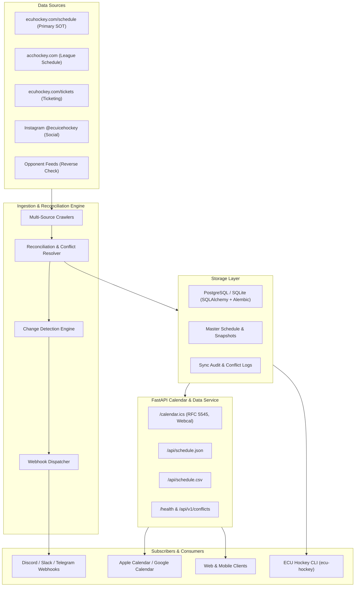

# Roadmap and Implementation Plan

<!--TOC-->

______________________________________________________________________

**Table of Contents**

- [1. System Architecture Overview](#1-system-architecture-overview)
- [2. Planned Milestones and Phases](#2-planned-milestones-and-phases)
  - [2.1. Milestone 1: v0.1.0 - Foundation & Core Architecture (Complete)](#21-milestone-1-v010---foundation--core-architecture-complete)
  - [2.2. Milestone 2: v0.2.0 - Storage Layer & Multi-Source Scrapers (Complete)](#22-milestone-2-v020---storage-layer--multi-source-scrapers-complete)
    - [2.2.1. Phase 2.1: Relational Persistence & Schema Migrations](#221-phase-21-relational-persistence--schema-migrations)
    - [2.2.2. Phase 2.2: Primary & League Web Crawlers](#222-phase-22-primary--league-web-crawlers)
    - [2.2.3. Phase 2.3: Social & Opponent Reverse Crawlers](#223-phase-23-social--opponent-reverse-crawlers)
  - [2.3. Milestone 3: v0.3.0 - Schedule Reconciliation, Change Detection & Alerts (Complete)](#23-milestone-3-v030---schedule-reconciliation-change-detection--alerts-complete)
    - [2.3.1. Phase 3.1: Tooling & Release Infrastructure Hygiene](#231-phase-31-tooling--release-infrastructure-hygiene)
    - [2.3.2. Phase 3.2: Reconciliation & Conflict Resolution Engine](#232-phase-32-reconciliation--conflict-resolution-engine)
    - [2.3.3. Phase 3.3: Change State Detection & Audit History](#233-phase-33-change-state-detection--audit-history)
    - [2.3.4. Phase 3.4: Webhook Notification Dispatcher](#234-phase-34-webhook-notification-dispatcher)
    - [2.3.5. Phase 3.5: Documentation Alignment](#235-phase-35-documentation-alignment)
  - [2.4. Milestone 4: v0.4.0 - Calendar & Data API Service](#24-milestone-4-v040---calendar--data-api-service)
    - [2.4.1. Phase 4.1: Public Calendar & Data Feeds](#241-phase-41-public-calendar--data-feeds)
    - [2.4.2. Phase 4.2: Diagnostics & Administration Endpoints](#242-phase-42-diagnostics--administration-endpoints)
    - [2.4.3. Phase 4.3: Documentation Alignment](#243-phase-43-documentation-alignment)
    - [2.4.4. Phase 4.4: Release Alignment & Milestone Reconciliation](#244-phase-44-release-alignment--milestone-reconciliation)
  - [2.5. Milestone 5: v0.5.0 - CLI, Automation & Production Deployment](#25-milestone-5-v050---cli-automation--production-deployment)
    - [2.5.1. Phase 5.1: Unified Command-Line Interface](#251-phase-51-unified-command-line-interface)
    - [2.5.2. Phase 5.2: Production Deployment Strategy & Hosting Analysis](#252-phase-52-production-deployment-strategy--hosting-analysis)
    - [2.5.3. Phase 5.3: Automated Container Build & Registry Publication to ghcr.io](#253-phase-53-automated-container-build--registry-publication-to-ghcrio)
    - [2.5.4. Phase 5.4: Automated Production Deployment to Hosting Service](#254-phase-54-automated-production-deployment-to-hosting-service)
    - [2.5.5. Phase 5.5: Scheduled Automation & CI Sync Workflows (Complete)](#255-phase-55-scheduled-automation--ci-sync-workflows-complete)
    - [2.5.6. Phase 5.6: GitHub Pages Documentation & Static Calendar Deployment (Complete)](#256-phase-56-github-pages-documentation--static-calendar-deployment-complete)
    - [2.5.7. Phase 5.7: Build Version Provenance & Deployed Version Reporting (Complete)](#257-phase-57-build-version-provenance--deployed-version-reporting-complete)
    - [2.5.8. Phase 5.8: Production Service Documentation & End-User Onboarding](#258-phase-58-production-service-documentation--end-user-onboarding)
    - [2.5.9. Phase 5.9: Calendar Feed Determinism & CI Test Resilience](#259-phase-59-calendar-feed-determinism--ci-test-resilience)
    - [2.5.10. Phase 5.10: Administrative Endpoint Behavior Audit](#2510-phase-510-administrative-endpoint-behavior-audit)
    - [2.5.11. Phase 5.11: Unconfigured Sync Trigger Response Semantics](#2511-phase-511-unconfigured-sync-trigger-response-semantics)
    - [2.5.12. Phase 5.12: Repository Badges & Status Indicators](#2512-phase-512-repository-badges--status-indicators)
    - [2.5.13. Phase 5.13: Documentation Alignment](#2513-phase-513-documentation-alignment)
  - [2.6. Milestone 6: v0.6.0 - Public Web Interface & Fan Engagement](#26-milestone-6-v060---public-web-interface--fan-engagement)
    - [2.6.1. Phase 6.1: Responsive HTML Interface & Embeds](#261-phase-61-responsive-html-interface--embeds)
    - [2.6.2. Phase 6.2: Dual-Format Content Negotiation Foundation](#262-phase-62-dual-format-content-negotiation-foundation)
    - [2.6.3. Phase 6.3: Negotiated Error Responses](#263-phase-63-negotiated-error-responses)
    - [2.6.4. Phase 6.4: Printable Schedule Grid PDF Generation](#264-phase-64-printable-schedule-grid-pdf-generation)
  - [2.7. Milestone 7: v0.7.0 - Human-Readable Operations & Diagnostics](#27-milestone-7-v070---human-readable-operations--diagnostics)
    - [2.7.1. Phase 7.1: Operational Telemetry Dashboards](#271-phase-71-operational-telemetry-dashboards)
    - [2.7.2. Phase 7.2: In-Process Background Synchronization Trigger](#272-phase-72-in-process-background-synchronization-trigger)
    - [2.7.3. Phase 7.3: Administrative Conflict Triage Interface](#273-phase-73-administrative-conflict-triage-interface)
  - [2.8. Milestone 8: v0.8.0 - Syndication & Integrations](#28-milestone-8-v080---syndication--integrations)
    - [2.8.1. Phase 8.1: RSS / Atom Syndication Feeds](#281-phase-81-rss--atom-syndication-feeds)
    - [2.8.2. Phase 8.2: Comprehensive Documentation Audit & Reconciliation](#282-phase-82-comprehensive-documentation-audit--reconciliation)
- [3. CodeQL Security & Quality Audit Trail](#3-codeql-security--quality-audit-trail)
- [4. Implementation Sequencing & Dependency Graph](#4-implementation-sequencing--dependency-graph)
  - [4.1. Sequencing Rationale](#41-sequencing-rationale)

______________________________________________________________________

<!--TOC-->

This document establishes the canonical implementation roadmap and tracking plan for the **ECU Ice Hockey Schedule Aggregator & Calendar Service**.

______________________________________________________________________

## 1. System Architecture Overview

The platform is designed around three decoupled, production-grade core tiers:

1. **Data Ingestion & Cross-Reference Engine (Worker):** Periodically scrapes multiple upstream sources, reconciles discrepancies, detects atomic changes (`CREATED`, `UPDATED`, `DELETED`, `CONFLICT_DETECTED`), and triggers webhook alerts.
2. **Calendar & Data API (FastAPI Application):** Lightweight, high-performance web service delivering RFC 5545 compliant `.ics` feeds (with `webcal://` support), normalized JSON feeds, and downloadable CSV exports.
3. **Storage & Persistence Layer:** Relational database (PostgreSQL in production, SQLite in development) managed with SQLAlchemy 2.0 and Alembic migrations, archiving raw source snapshots and synchronization audits.

______________________________________________________________________

## 2. Planned Milestones and Phases

### 2.1. Milestone 1: v0.1.0 - Foundation & Core Architecture (Complete)

- [x] Configure native `uv` project with dynamic versioning (`hatchling` + `hatch-vcs`) (Merged in [PR #1](https://github.com/bdperkin/ecu-hockey-calendar/pull/1)).
- [x] Implement strict `ruff` and `ty` type checking configurations (Merged in [PR #1](https://github.com/bdperkin/ecu-hockey-calendar/pull/1)).
- [x] Establish comprehensive test suite with 100% test and branch coverage (Merged in [PR #1](https://github.com/bdperkin/ecu-hockey-calendar/pull/1)).
- [x] Set up Sphinx documentation with markdown (`myst-parser`) and Furo theme (Merged in [PR #1](https://github.com/bdperkin/ecu-hockey-calendar/pull/1)).
- [x] Implement quality linters: Pylint (10.00/10), Codespell, Interrogate, Deptry, Vulture, Radon/Xenon (Merged in [PR #1](https://github.com/bdperkin/ecu-hockey-calendar/pull/1)).
- [x] Configure comprehensive pre-commit suite (73 hooks) and pre-commit.ci (Merged in [PR #1](https://github.com/bdperkin/ecu-hockey-calendar/pull/1)).
- [x] Configure GitHub Actions CI matrix, CodeQL security analysis, Dependabot, and Semantic Release (Merged in [PR #1](https://github.com/bdperkin/ecu-hockey-calendar/pull/1), [PR #20](https://github.com/bdperkin/ecu-hockey-calendar/pull/20), [PR #21](https://github.com/bdperkin/ecu-hockey-calendar/pull/21), Dependabot PRs [#27](https://github.com/bdperkin/ecu-hockey-calendar/pull/27), [#28](https://github.com/bdperkin/ecu-hockey-calendar/pull/28), [#29](https://github.com/bdperkin/ecu-hockey-calendar/pull/29), [#30](https://github.com/bdperkin/ecu-hockey-calendar/pull/30), [#31](https://github.com/bdperkin/ecu-hockey-calendar/pull/31)).
- [x] Configure repository settings (disable Projects & Wiki, enable auto-merge, branch protection) (Merged in [PR #1](https://github.com/bdperkin/ecu-hockey-calendar/pull/1)).
- [x] Integrate scraper specification and roadmap into `TODO.md` (Merged in [PR #17](https://github.com/bdperkin/ecu-hockey-calendar/pull/17)).

### 2.2. Milestone 2: v0.2.0 - Storage Layer & Multi-Source Scrapers (Complete)

#### 2.2.1. Phase 2.1: Relational Persistence & Schema Migrations

- [x] **[#2](https://github.com/bdperkin/ecu-hockey-calendar/issues/2) - feat(storage): implement SQLAlchemy models and Alembic migration pipeline** (Merged in [PR #24](https://github.com/bdperkin/ecu-hockey-calendar/pull/24))
  - **Summary:** Set up SQLAlchemy 2.0 ORM models for games, teams, sources, raw snapshots, and sync audits.
  - **Description:** Support PostgreSQL for production and SQLite for local development. Define `Team`, `Game`, `DataSource`, `RawSnapshot`, and `SyncAudit` tables. Configure Alembic migration environment with automated schema generation.
- [x] **[#25](https://github.com/bdperkin/ecu-hockey-calendar/issues/25) - fix(security): resolve CodeQL security and quality code scanning alerts** (Merged in [PR #26](https://github.com/bdperkin/ecu-hockey-calendar/pull/26))
  - **Summary:** Resolve 7 CodeQL code scanning alerts (Alerts #1–#4 `py/unused-global-variable`, Alerts #5–#6 `py/unreachable-statement`, Alert #7 `py/unused-import`).
  - **Description:** Add explicit `__all__` exports in Alembic migrations and `alembic/env.py`, and refactor session rollback test blocks to use explicit exception handling.

#### 2.2.2. Phase 2.2: Primary & League Web Crawlers

- [x] **[#3](https://github.com/bdperkin/ecu-hockey-calendar/issues/3) - feat(ingestion): build resilient crawler for primary ECU Hockey schedule site** (Merged in [PR #32](https://github.com/bdperkin/ecu-hockey-calendar/pull/32))
  - **Summary:** Build asynchronous crawler for `https://www.ecuhockey.com/schedule/upcoming`.
  - **Description:** Implement `httpx` + `BeautifulSoup4` parser with retry and backoff logic. Extract dates, times, home/away status, opponents, venues, scores, and game status.
- [x] **[#4](https://github.com/bdperkin/ecu-hockey-calendar/issues/4) - feat(ingestion): implement ACC Hockey league schedule page parser** (Merged in [PR #33](https://github.com/bdperkin/ecu-hockey-calendar/pull/33))
  - **Summary:** Ingest conference games and scores from `https://www.acchockey.com/page/show/9602441-east-carolina`.
  - **Description:** Handle SportEngine markup, normalize opponent names, and capture official conference verification metadata.
- [x] **[#5](https://github.com/bdperkin/ecu-hockey-calendar/issues/5) - feat(ingestion): parse ticket sales page for game schedules and promotions** (Merged in [PR #34](https://github.com/bdperkin/ecu-hockey-calendar/pull/34))
  - **Summary:** Scrape ticketing information from `https://www.ecuhockey.com/tickets`.
  - **Description:** Extract home games, promotional theme nights, ticket pricing, and ticketing links to enrich calendar event descriptions.
- [x] **fix(ingestion): resolve CodeQL alerts for fallback parser exception handling** (Merged in [PR #35](https://github.com/bdperkin/ecu-hockey-calendar/pull/35))
  - **Summary:** Resolve CodeQL Alerts #8 and #9 (`py/empty-except`) in fallback ingestion parser.
  - **Description:** Add explanatory comments and structured logger debug warnings inside empty fallback exception blocks.

#### 2.2.3. Phase 2.3: Social & Opponent Reverse Crawlers

- [x] **[#6](https://github.com/bdperkin/ecu-hockey-calendar/issues/6) - feat(ingestion): create resilient Instagram feed parser for game announcements** (Merged in [PR #36](https://github.com/bdperkin/ecu-hockey-calendar/pull/36))
  - **Summary:** Extract schedule announcements and time changes from `https://www.instagram.com/ecuicehockey/`.
  - **Description:** Integrate Instagram Graph API / resilient feed parser with exponential backoff and rate-limit mitigation.
- [x] **[#7](https://github.com/bdperkin/ecu-hockey-calendar/issues/7) - feat(ingestion): automated opponent schedule reverse lookup and cross-check** (Merged in [PR #37](https://github.com/bdperkin/ecu-hockey-calendar/pull/37))
  - **Summary:** Automatically query and cross-verify preliminary game data against opponent schedule sources.
  - **Description:** Maintain opponent directory (UNC, NC State, Virginia Tech, Wake Forest, etc.) and cross-check dates, venues, and times.

### 2.3. Milestone 3: v0.3.0 - Schedule Reconciliation, Change Detection & Alerts (Complete)

#### 2.3.1. Phase 3.1: Tooling & Release Infrastructure Hygiene

- [x] **[#47](https://github.com/bdperkin/ecu-hockey-calendar/issues/47) - chore(roadmap): remove ecu_hockey_scraper_prompt.md and perform comprehensive TODO.md audit** (Merged in [PR #49](https://github.com/bdperkin/ecu-hockey-calendar/pull/49))
  - **Summary:** Remove obsolete prompt document, reconcile all open/closed issues and PRs, and optimize implementation ordering.
  - **Description:** Clean up repository root, ensure bidirectional traceability across all issues and PRs, and sequence development milestones for maximum velocity.
- [x] **[#44](https://github.com/bdperkin/ecu-hockey-calendar/issues/44) - chore(tooling): migrate PyMarkdown configuration from .pymarkdown.json into pyproject.toml** (Merged in [PR #52](https://github.com/bdperkin/ecu-hockey-calendar/pull/52))
  - **Summary:** Consolidate markdown linter configuration into native `pyproject.toml`.
  - **Description:** Add `[tool.pymarkdown]` section to `pyproject.toml`, remove `.pymarkdown.json`, and update pre-commit / CI invocations.
- [x] **[#45](https://github.com/bdperkin/ecu-hockey-calendar/issues/45) - fix(ci): investigate and resolve why CHANGELOG.md is not updated by Python Semantic Release** (Merged in [PR #54](https://github.com/bdperkin/ecu-hockey-calendar/pull/54), pre-commit hook fixed in [PR #56](https://github.com/bdperkin/ecu-hockey-calendar/pull/56))
  - **Summary:** Configure PSR changelog update insertion markers, repository secrets, and CI release permissions.
  - **Description:** Add `<!-- version list -->` insertion flag to `CHANGELOG.md`, backfill historical release entries, configure `RELEASE_TOKEN` secret for branch protection bypass, and exclude `CHANGELOG.md` from markdown pre-commit hooks.
- [x] **[#48](https://github.com/bdperkin/ecu-hockey-calendar/issues/48) - fix(release): diagnose and align release versioning with project milestones (currently at v0.8.2 instead of v0.2.0)** (Merged in [PR #57](https://github.com/bdperkin/ecu-hockey-calendar/pull/57))
  - **Summary:** Align project version tags and package metadata with planned milestones.
  - **Description:** Adjust tag namespace and reset release version progression so that Milestone 3 releases as `v0.3.0`.

#### 2.3.2. Phase 3.2: Reconciliation & Conflict Resolution Engine

- [x] **[#8](https://github.com/bdperkin/ecu-hockey-calendar/issues/8) - feat(reconciliation): multi-source schedule cross-referencing and conflict resolution engine** (Merged in [PR #38](https://github.com/bdperkin/ecu-hockey-calendar/pull/38), fixed in [PR #40](https://github.com/bdperkin/ecu-hockey-calendar/pull/40) & [PR #42](https://github.com/bdperkin/ecu-hockey-calendar/pull/42))
  - **Summary:** Cross-reference data across disparate sources using deterministic and fuzzy scoring.
  - **Description:** Enforce configurable precedence hierarchy (Primary SOT + League > Ticketing/Social > Opponent). Detect discrepancies and flag high-confidence conflicts for review.
- [x] **[#39](https://github.com/bdperkin/ecu-hockey-calendar/issues/39) - fix(security): resolve CodeQL alert 12 for unused global variable in fuzzy_matcher** (Merged in [PR #40](https://github.com/bdperkin/ecu-hockey-calendar/pull/40))
  - **Summary:** Export `GENERIC_COLLEGE_TERMS` in `fuzzy_matcher.py` `__all__`.
  - **Description:** Resolve CodeQL `py/unused-global-variable` alert and verify tuple contents with unit tests.
- [x] **[#41](https://github.com/bdperkin/ecu-hockey-calendar/issues/41) - fix(security): resolve CodeQL alert 13 for import and import-from in test_reconciliation_fuzzy_matcher** (Merged in [PR #42](https://github.com/bdperkin/ecu-hockey-calendar/pull/42), roadmap updated in [PR #43](https://github.com/bdperkin/ecu-hockey-calendar/pull/43))
  - **Summary:** Remove redundant module alias import in reconciliation test suite.
  - **Description:** Resolve CodeQL `py/import-and-import-from` alert while preserving test coverage.

#### 2.3.3. Phase 3.3: Change State Detection & Audit History

- [x] **[#9](https://github.com/bdperkin/ecu-hockey-calendar/issues/9) - feat(reconciliation): change detection and sync state tracking engine** (Merged in [PR #58](https://github.com/bdperkin/ecu-hockey-calendar/pull/58))
  - **Summary:** Track atomic game state transitions (`CREATED`, `UPDATED`, `DELETED`, `CONFLICT_DETECTED`).
  - **Description:** Generate field-level diffs, store historical snapshots, and log sync cycle audits.

#### 2.3.4. Phase 3.4: Webhook Notification Dispatcher

- [x] **[#15](https://github.com/bdperkin/ecu-hockey-calendar/issues/15) - feat(notifications): multi-platform webhook alerting for schedule updates and conflicts** (Merged in [PR #60](https://github.com/bdperkin/ecu-hockey-calendar/pull/60))
  - **Summary:** Broadcast rich notifications to Discord, Slack, and Telegram channels.
  - **Description:** Dispatch formatted embeds for schedule additions, game updates, cancellations, and active conflict alerts.

#### 2.3.5. Phase 3.5: Documentation Alignment

- [x] **[#46](https://github.com/bdperkin/ecu-hockey-calendar/issues/46) - docs: update README.md and Sphinx documentation to reflect current project capabilities**
  - **Summary:** Update `README.md` and Sphinx docs in `docs/` to reflect current project capabilities.
  - **Description:** Document multi-source crawler architecture, SQLAlchemy persistence layer, reconciliation engine, change detection, and webhook notifications with usage examples.

### 2.4. Milestone 4: v0.4.0 - Calendar & Data API Service

#### 2.4.1. Phase 4.1: Public Calendar & Data Feeds

- [x] **[#10](https://github.com/bdperkin/ecu-hockey-calendar/issues/10) - feat(api): RFC 5545 iCalendar (.ics) subscription endpoint and webcal support**
  - **Summary:** Provide `/calendar.ics` adhering strictly to RFC 5545 with `webcal://` subscription support.
  - **Description:** Full compatibility with Apple Calendar, Google Calendar, and Outlook with deterministic UIDs, alarms, locations, and descriptions.
- [x] **[#11](https://github.com/bdperkin/ecu-hockey-calendar/issues/11) - feat(api): public JSON and CSV master schedule data feeds**
  - **Summary:** Provide machine-readable `/api/schedule.json` and downloadable `/api/schedule.csv`.
  - **Description:** Normalized feeds with query filters (`season`, `opponent`, `home_only`, `status`) and OpenAPI interactive documentation.

#### 2.4.2. Phase 4.2: Diagnostics & Administration Endpoints

- [x] **[#12](https://github.com/bdperkin/ecu-hockey-calendar/issues/12) - feat(api): health check, sync diagnostics, and conflict review endpoints**
  - **Summary:** Provide operational endpoints for system health, sync telemetry, and conflict review.
  - **Description:** Implement `/health`, `/api/v1/sync/status`, and `/api/v1/conflicts` with authentication for administrative actions.

#### 2.4.3. Phase 4.3: Documentation Alignment

- [x] **[#62](https://github.com/bdperkin/ecu-hockey-calendar/issues/62) - docs: update README.md and Sphinx documentation to reflect current project capabilities**
  - **Summary:** Update `README.md` and Sphinx docs in `docs/` to reflect public API endpoints and calendar feeds.
  - **Description:** Document `/calendar.ics`, `/api/schedule.json`, `/api/schedule.csv`, OpenAPI `/docs`, and administration diagnostics endpoints.

#### 2.4.4. Phase 4.4: Release Alignment & Milestone Reconciliation

- [x] **[#73](https://github.com/bdperkin/ecu-hockey-calendar/issues/73) - fix(release): diagnose and align release versioning with project milestones (currently at v0.2.7 instead of v0.4.0)**
  - **Summary:** Reconcile repository releases and git tags with completed milestones (v0.2.0, v0.3.0, v0.4.0) and fix PSR minor bumping.
  - **Description:** Resolve discrepancy between PSR parser rules, conventional-commit types, and workflow triggers to ensure Milestone 4 is released as `v0.4.0` and pre-1.0 milestone versioning is preserved.

### 2.5. Milestone 5: v0.5.0 - CLI, Automation & Production Deployment

#### 2.5.1. Phase 5.1: Unified Command-Line Interface

- [x] **[#13](https://github.com/bdperkin/ecu-hockey-calendar/issues/13) - feat(cli): command-line interface for schedule sync, inspection, and export**
  - **Summary:** Rich CLI interface (`ecu-hockey`) with subcommands: `sync`, `status`, `export`, `conflicts`, and `serve`.
  - **Description:** Provide interactive terminal output using `rich` for formatting, status tables, and diagnostics.

#### 2.5.2. Phase 5.2: Production Deployment Strategy & Hosting Analysis

- [x] **[#14](https://github.com/bdperkin/ecu-hockey-calendar/issues/14) - docs(deployment): architectural hosting analysis and production deployment guide**
  - **Summary:** Author `DEPLOYMENT.md` evaluating hosting providers, architecture, and operational practices.
  - **Description:** Compare Render, Railway, Fly.io, and AWS Lambda + EventBridge. Address Instagram rate limits, proxy rotation, persistent database volumes, SSL certificates, and container configuration.

#### 2.5.3. Phase 5.3: Automated Container Build & Registry Publication to ghcr.io

- [x] **[#82](https://github.com/bdperkin/ecu-hockey-calendar/issues/82) - ci(docker): automated publication of production container images to ghcr.io via GitHub Actions**
  - **Summary:** GitHub Actions CI/CD workflow to build multi-arch container images and publish them to GitHub Container Registry (`ghcr.io`).
  - **Description:** Build `linux/amd64` and `linux/arm64` images using `docker/build-push-action`, authenticate via `GITHUB_TOKEN`, extract semantic tags with `docker/metadata-action`, validate builds on pull requests without pushing, and publish on tagged releases.

#### 2.5.4. Phase 5.4: Automated Production Deployment to Hosting Service

- [x] **[#84](https://github.com/bdperkin/ecu-hockey-calendar/issues/84) - ci(deploy): automated production deployment to hosting service via GitHub Actions using container images**
  - **Summary:** Continuous deployment GitHub Actions workflow to deploy container images to a hosting provider.
  - **Description:** Implement `.github/workflows/deploy.yml` triggered on container publication or manual dispatch, execute database schema migrations (`alembic upgrade head`), and verify post-deployment `/health` probe.

#### 2.5.5. Phase 5.5: Scheduled Automation & CI Sync Workflows (Complete)

- [x] **[#16](https://github.com/bdperkin/ecu-hockey-calendar/issues/16) - ci(automation): automated scheduled ingestion and calendar release workflow**
  - **Summary:** GitHub Actions scheduled workflow running periodic syncs and publishing static calendar releases.
  - **Description:** Automate periodic schedule checks, publish calendar artifacts, and trigger webhooks on changes.

#### 2.5.6. Phase 5.6: GitHub Pages Documentation & Static Calendar Deployment (Complete)

- [x] **[#18](https://github.com/bdperkin/ecu-hockey-calendar/issues/18) - ci(pages): automated GitHub Pages deployment to `https://bdperkin.github.io/ecu-hockey-calendar/`** (Merged in [PR #19](https://github.com/bdperkin/ecu-hockey-calendar/pull/19), [PR #22](https://github.com/bdperkin/ecu-hockey-calendar/pull/22), [PR #23](https://github.com/bdperkin/ecu-hockey-calendar/pull/23))
  - **Summary:** Configure automated Sphinx documentation and static calendar asset publishing to GitHub Pages.
  - **Description:** Implement `.github/workflows/pages.yml` with `actions/upload-pages-artifact` and `actions/deploy-pages`. Build Sphinx documentation with Furo theme and publish static calendar artifacts (`calendar.ics`, `schedule.json`, `schedule.csv`) to `https://bdperkin.github.io/ecu-hockey-calendar/`.

#### 2.5.7. Phase 5.7: Build Version Provenance & Deployed Version Reporting (Complete)

- [x] **[#94](https://github.com/bdperkin/ecu-hockey-calendar/issues/94) - fix(packaging): resolve fallback version 0.1.0.dev0 reported by containerized API and deployments**
  - **Summary:** Propagate the real `hatch-vcs` version into container builds so deployed services stop reporting the `0.1.0.dev0` fallback.
  - **Description:** Stamp builds via `SETUPTOOLS_SCM_PRETEND_VERSION_FOR_ECU_HOCKEY_CALENDAR` using a `Dockerfile` build argument supplied by `.github/workflows/docker.yml`, keeping `.git` excluded from the build context. Consolidate the divergent hardcoded fallbacks in `src/ecu_hockey_calendar/__init__.py`, `src/ecu_hockey_calendar/api/app.py`, and `docs/conf.py` into a single shared resolver with an unmistakable non-release sentinel, and add regression and deployment smoke coverage asserting `/` and `/openapi.json` report the true release version.

#### 2.5.8. Phase 5.8: Production Service Documentation & End-User Onboarding

- [x] **[#95](https://github.com/bdperkin/ecu-hockey-calendar/issues/95) - docs(deployment): document live production deployment at ecu-hockey-api.onrender.com with full endpoint reference (Complete)**
  - **Summary:** Document the live production service at `https://ecu-hockey-api.onrender.com/` across `README.md`, `DEPLOYMENT.md`, and `docs/deployment.md`.
  - **Description:** Add a concise deployment summary and subscription URL to `README.md`, and a comprehensive reference to `DEPLOYMENT.md` and `docs/deployment.md` covering every endpoint (`/`, `/health`, `/calendar.ics`, `/api/schedule.json`, `/api/schedule.csv`, `/api/v1/sync/status`, `/api/v1/sync/trigger`, `/api/v1/conflicts`, `/docs`, `/redoc`, `/openapi.json`) with methods, content types, authentication, and query parameters. Document the deployed Render topology (web service, six-hourly cron worker, managed PostgreSQL), correct the stale `ecu-hockey.onrender.com` placeholder, and surface the public base URL in `docs/api_service.md`, `docs/quickstart.md`, and `docs/index.md`.
- [x] **[#96](https://github.com/bdperkin/ecu-hockey-calendar/issues/96) - docs(calendar): add end-user ECU Hockey Calendar Sync Guide for Google, Apple, and Outlook subscriptions (Complete)**
  - **Summary:** Publish a non-technical, step-by-step guide for subscribing to the live schedule feed in Google Calendar, Apple Calendar, and Outlook.
  - **Description:** Add `docs/calendar_sync.md` to the Sphinx toctree with numbered per-client instructions for the production HTTPS feed (`https://ecu-hockey-api.onrender.com/calendar.ics`) and the macOS/iOS instant subscription URL (`webcal://ecu-hockey-api.onrender.com/calendar.ics`), a one-click `?webcal=true` subscribe link, optional `season`, `include_past`, and `alarm_minutes` filters, and a troubleshooting FAQ covering refresh cadence and cold-start latency. Document the equivalent local development flow, add a concise subscribe section to `README.md`, and replace the `your-domain.com` placeholders in `docs/api_service.md` with cross-links to the guide.

#### 2.5.9. Phase 5.9: Calendar Feed Determinism & CI Test Resilience

- [x] **[#114](https://github.com/bdperkin/ecu-hockey-calendar/issues/114) - fix(api): resolve second-boundary race condition in calendar ETag generation and add CI test resilience (Complete)**
  - **Summary:** Stabilize `/calendar.ics` conditional caching across clock ticks by passing `last_mod_dt` as `dtstamp_override` and adding pytest retry support.
  - **Description:** Address the second-boundary race condition where `generate_ics_feed` injected `datetime.now(UTC)` into every `VEVENT`, causing ETags to mutate every second on identical schedule records. Pre-compute `last_mod_dt` and pass it as `dtstamp_override` to guarantee deterministic ETag calculation across requests when games are unchanged, and introduce `pytest-rerunfailures` with `--reruns 2 --reruns-delay 1` in CI workflows for test suite resilience.

#### 2.5.10. Phase 5.10: Administrative Endpoint Behavior Audit

- [x] **[#102](https://github.com/bdperkin/ecu-hockey-calendar/issues/102) - investigate(api): determine intended behavior of POST /api/v1/sync/trigger and whether it warrants dual-format responses**

  - **Summary:** Investigate why `POST /api/v1/sync/trigger` reports success while performing no synchronization, and recommend the correct behavior before considering an HTML interface.
  - **Description:** `trigger_sync_cycle` dispatches through an optional `app.state.sync_trigger_handler` hook that `create_app` never assigns, so production requests return `202 Accepted` with a success message and an unused `sync_cycle_id` while no crawl runs. Determine whether this is intentional, weigh real trigger mechanisms against the split web/cron service topology and scraper rate limits, decide the honest response semantics when no mechanism is wired, and only then evaluate dual-format output versus a dashboard "Sync now" control. Raise follow-up implementation issues for the conclusions.
  - **Findings:** Investigation completed (see [report](https://github.com/bdperkin/ecu-hockey-calendar/issues/102#issuecomment-5627626890)). Confirmed production no-op is an unintended defect. Recommended honest `501 Not Implemented` semantics when unconfigured ([#116](https://github.com/bdperkin/ecu-hockey-calendar/issues/116)), opt-in in-process background execution via FastAPI `BackgroundTasks` with concurrency locking and rate-limiting cooldown for v0.7.0 ([#117](https://github.com/bdperkin/ecu-hockey-calendar/issues/117)), and rejected dual-format HTML on `POST` in favor of an interactive dashboard control on the [#99](https://github.com/bdperkin/ecu-hockey-calendar/issues/99) status dashboard.

#### 2.5.11. Phase 5.11: Unconfigured Sync Trigger Response Semantics

- [x] **[#116](https://github.com/bdperkin/ecu-hockey-calendar/issues/116) - fix(api): return 501 Not Implemented from POST /api/v1/sync/trigger when no trigger handler is registered**

  - **Summary:** Return HTTP `501 Not Implemented` instead of `202 Accepted` when `app.state.sync_trigger_handler` is unconfigured.
  - **Description:** In default and production configurations, `POST /api/v1/sync/trigger` returns `202 Accepted` with `"Synchronization cycle triggered successfully."` while executing no crawlers, reconciliation, or audit recording. Update the route handler to inspect `sync_trigger_handler` and return `HTTP 501 Not Implemented` with an explanatory error payload when no handler is registered. Update unit tests in `tests/test_api_health_diagnostics.py` to assert `501` semantics, and align `docs/api.md` and `DEPLOYMENT.md` endpoint inventories.

#### 2.5.12. Phase 5.12: Repository Badges & Status Indicators

- [x] **[#86](https://github.com/bdperkin/ecu-hockey-calendar/issues/86) - docs(readme): audit project and implement missing status, quality, and technology badges**
  - **Summary:** Audit project workflows, security, and dependencies, and add missing badges to `README.md`.
  - **Description:** Identify and incorporate status badges for GitHub Pages documentation, CodeQL security scanning, pre-commit.ci, dependency review, semantic release, FastAPI, SQLAlchemy, and license/security policies into logically organized badge sections.

#### 2.5.13. Phase 5.13: Documentation Alignment

- [x] **[#63](https://github.com/bdperkin/ecu-hockey-calendar/issues/63) - docs: update README.md and Sphinx documentation to reflect current project capabilities**
  - **Summary:** Update `README.md` and Sphinx docs in `docs/` to reflect end-to-end capabilities, CLI, and production deployment.
  - **Description:** Document `ecu-hockey` CLI subcommands, production deployment guides, static GitHub Pages calendar feeds, container publication, and automated CI workflows.

### 2.6. Milestone 6: v0.6.0 - Public Web Interface & Fan Engagement

#### 2.6.1. Phase 6.1: Responsive HTML Interface & Embeds

- [x] **[#77](https://github.com/bdperkin/ecu-hockey-calendar/issues/77) - feat(web): responsive HTML schedule view and embeddable iframe widget**
  - **Summary:** Mobile-first HTML schedule view and lightweight embeddable iframe route powered by Jinja2 templates.
  - **Description:** Provide `/schedule` web interface with ECU branding, fixture cards, and ticket links, plus `/schedule/embed` stripped-down widget and iframe snippet for external community sites.

#### 2.6.2. Phase 6.2: Dual-Format Content Negotiation Foundation

- [x] **[#97](https://github.com/bdperkin/ecu-hockey-calendar/issues/97) - feat(api): content-negotiated HTML and JSON responses for service status endpoint (/)**

  - **Summary:** Serve both `application/json` and `text/html; charset=utf-8` from `GET /`, and establish the shared content negotiation and Jinja2 templating foundation.
  - **Description:** Add the `jinja2` runtime dependency, a packaged `src/ecu_hockey_calendar/api/templates/` directory, a `negotiation.py` helper implementing `Accept` q-value ranking with a `?format=` override and `Vary: Accept`, and an ECU-branded responsive `base.html` layout with a shared "View as JSON" control and pretty-printed payload panel. Render the service status page with the `endpoints` map as a clickable link list. `Accept: */*` and header-less clients continue to receive unchanged JSON.

#### 2.6.3. Phase 6.3: Negotiated Error Responses

- [x] **[#101](https://github.com/bdperkin/ecu-hockey-calendar/issues/101) - feat(api): content-negotiated HTML and JSON error responses for 401, 404, 422, and 500**

  - **Summary:** Extend content negotiation to error responses so browsers receive styled error pages while API clients keep byte-for-byte identical JSON error bodies.
  - **Description:** Register negotiated handlers for `StarletteHTTPException`, `RequestValidationError`, and unhandled `Exception`, rendering a `templates/error.html` page with plain-language explanations, authentication guidance for `401`, navigation links for `404`, and a readable field/problem/value table for `422` validation errors. Preserve all status codes, the `WWW-Authenticate: Bearer` header, `304` conditional responses, and `HEAD` handling, and keep the `500` handler free of stack-trace exposure so CodeQL Alert #14 does not regress.

#### 2.6.4. Phase 6.4: Printable Schedule Grid PDF Generation

- [x] **[#79](https://github.com/bdperkin/ecu-hockey-calendar/issues/79) - feat(export): printable schedule grid PDF generation for parents and coaches**
  - **Summary:** High-fidelity printable PDF schedule export using WeasyPrint for family refrigerators and bench clipboards.
  - **Description:** Provide `/api/schedule.pdf` and CLI `ecu-hockey export -f pdf` rendering a high-contrast, print-optimized calendar grid on standard US Letter layout.

### 2.7. Milestone 7: v0.7.0 - Human-Readable Operations & Diagnostics

#### 2.7.1. Phase 7.1: Operational Telemetry Dashboards

- [ ] **[#98](https://github.com/bdperkin/ecu-hockey-calendar/issues/98) - feat(api): content-negotiated HTML and JSON responses for health probe endpoint (/health)**

  - **Summary:** Serve a human-readable health dashboard to browsers while monitoring systems keep parsing the unchanged JSON payload.
  - **Description:** Render component cards for database and scraper subsystems, a source table with relative `last_scraped_at` ages, and formatted uptime, with accessible status labels alongside color coding. Preserve HTTP status semantics and the `HEAD /health` handler, and harden the `.github/workflows/deploy.yml` probe with an explicit `Accept: application/json` header so the `jq -r '.status'` deployment gate cannot regress.

- [ ] **[#99](https://github.com/bdperkin/ecu-hockey-calendar/issues/99) - feat(api): content-negotiated HTML and JSON responses for sync status endpoint (/api/v1/sync/status)**

  - **Summary:** Serve a synchronization telemetry dashboard to browsers while automation keeps receiving the unchanged JSON payload.
  - **Description:** Render a `current_status` badge, stat tiles for games created, updated, and deleted plus a conflicts tile linking through to the conflict triage view, human-readable and relative timestamps, formatted cycle duration, and a scraper source table. Surface `error_message` in a dedicated error panel, provide a friendly empty state when no sync has run, and note the six-hourly worker cadence.

#### 2.7.2. Phase 7.2: In-Process Background Synchronization Trigger

- [ ] **[#117](https://github.com/bdperkin/ecu-hockey-calendar/issues/117) - feat(api): implement in-process background synchronization trigger with concurrency and cooldown safeguards**

  - **Summary:** Implement in-process background crawl execution using FastAPI `BackgroundTasks` with concurrency locking, rate-limiting cooldowns, and audit telemetry tracking.
  - **Description:** Extract the core synchronization pipeline into a shared, reusable service module, provide a default `BackgroundTasks` trigger handler enabled via `ENABLE_API_SYNC_TRIGGER=true`, protect against concurrent triggers with an `asyncio.Lock` returning `409 Conflict`, enforce a cooldown interval returning `429 Too Many Requests` with a `Retry-After` header to protect upstream sources and Instagram IP reputation, and record in-progress status in `SyncAuditModel` so `/api/v1/sync/status` immediately reports `syncing`. Powers the interactive "Sync now" control on the [#99](https://github.com/bdperkin/ecu-hockey-calendar/issues/99) dashboard.

#### 2.7.3. Phase 7.3: Administrative Conflict Triage Interface

- [ ] **[#100](https://github.com/bdperkin/ecu-hockey-calendar/issues/100) - feat(api): content-negotiated HTML and JSON responses for conflicts endpoint (/api/v1/conflicts)**

  - **Summary:** Serve an administrative conflict triage table to authenticated browsers while API clients keep receiving the unchanged JSON payload.
  - **Description:** Render side-by-side cross-source value comparisons with labeled severity badges, a working filter form bound to the existing `severity`, `game_id`, `field`, and `requires_review` parameters, and pagination driven by `limit` and `offset`. Return a styled HTML `401` page to unauthenticated browsers while preserving the existing JSON error body and authorization enforcement unchanged.

### 2.8. Milestone 8: v0.8.0 - Syndication & Integrations

#### 2.8.1. Phase 8.1: RSS / Atom Syndication Feeds

- [ ] **[#78](https://github.com/bdperkin/ecu-hockey-calendar/issues/78) - feat(syndication): RSS and Atom XML schedule syndication feeds for media and automation**
  - **Summary:** Dynamic RSS 2.0 and Atom 1.0 XML feeds powered by `feedgen` for media outlets and automation workflows.
  - **Description:** Provide `/feed.rss` and `/feed.atom` feeds exposing fixture announcements, time changes, and final scores for integration with Zapier, Make.com, and Discord bots.

#### 2.8.2. Phase 8.2: Comprehensive Documentation Audit & Reconciliation

- [ ] **[#103](https://github.com/bdperkin/ecu-hockey-calendar/issues/103) - docs: comprehensive internal and external documentation audit and reconciliation**
  - **Summary:** Final verification pass proving every internal and external documentation surface matches the shipped system once all preceding roadmap issues are complete.
  - **Description:** Audit `README.md`, `DEPLOYMENT.md`, the full Sphinx site, `CONTRIBUTING.md`, `SUPPORT.md`, and repository metadata against the running service, verifying that every documented endpoint, CLI subcommand, flag, query parameter, code example, and URL is accurate. Reconcile the content negotiation and `?format=` behavior that Issues #97 through #102 introduce without carrying documentation requirements of their own, close the missing documentation alignment phases for Milestones 6, 7, and 8, cover surfaces no issue owns (`docs/api.md`, `docs/cli.md`, `docs/index.md`, repository topics), and confirm docstring coverage, `TODO.md` cross-references, and the CodeQL audit trail remain current. Publish a written audit report and split out follow-up issues for anything not fixed inline.

______________________________________________________________________

## 3. CodeQL Security & Quality Audit Trail

The repository strictly enforces CodeQL security and code scanning analysis across all branches and pull requests. All detected findings have been remediated, tested, and verified with 0 active alerts:

| Alert # | Rule ID                     | Classification | Location                                                  | Resolution Details                                                         | Fix Reference                                                                                                                              |
| ------- | --------------------------- | -------------- | --------------------------------------------------------- | -------------------------------------------------------------------------- | ------------------------------------------------------------------------------------------------------------------------------------------ |
| #1      | `py/unused-global-variable` | Quality        | `alembic/versions/20260906_0155_...py`                    | Added explicit `__all__` export for migration revision identifiers         | [PR #26](https://github.com/bdperkin/ecu-hockey-calendar/pull/26) (Issue [#25](https://github.com/bdperkin/ecu-hockey-calendar/issues/25)) |
| #2      | `py/unused-global-variable` | Quality        | `alembic/versions/20260906_0155_...py`                    | Added explicit `__all__` export for migration revision identifiers         | [PR #26](https://github.com/bdperkin/ecu-hockey-calendar/pull/26) (Issue [#25](https://github.com/bdperkin/ecu-hockey-calendar/issues/25)) |
| #3      | `py/unused-global-variable` | Quality        | `alembic/versions/20260906_0155_...py`                    | Added explicit `__all__` export for migration revision identifiers         | [PR #26](https://github.com/bdperkin/ecu-hockey-calendar/pull/26) (Issue [#25](https://github.com/bdperkin/ecu-hockey-calendar/issues/25)) |
| #4      | `py/unused-global-variable` | Quality        | `alembic/versions/20260906_0155_...py`                    | Added explicit `__all__` export for migration revision identifiers         | [PR #26](https://github.com/bdperkin/ecu-hockey-calendar/pull/26) (Issue [#25](https://github.com/bdperkin/ecu-hockey-calendar/issues/25)) |
| #5      | `py/unreachable-statement`  | Quality        | `tests/test_storage_engine.py`                            | Refactored session rollback tests with explicit exception catching         | [PR #26](https://github.com/bdperkin/ecu-hockey-calendar/pull/26) (Issue [#25](https://github.com/bdperkin/ecu-hockey-calendar/issues/25)) |
| #6      | `py/unreachable-statement`  | Quality        | `tests/test_storage_engine.py`                            | Refactored session rollback tests with explicit exception catching         | [PR #26](https://github.com/bdperkin/ecu-hockey-calendar/pull/26) (Issue [#25](https://github.com/bdperkin/ecu-hockey-calendar/issues/25)) |
| #7      | `py/unused-import`          | Quality        | `alembic/env.py`                                          | Added explicit `__all__` export for target metadata                        | [PR #26](https://github.com/bdperkin/ecu-hockey-calendar/pull/26) (Issue [#25](https://github.com/bdperkin/ecu-hockey-calendar/issues/25)) |
| #8      | `py/empty-except`           | Quality        | `src/ecu_hockey_calendar/ingestion/parsers.py`            | Added debug warning log and comment explaining empty fallback parse block  | [PR #35](https://github.com/bdperkin/ecu-hockey-calendar/pull/35)                                                                          |
| #9      | `py/empty-except`           | Quality        | `src/ecu_hockey_calendar/ingestion/parsers.py`            | Added debug warning log and comment explaining empty fallback parse block  | [PR #35](https://github.com/bdperkin/ecu-hockey-calendar/pull/35)                                                                          |
| #12     | `py/unused-global-variable` | Quality        | `src/ecu_hockey_calendar/reconciliation/fuzzy_matcher.py` | Added `GENERIC_COLLEGE_TERMS` to module `__all__` export list              | [PR #40](https://github.com/bdperkin/ecu-hockey-calendar/pull/40) (Issue [#39](https://github.com/bdperkin/ecu-hockey-calendar/issues/39)) |
| #13     | `py/import-and-import-from` | Quality        | `tests/test_reconciliation_fuzzy_matcher.py`              | Cleaned redundant module import and standardized direct member imports     | [PR #42](https://github.com/bdperkin/ecu-hockey-calendar/pull/42) (Issue [#41](https://github.com/bdperkin/ecu-hockey-calendar/issues/41)) |
| #14     | `py/stack-trace-exposure`   | Security       | `src/ecu_hockey_calendar/api/routes/health.py`            | Log exceptions internally on server and return generic safe error messages | [PR #70](https://github.com/bdperkin/ecu-hockey-calendar/pull/70) (Issue [#69](https://github.com/bdperkin/ecu-hockey-calendar/issues/69)) |

______________________________________________________________________

## 4. Implementation Sequencing & Dependency Graph

To optimize delivery velocity and maintain continuous quality, issues are sequenced based on architectural dependencies and release hygiene:

```mermaid
flowchart TD
    subgraph HYGIENE["Stage 1: Tooling & Release Hygiene (Complete)"]
        T47["#47: Remove Prompt & Audit TODO.md"]
        T44["#44: Migrate PyMarkdown to pyproject.toml"]
        T45["#45: Fix Semantic Release CHANGELOG.md"]
        T48["#48: Align Release Versioning with Milestones"]
    end

    subgraph M3["Stage 2: Milestone 3 Completion (Complete)"]
        T9["#9: Change Detection & State Tracking"]
        T15["#15: Webhook Notification Dispatcher"]
        T46["#46: README & Sphinx Docs Update"]
    end

    subgraph M4["Stage 3: Milestone 4 (API Service)"]
        T10["#10: RFC 5545 iCalendar (.ics) Feed"]
        T11["#11: Public JSON & CSV Feeds"]
        T12["#12: Health & Diagnostics Endpoints"]
        T62["#62: README & Sphinx Docs Update (v0.4.0)"]
        T73["#73: Release Version Alignment (v0.4.0)"]
    end

    subgraph M5["Stage 4: Milestone 5 (Automation, Correctness & Documentation)"]
        T13["#13: Unified CLI (ecu-hockey)"]
        T14["#14: DEPLOYMENT.md Hosting Analysis"]
        T82["#82: Container Publication to GHCR"]
        T84["#84: Production Deployment via GH Actions"]
        T16["#16: Scheduled Ingestion CI Workflow"]
        T94["#94: Fix Deployed Version Provenance"]
        T95["#95: Document Live Production Deployment"]
        T96["#96: End-User Calendar Sync Guide"]
        T114["#114: Calendar ETag Determinism & Test Resilience"]
        T102["#102: Investigate Sync Trigger Endpoint"]
        T116["#116: Fix Unconfigured Sync Trigger Semantics (501)"]
        T86["#86: README Badges Audit & Addition"]
        T63["#63: README & Sphinx Docs Update (v0.5.0)"]
    end

    subgraph M6["Stage 5: Milestone 6 (Public Web Interface & Fan Engagement)"]
        T77["#77: Responsive HTML View & Embeds"]
        T97["#97: Dual-Format Root Landing Page"]
        T101["#101: Dual-Format Error Responses"]
        T79["#79: Printable Schedule PDF Export"]
    end

    subgraph M7["Stage 6: Milestone 7 (Human-Readable Operations & Diagnostics)"]
        T98["#98: Dual-Format Health Probe"]
        T117["#117: In-Process Background Sync Execution"]
        T99["#99: Dual-Format Sync Status"]
        T100["#100: Dual-Format Conflicts View"]
    end

    subgraph M8["Stage 7: Milestone 8 (Syndication & Integrations)"]
        T78["#78: RSS / Atom Syndication Feeds"]
        T103["#103: Full Documentation Audit"]
    end

    T47 --> T44
    T44 --> T45
    T45 --> T48
    T48 --> T9
    T9 --> T15
    T15 --> T46
    T46 --> T10
    T10 --> T11
    T11 --> T12
    T12 --> T62
    T62 --> T73
    T73 --> T13
    T13 --> T14
    T14 --> T82
    T82 --> T84
    T84 --> T16
    T16 --> T94
    T94 --> T95
    T95 --> T96
    T96 --> T114
    T114 --> T102
    T102 --> T116
    T116 --> T86
    T86 --> T63
    T63 --> T77
    T77 --> T97
    T97 --> T101
    T101 --> T79
    T79 --> T98
    T98 --> T117
    T117 --> T99
    T99 --> T100
    T100 --> T78
    T78 --> T103
    T102 -.informs.-> T116
    T102 -.informs.-> T117
    T117 -.powers.-> T99
    T77 -.templates.-> T79
```

### 4.1. Sequencing Rationale

1. **Tooling & Release Hygiene**:
   - Issue **[#47](https://github.com/bdperkin/ecu-hockey-calendar/issues/47)** removes obsolete specification prompts and establishes complete issue/PR/CodeQL roadmap traceability.
   - Issue **[#44](https://github.com/bdperkin/ecu-hockey-calendar/issues/44)** consolidates `.pymarkdown.json` into `pyproject.toml`, eliminating unnecessary root config files.
   - Issue **[#45](https://github.com/bdperkin/ecu-hockey-calendar/issues/45)** and Issue **[#48](https://github.com/bdperkin/ecu-hockey-calendar/issues/48)** fix Python Semantic Release changelog generation and align release versioning with project milestones *before* additional features are merged.
2. **Milestone 3 Completion**:
   - Issue **[#9](https://github.com/bdperkin/ecu-hockey-calendar/issues/9)** (Change Detection) directly builds upon the multi-source reconciliation engine completed in Issue **[#8](https://github.com/bdperkin/ecu-hockey-calendar/issues/8)**.
   - Issue **[#15](https://github.com/bdperkin/ecu-hockey-calendar/issues/15)** (Webhooks) dispatches the atomic state change events detected by Issue **[#9](https://github.com/bdperkin/ecu-hockey-calendar/issues/9)**.
   - Issue **[#46](https://github.com/bdperkin/ecu-hockey-calendar/issues/46)** documents the completed Ingestion, Storage, Reconciliation, and Notification systems.
3. **Milestone 4 (API Feeds)**:
   - Issues **[#10](https://github.com/bdperkin/ecu-hockey-calendar/issues/10)** and **[#11](https://github.com/bdperkin/ecu-hockey-calendar/issues/11)** expose the reconciled database records as standard RFC 5545 iCalendar (`.ics`), JSON, and CSV feeds via FastAPI.
   - Issue **[#12](https://github.com/bdperkin/ecu-hockey-calendar/issues/12)** adds diagnostics and conflict management endpoints.
   - Issue **[#62](https://github.com/bdperkin/ecu-hockey-calendar/issues/62)** updates documentation and Sphinx guides for calendar feeds and API operational endpoints.
   - Issue **[#73](https://github.com/bdperkin/ecu-hockey-calendar/issues/73)** diagnoses version divergence, aligns git tags and GitHub Releases with completed Milestones 2, 3, and 4 (`v0.4.0`), and resolves release automation configuration before beginning Milestone 5.
4. **Milestone 5 (Automation, Correctness & Documentation)**:
   - Issue **[#13](https://github.com/bdperkin/ecu-hockey-calendar/issues/13)** unifies crawlers, reconciliation, database operations, and API serving into an interactive CLI.
   - Issue **[#14](https://github.com/bdperkin/ecu-hockey-calendar/issues/14)** analyzes hosting architectures in `DEPLOYMENT.md` and establishes multi-stage container configurations.
   - Issue **[#82](https://github.com/bdperkin/ecu-hockey-calendar/issues/82)** establishes automated multi-architecture Docker container building and publication to `ghcr.io` via GitHub Actions.
   - Issue **[#84](https://github.com/bdperkin/ecu-hockey-calendar/issues/84)** implements automated continuous deployment of published containers to a cloud hosting platform with database migration execution and health check verification.
   - Issue **[#16](https://github.com/bdperkin/ecu-hockey-calendar/issues/16)** automates scheduled ingestion runs in GitHub Actions, publishing static calendar feeds to GitHub Pages (leveraging the pipeline from Issue **[#18](https://github.com/bdperkin/ecu-hockey-calendar/issues/18)**).
   - Issue **[#94](https://github.com/bdperkin/ecu-hockey-calendar/issues/94)** is sequenced next because the version string is groundwork: Issues **[#95](https://github.com/bdperkin/ecu-hockey-calendar/issues/95)**, **[#97](https://github.com/bdperkin/ecu-hockey-calendar/issues/97)**, and **[#98](https://github.com/bdperkin/ecu-hockey-calendar/issues/98)** all document or render it, and fixing the build fallback first prevents publishing documentation and dashboards that display `0.1.0.dev0`.
   - Issue **[#95](https://github.com/bdperkin/ecu-hockey-calendar/issues/95)** establishes the canonical production URLs and endpoint reference, correcting the stale hostname placeholder that downstream documentation cites.
   - Issue **[#96](https://github.com/bdperkin/ecu-hockey-calendar/issues/96)** carries the highest end-user value in the backlog: the production calendar feed is already live and correct, and this converts existing capability into actual fan adoption at no code risk.
   - Issue **[#114](https://github.com/bdperkin/ecu-hockey-calendar/issues/114)** resolves a second-boundary race condition in calendar ETag generation and adds pytest retry resilience to protect CI runs.
   - Issue **[#102](https://github.com/bdperkin/ecu-hockey-calendar/issues/102)** audits the administrative sync trigger, confirming that reporting success for an unwired trigger is a live defect and recommending an in-process background worker architecture with concurrency and cooldown protection, while rejecting dual-format HTML on POST.
   - Issue **[#116](https://github.com/bdperkin/ecu-hockey-calendar/issues/116)** addresses the immediate defect by returning `501 Not Implemented` when unconfigured.
   - Issue **[#86](https://github.com/bdperkin/ecu-hockey-calendar/issues/86)** adds repository presentation badges once the release version reported by Issue **[#94](https://github.com/bdperkin/ecu-hockey-calendar/issues/94)** is trustworthy.
   - Issue **[#63](https://github.com/bdperkin/ecu-hockey-calendar/issues/63)** closes the milestone as a verification sweep over everything above, narrowed to the CLI, container, and automation surfaces that Issues **[#95](https://github.com/bdperkin/ecu-hockey-calendar/issues/95)** and **[#96](https://github.com/bdperkin/ecu-hockey-calendar/issues/96)** do not already cover.
5. **Milestone 6 (Public Web Interface & Fan Engagement)**:
   - Issue **[#77](https://github.com/bdperkin/ecu-hockey-calendar/issues/77)** owns the templating foundation — the `jinja2` dependency, the packaged `templates/` directory, and the ECU-branded `base.html` layout — and delivers the responsive `/schedule` view and `/schedule/embed` widget on top of it.
   - Issue **[#97](https://github.com/bdperkin/ecu-hockey-calendar/issues/97)** adds the `Accept` negotiation helper and converts `/` from a raw JSON payload into the service's front door, reusing the layout from Issue **[#77](https://github.com/bdperkin/ecu-hockey-calendar/issues/77)** rather than duplicating it.
   - Issue **[#101](https://github.com/bdperkin/ecu-hockey-calendar/issues/101)** closes the browser experience by negotiating error responses, so a `404` or `422` reached from a rendered page no longer drops to a raw JSON blob.
   - Issue **[#79](https://github.com/bdperkin/ecu-hockey-calendar/issues/79)** renders the printable schedule grid through WeasyPrint, reusing the same template tree with a print stylesheet, which is why it is grouped with the web interface rather than with syndication.
6. **Milestone 7 (Human-Readable Operations & Diagnostics)**:
   - Issue **[#98](https://github.com/bdperkin/ecu-hockey-calendar/issues/98)** extends the negotiation contract established in Issue **[#97](https://github.com/bdperkin/ecu-hockey-calendar/issues/97)** to the health probe, making operational state legible to non-technical stakeholders in a browser while remaining byte-for-byte compatible for monitoring automation.
   - Issue **[#117](https://github.com/bdperkin/ecu-hockey-calendar/issues/117)** implements the in-process background synchronization engine with concurrency lock and cooldown safeguards specified in #102, powering the "Sync now" dashboard control in Issue **[#99](https://github.com/bdperkin/ecu-hockey-calendar/issues/99)**.
   - Issue **[#99](https://github.com/bdperkin/ecu-hockey-calendar/issues/99)** delivers the synchronization telemetry dashboard and interactive controls.
   - Issue **[#100](https://github.com/bdperkin/ecu-hockey-calendar/issues/100)** completes the series with administrative conflict triage. It is sequenced last and carries the lowest priority because it is token-gated, giving it the narrowest reachable audience of any open issue.
7. **Milestone 8 (Syndication & Integrations)**:
   - Issue **[#78](https://github.com/bdperkin/ecu-hockey-calendar/issues/78)** adds RSS 2.0 and Atom syndication for media outlets and automation platforms. It has no dependants and the least evidenced demand, so it is deferred to a forward-looking integrations bucket that can absorb future downstream surfaces.
   - Issue **[#103](https://github.com/bdperkin/ecu-hockey-calendar/issues/103)** closes the roadmap with a full documentation audit. It is sequenced last by necessity: it verifies the documentation against the completed system rather than against intent. It also covers three structural gaps — Issues **[#97](https://github.com/bdperkin/ecu-hockey-calendar/issues/97)** through **[#102](https://github.com/bdperkin/ecu-hockey-calendar/issues/102)** change public API behavior without carrying documentation requirements, Milestones 6, 7, and 8 have no documentation alignment phase of their own, and several surfaces (`docs/api.md`, `docs/cli.md`, `docs/index.md`, repository topics) are owned by no issue at all.
