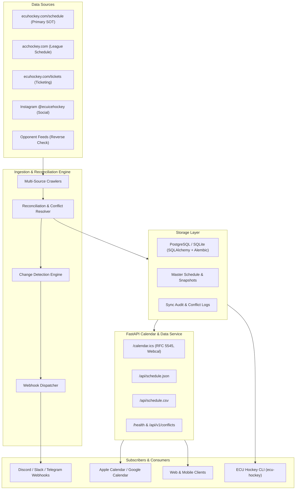

# Roadmap and Implementation Plan

<!--TOC-->

______________________________________________________________________

**Table of Contents**

- [1. System Architecture Overview](#1-system-architecture-overview)
- [2. Planned Milestones and Phases](#2-planned-milestones-and-phases)
  - [2.1. Milestone 1: v0.1.0 - Foundation & Core Architecture (Complete)](#21-milestone-1-v010---foundation--core-architecture-complete)
  - [2.2. Milestone 2: v0.2.0 - Storage Layer & Multi-Source Scrapers](#22-milestone-2-v020---storage-layer--multi-source-scrapers)
    - [2.2.1. Phase 2.1: Relational Persistence & Schema Migrations](#221-phase-21-relational-persistence--schema-migrations)
    - [2.2.2. Phase 2.2: Primary & League Web Crawlers](#222-phase-22-primary--league-web-crawlers)
    - [2.2.3. Phase 2.3: Social & Opponent Reverse Crawlers](#223-phase-23-social--opponent-reverse-crawlers)
  - [2.3. Milestone 3: v0.3.0 - Schedule Reconciliation, Change Detection & Alerts](#23-milestone-3-v030---schedule-reconciliation-change-detection--alerts)
    - [2.3.1. Phase 3.1: Reconciliation & Conflict Resolution](#231-phase-31-reconciliation--conflict-resolution)
    - [2.3.2. Phase 3.2: Change State Detection & Audit History](#232-phase-32-change-state-detection--audit-history)
    - [2.3.3. Phase 3.3: Webhook Notification Dispatcher](#233-phase-33-webhook-notification-dispatcher)
  - [2.4. Milestone 4: v0.4.0 - Calendar & Data API Service](#24-milestone-4-v040---calendar--data-api-service)
    - [2.4.1. Phase 4.1: Public Calendar & Data Feeds](#241-phase-41-public-calendar--data-feeds)
    - [2.4.2. Phase 4.2: Diagnostics & Administration Endpoints](#242-phase-42-diagnostics--administration-endpoints)
  - [2.5. Milestone 5: v0.5.0 - CLI, Automation & Production Deployment](#25-milestone-5-v050---cli-automation--production-deployment)
    - [2.5.1. Phase 5.1: Unified Command-Line Interface](#251-phase-51-unified-command-line-interface)
    - [2.5.2. Phase 5.2: Production Deployment Strategy & Hosting Analysis](#252-phase-52-production-deployment-strategy--hosting-analysis)
    - [2.5.3. Phase 5.3: Scheduled Automation & CI Sync Workflows](#253-phase-53-scheduled-automation--ci-sync-workflows)
    - [2.5.4. Phase 5.4: GitHub Pages Documentation & Static Calendar Deployment](#254-phase-54-github-pages-documentation--static-calendar-deployment)

______________________________________________________________________

<!--TOC-->

This document establishes the implementation roadmap and tracking plan for the **ECU Ice Hockey Schedule Aggregator & Calendar Service**, integrating requirements from `ecu_hockey_scraper_prompt.md`.

______________________________________________________________________

## 1. System Architecture Overview

The platform is designed around three decoupled, production-grade core tiers:

1. **Data Ingestion & Cross-Reference Engine (Worker):** Periodically scrapes multiple upstream sources, reconciles discrepancies, detects atomic changes (`CREATED`, `UPDATED`, `DELETED`, `CONFLICT_DETECTED`), and triggers webhook alerts.
2. **Calendar & Data API (FastAPI Application):** Lightweight, high-performance web service delivering RFC 5545 compliant `.ics` feeds (with `webcal://` support), normalized JSON feeds, and downloadable CSV exports.
3. **Storage & Persistence Layer:** Relational database (PostgreSQL in production, SQLite in development) managed with SQLAlchemy 2.0 and Alembic migrations, archiving raw source snapshots and synchronization audits.

______________________________________________________________________

## 2. Planned Milestones and Phases

### 2.1. Milestone 1: v0.1.0 - Foundation & Core Architecture (Complete)

- [x] Configure native `uv` project with dynamic versioning (`hatchling` + `hatch-vcs`).
- [x] Implement strict `ruff` and `ty` type checking configurations.
- [x] Establish comprehensive test suite with 100% test and branch coverage.
- [x] Set up Sphinx documentation with markdown (`myst-parser`) and Furo theme.
- [x] Implement quality linters: Pylint (10.00/10), Codespell, Interrogate, Deptry, Vulture, Radon/Xenon.
- [x] Configure comprehensive pre-commit suite (73 hooks) and pre-commit.ci.
- [x] Configure GitHub Actions CI matrix, CodeQL security analysis, Dependabot, and Semantic Release.
- [x] Configure repository settings (disable Projects & Wiki, enable auto-merge, branch protection).

### 2.2. Milestone 2: v0.2.0 - Storage Layer & Multi-Source Scrapers

#### 2.2.1. Phase 2.1: Relational Persistence & Schema Migrations

- [x] **[#2](https://github.com/bdperkin/ecu-hockey-calendar/issues/2) - feat(storage): implement SQLAlchemy models and Alembic migration pipeline**
  - **Summary:** Set up SQLAlchemy 2.0 ORM models for games, teams, sources, raw snapshots, and sync audits.
  - **Description:** Support PostgreSQL for production and SQLite for local development. Define `Team`, `Game`, `DataSource`, `RawSnapshot`, and `SyncAudit` tables. Configure Alembic migration environment with automated schema generation.
- [x] **[#25](https://github.com/bdperkin/ecu-hockey-calendar/issues/25) - fix(security): resolve CodeQL security and quality code scanning alerts**
  - **Summary:** Resolve 7 CodeQL code scanning alerts detected under the security-and-quality query suite.
  - **Description:** Add explicit `__all__` exports in Alembic migrations and `alembic/env.py`, and refactor session rollback test blocks to use explicit exception handling.

#### 2.2.2. Phase 2.2: Primary & League Web Crawlers

- [x] **[#3](https://github.com/bdperkin/ecu-hockey-calendar/issues/3) - feat(ingestion): build resilient crawler for primary ECU Hockey schedule site**
  - **Summary:** Build asynchronous crawler for `https://www.ecuhockey.com/schedule/upcoming`.
  - **Description:** Implement `httpx` + `BeautifulSoup4` parser with retry and backoff logic. Extract dates, times, home/away status, opponents, venues, scores, and game status.
- [ ] **[#4](https://github.com/bdperkin/ecu-hockey-calendar/issues/4) - feat(ingestion): implement ACC Hockey league schedule page parser**
  - **Summary:** Ingest conference games and scores from `https://www.acchockey.com/page/show/9602441-east-carolina`.
  - **Description:** Handle SportEngine markup, normalize opponent names, and capture official conference verification metadata.
- [ ] **[#5](https://github.com/bdperkin/ecu-hockey-calendar/issues/5) - feat(ingestion): parse ticket sales page for game schedules and promotions**
  - **Summary:** Scrape ticketing information from `https://www.ecuhockey.com/tickets`.
  - **Description:** Extract home games, promotional theme nights, ticket pricing, and ticketing links to enrich calendar event descriptions.

#### 2.2.3. Phase 2.3: Social & Opponent Reverse Crawlers

- [ ] **[#6](https://github.com/bdperkin/ecu-hockey-calendar/issues/6) - feat(ingestion): create resilient Instagram feed parser for game announcements**
  - **Summary:** Extract schedule announcements and time changes from `https://www.instagram.com/ecuicehockey/`.
  - **Description:** Integrate Instagram Graph API / resilient feed parser with exponential backoff and rate-limit mitigation.
- [ ] **[#7](https://github.com/bdperkin/ecu-hockey-calendar/issues/7) - feat(ingestion): automated opponent schedule reverse lookup and cross-check**
  - **Summary:** Automatically query and cross-verify preliminary game data against opponent schedule sources.
  - **Description:** Maintain opponent directory (UNC, NC State, Virginia Tech, Wake Forest, etc.) and cross-check dates, venues, and times.

### 2.3. Milestone 3: v0.3.0 - Schedule Reconciliation, Change Detection & Alerts

#### 2.3.1. Phase 3.1: Reconciliation & Conflict Resolution

- [ ] **[#8](https://github.com/bdperkin/ecu-hockey-calendar/issues/8) - feat(reconciliation): implement fuzzy-matching and multi-source conflict resolution engine**
  - **Summary:** Cross-reference data across disparate sources using deterministic and fuzzy scoring.
  - **Description:** Enforce configurable precedence hierarchy (Primary SOT + League > Ticketing/Social > Opponent). Detect discrepancies and flag high-confidence conflicts for review.

#### 2.3.2. Phase 3.2: Change State Detection & Audit History

- [ ] **[#9](https://github.com/bdperkin/ecu-hockey-calendar/issues/9) - feat(reconciliation): change detection and sync state tracking engine**
  - **Summary:** Track atomic game state transitions (`CREATED`, `UPDATED`, `DELETED`, `CONFLICT_DETECTED`).
  - **Description:** Generate field-level diffs, store historical snapshots, and log sync cycle audits.

#### 2.3.3. Phase 3.3: Webhook Notification Dispatcher

- [ ] **[#15](https://github.com/bdperkin/ecu-hockey-calendar/issues/15) - feat(notifications): multi-platform webhook alerting for schedule updates and conflicts**
  - **Summary:** Broadcast rich notifications to Discord, Slack, and Telegram channels.
  - **Description:** Dispatch formatted embeds for schedule additions, game updates, cancellations, and active conflict alerts.

### 2.4. Milestone 4: v0.4.0 - Calendar & Data API Service

#### 2.4.1. Phase 4.1: Public Calendar & Data Feeds

- [ ] **[#10](https://github.com/bdperkin/ecu-hockey-calendar/issues/10) - feat(api): RFC 5545 iCalendar (.ics) subscription endpoint and webcal support**
  - **Summary:** Provide `/calendar.ics` adhering strictly to RFC 5545 with `webcal://` subscription support.
  - **Description:** Full compatibility with Apple Calendar, Google Calendar, and Outlook with deterministic UIDs, alarms, locations, and descriptions.
- [ ] **[#11](https://github.com/bdperkin/ecu-hockey-calendar/issues/11) - feat(api): public JSON and CSV master schedule data feeds**
  - **Summary:** Provide machine-readable `/api/schedule.json` and downloadable `/api/schedule.csv`.
  - **Description:** Normalized feeds with query filters (`season`, `opponent`, `home_only`, `status`) and OpenAPI interactive documentation.

#### 2.4.2. Phase 4.2: Diagnostics & Administration Endpoints

- [ ] **[#12](https://github.com/bdperkin/ecu-hockey-calendar/issues/12) - feat(api): health check, sync diagnostics, and conflict review endpoints**
  - **Summary:** Provide operational endpoints for system health, sync telemetry, and conflict review.
  - **Description:** Implement `/health`, `/api/v1/sync/status`, and `/api/v1/conflicts` with authentication for administrative actions.

### 2.5. Milestone 5: v0.5.0 - CLI, Automation & Production Deployment

#### 2.5.1. Phase 5.1: Unified Command-Line Interface

- [ ] **[#13](https://github.com/bdperkin/ecu-hockey-calendar/issues/13) - feat(cli): command-line interface for schedule sync, inspection, and export**
  - **Summary:** Rich CLI interface (`ecu-hockey`) with subcommands: `sync`, `status`, `export`, `conflicts`, and `serve`.
  - **Description:** Provide interactive terminal output using `rich` for formatting, status tables, and diagnostics.

#### 2.5.2. Phase 5.2: Production Deployment Strategy & Hosting Analysis

- [ ] **[#14](https://github.com/bdperkin/ecu-hockey-calendar/issues/14) - docs(deployment): architectural hosting analysis and production deployment guide**
  - **Summary:** Author `DEPLOYMENT.md` evaluating hosting providers, architecture, and operational practices.
  - **Description:** Compare Render, Railway, Fly.io, and AWS Lambda + EventBridge. Address Instagram rate limits, proxy rotation, persistent database volumes, SSL certificates, and container configuration.

#### 2.5.3. Phase 5.3: Scheduled Automation & CI Sync Workflows

- [ ] **[#16](https://github.com/bdperkin/ecu-hockey-calendar/issues/16) - ci(automation): automated scheduled ingestion and calendar release workflow**
  - **Summary:** GitHub Actions scheduled workflow running periodic syncs and publishing static calendar releases.
  - **Description:** Automate periodic schedule checks, publish calendar artifacts, and trigger webhooks on changes.

#### 2.5.4. Phase 5.4: GitHub Pages Documentation & Static Calendar Deployment

- [x] **[#18](https://github.com/bdperkin/ecu-hockey-calendar/issues/18) - ci(pages): automated GitHub Pages deployment to \`https://bdperkin.github.io/ecu-hockey-calendar/\`**
  - **Summary:** Configure automated Sphinx documentation and static calendar asset publishing to GitHub Pages.
  - **Description:** Implement `.github/workflows/pages.yml` with `actions/upload-pages-artifact` and `actions/deploy-pages`. Build Sphinx documentation with Furo theme and publish static calendar artifacts (`calendar.ics`, `schedule.json`, `schedule.csv`) to `https://bdperkin.github.io/ecu-hockey-calendar/`.
